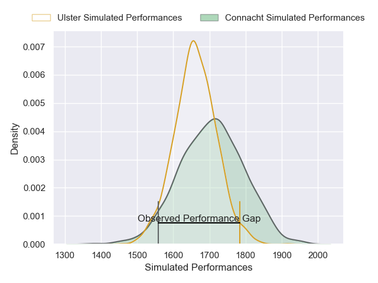
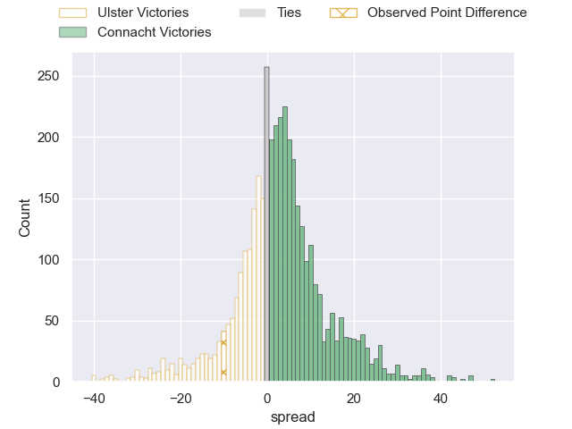
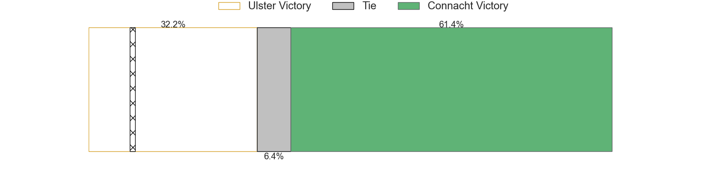
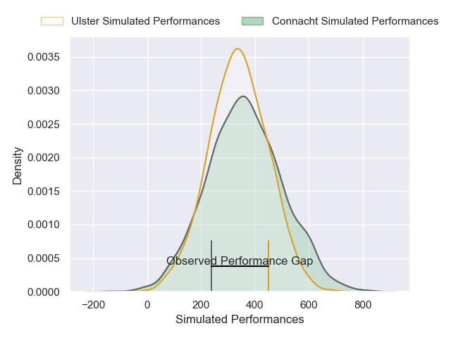
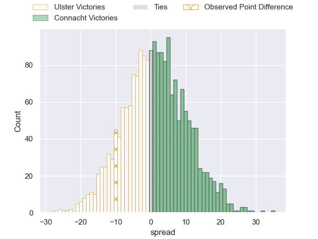

---  
layout: page  
title: Ulster at Connacht; 17-7  
date: 2024-12-28 18:00:00 -0500  
categories: "United Rugby Championship 2024" match review  
---
# Ulster at Connacht; 17-7

# Club Level Predictions

The first set of predictions treats a club as the smallest object, as the club develops its members, organizes a gameplan, and deploys its players as needed for each match. This club model has a prediction of 0.566, which translates to predicting Connacht to win by 2.3.

Our Over/Under is 49.5 - and combined with the spread above, we have a predicted scoreline of 23 to 26

Each club has a rating and a rating deviation (similar to a Glicko rating), and expected performances can be generated. This allows for simulated matches and spreads like the ones below.
## Projected Performances - Club Model

## Projected Spreads - Club Model

## Projected Results - Club Model

# Player Level Predictions

Treating teams instead as an entity made up of the currently active players, I have ratings for each player in an altogether different system. These can be combined to form team ratings once teamsheets are announced, weighting starters a bit higher than the reserves. After the match is played, players can be weighted by their minutes on the field, allowing for an accurate measure of the team's composition. With these compiled team ratings, we can make predictions, measure inaccuracy, and update the individual player ratings.
## Prediction without Player Minutes: Connacht by 1.4

Ulster by 7.0 on a neutral pitch

## Projected Performances - Player Model

## Projected Spreads - Player Model

## Projected Results - Player Model

|   Away Minutes | Away Player        |   Away Percentile |   Number |   Home Percentile | Home Player           |   Home Minutes |
|---------------:|:-------------------|------------------:|---------:|------------------:|:----------------------|---------------:|
|             68 | Eric O'Sullivan    |             78.21 |        1 |             66.16 | Denis Buckley         |             28 |
|             80 | John Andrew        |             25.16 |        2 |             16.3  | Dylan Tierney-Martin  |             80 |
|             48 | Scott Wilson       |             15.52 |        3 |             52.63 | Finlay Bealham        |             80 |
|             80 | Kieran Treadwell   |             36.06 |        4 |             92.07 | Josh Murphy           |             57 |
|             48 | Cormac Izuchukwu   |             44.95 |        5 |             27.61 | Darragh Murray        |             80 |
|             32 | Matthew Rea        |             10.76 |        6 |             16.14 | Cian Prendergast      |             80 |
|             32 | Nick Timoney       |             68.49 |        7 |             53.12 | Shamus Hurley-Langton |             48 |
|             14 | James McNabney     |              2.64 |        8 |             14.25 | Paul Boyle            |             56 |
|             29 | Nathan Doak        |              5.15 |        9 |             28.18 | Caolin Blade          |             57 |
|             14 | Jack Murphy        |             60.32 |       10 |             93.19 | Jack Carty            |             80 |
|             23 | Rory Telfer        |             52.14 |       11 |             94.25 | Santiago Cordero      |             66 |
|             80 | Jude Postlethwaite |              0.59 |       12 |             97.72 | Bundee Aki            |             80 |
|             52 | Ben Carson         |             65.25 |       13 |              1.88 | Cathal Forde          |             49 |
|             62 | Werner Kok         |             25.41 |       14 |             56.1  | Mack Hansen           |             80 |
|             28 | Michael Lowry      |             72.16 |       15 |              3.98 | Piers O'Conor         |             80 |
|             18 | Andrew Warwick     |              9.13 |       16 |             61.24 | Oisin Dowling         |             80 |
|             80 | David McCann       |             59.5  |       17 |             11.74 | Sean Jansen           |             63 |
|             23 | Corrie Barrett     |             16.86 |       18 |              4.09 | Ben Murphy            |             80 |
|             18 | Wilhelm De Klerk   |             66.73 |       19 |             80.42 | Shane Jennings        |             66 |
|             80 | James McCormick    |             12.03 |       20 |             83.34 | Peter Dooley          |             80 |
|             80 | Harry Sheridan     |             66.9  |       21 |             58.86 | Eoin de Buitléar      |             80 |
|            nan | nan                |            nan    |       22 |             27.18 | Jack Aungier          |             15 |
|            nan | nan                |            nan    |       23 |             88.81 | Conor Oliver          |             62 |

