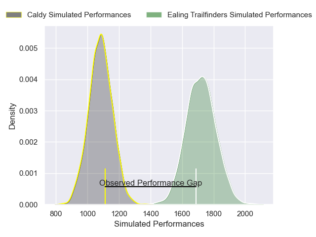
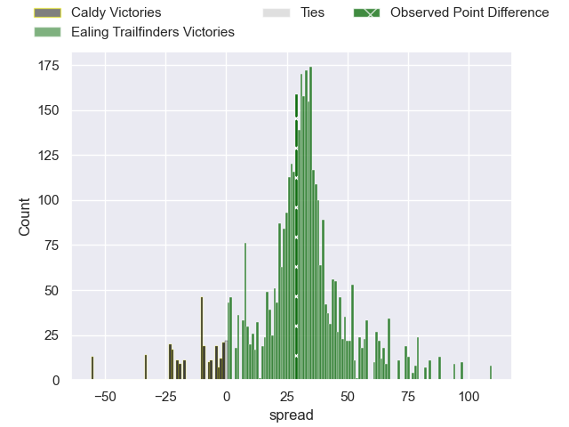
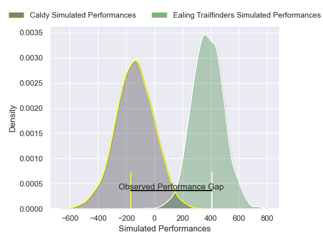
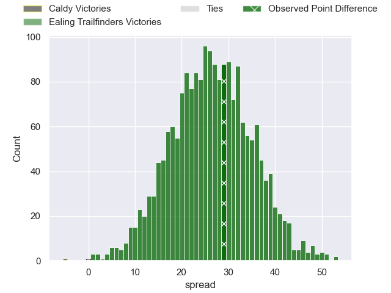

---  
layout: page  
title: Caldy at Ealing Trailfinders; 26-55  
date: 2024-12-28 18:00:00 -0500  
categories: "RFU Championship 2024" match review  
---
# Caldy at Ealing Trailfinders; 26-55

# Club Level Predictions

The first set of predictions treats a club as the smallest object, as the club develops its members, organizes a gameplan, and deploys its players as needed for each match. This club model has a prediction of 0.972, which translates to predicting Ealing Trailfinders to win by 31.6.

Our Over/Under is 85.5 - and combined with the spread above, we have a predicted scoreline of 27 to 59

Each club has a rating and a rating deviation (similar to a Glicko rating), and expected performances can be generated. This allows for simulated matches and spreads like the ones below.
## Projected Performances - Club Model

## Projected Spreads - Club Model

## Projected Results - Club Model

# Player Level Predictions

Treating teams instead as an entity made up of the currently active players, I have ratings for each player in an altogether different system. These can be combined to form team ratings once teamsheets are announced, weighting starters a bit higher than the reserves. After the match is played, players can be weighted by their minutes on the field, allowing for an accurate measure of the team's composition. With these compiled team ratings, we can make predictions, measure inaccuracy, and update the individual player ratings.
## Prediction without Player Minutes: Ealing Trailfinders by 29.4

Ealing Trailfinders by 25.1 on a neutral pitch

## Projected Performances - Player Model

## Projected Spreads - Player Model

## Projected Results - Player Model

|   Away Minutes | Away Player          |   Away Percentile |   Number |   Home Percentile | Home Player         |   Home Minutes |
|---------------:|:---------------------|------------------:|---------:|------------------:|:--------------------|---------------:|
|             33 | Monty Weatherby      |             38.44 |        1 |             87.08 | Lefty Zigiriadis    |             15 |
|             80 | Oliver Hearn         |              2.37 |        2 |             88.13 | Mike Willemse       |             29 |
|             65 | Joe Sproston         |             11.39 |        3 |             87.34 | Biyi Alo            |             68 |
|             69 | Freddie Stevenson    |             29.27 |        4 |             24.65 | Matas Jurevicius    |             47 |
|             58 | Thomas Sanders       |             24.04 |        5 |             90.16 | Daniel Cutmore      |             24 |
|             19 | Will Riley           |             62.08 |        6 |             56.36 | Danny Bridge        |             12 |
|             80 | Tristan Woodman      |             54.57 |        7 |             92.06 | Simon Uzokwe        |             32 |
|             41 | Callum Ridgway       |              1.45 |        8 |              2.24 | Callum Chick        |             12 |
|             80 | Joseph Murray        |             23.51 |        9 |             88.41 | Craig Hampson       |             32 |
|             25 | Lewis Barker         |              3.41 |       10 |             98.2  | Craig Willis        |             32 |
|             80 | William Robinson     |             14.06 |       11 |             43.05 | Ben Harris          |             80 |
|             60 | Sam Bedlow           |              0.1  |       12 |             56.83 | Francis Moore       |             32 |
|             53 | Rekeiti Ma'asi-White |             25.54 |       13 |             82.87 | Reuben Bird-Tulloch |             80 |
|             80 | Jacob Mitchell       |             33.8  |       14 |             91.3  | Angus Kernohan      |             48 |
|             80 | Matt Kilcourse       |             15.15 |       15 |             85.61 | Max Bodilly         |             58 |
|             80 | Jacob  Tansey        |             33.01 |       16 |             53.9  | Elliott Chilvers    |             80 |
|             80 | Dan Rabbette         |             27.05 |       17 |             80.7  | Cameron Terry       |             80 |
|             44 | Nathan Rushton       |              8.19 |       18 |             79.15 | George Davis        |             80 |
|             80 | Jack Ellam           |            nan    |       19 |             71.64 | Ryan Smid           |             80 |
|             19 | Alex Groves          |            nan    |       20 |             93.99 | Bobby de Wee        |             47 |
|             47 | Charlie Attis        |             35.67 |       21 |             11.59 | Micheal Stronge     |             65 |
|             10 | Connor Wilkinson     |              7.43 |       22 |             77.56 | George Worboys      |             33 |
|            nan | nan                  |            nan    |       23 |             26.04 | Dan O'Brien         |             33 |

