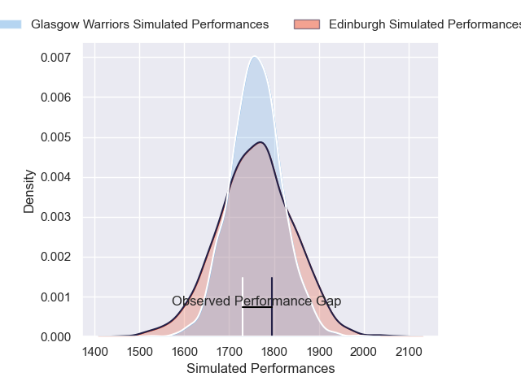
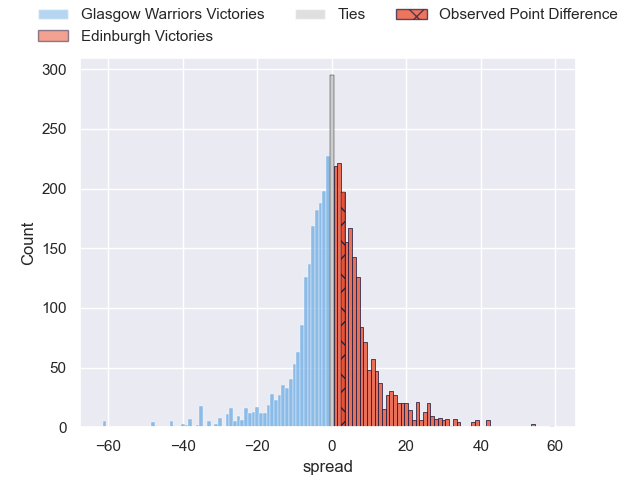
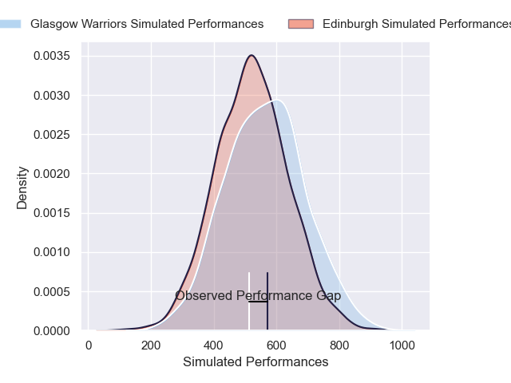
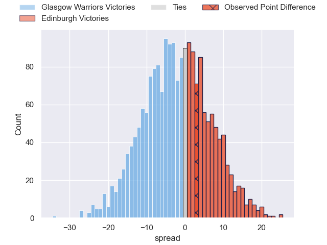

---  
layout: page  
title: Glasgow Warriors at Edinburgh; 7-10  
date: 2024-12-28 18:00:00 -0500  
categories: "United Rugby Championship 2024" match review  
---
# Glasgow Warriors at Edinburgh; 7-10

# Club Level Predictions

The first set of predictions treats a club as the smallest object, as the club develops its members, organizes a gameplan, and deploys its players as needed for each match. This club model has a prediction of 0.497, which translates to predicting Glasgow Warriors to win by 0.1.

Our Over/Under is 48.5 - and combined with the spread above, we have a predicted scoreline of 24 to 24

Each club has a rating and a rating deviation (similar to a Glicko rating), and expected performances can be generated. This allows for simulated matches and spreads like the ones below.
## Projected Performances - Club Model

## Projected Spreads - Club Model

## Projected Results - Club Model

# Player Level Predictions

Treating teams instead as an entity made up of the currently active players, I have ratings for each player in an altogether different system. These can be combined to form team ratings once teamsheets are announced, weighting starters a bit higher than the reserves. After the match is played, players can be weighted by their minutes on the field, allowing for an accurate measure of the team's composition. With these compiled team ratings, we can make predictions, measure inaccuracy, and update the individual player ratings.
## Prediction without Player Minutes: Glasgow Warriors by 2.5

Glasgow Warriors by 13.1 on a neutral pitch

## Projected Performances - Player Model

## Projected Spreads - Player Model

## Projected Results - Player Model

|   Away Minutes | Away Player           |   Away Percentile |   Number |   Home Percentile | Home Player         |   Home Minutes |
|---------------:|:----------------------|------------------:|---------:|------------------:|:--------------------|---------------:|
|             47 | Jamie Bhatti          |             91.14 |        1 |             36.31 | Boan Venter         |             53 |
|             47 | Gregor Hiddleston     |             74.84 |        2 |             69.94 | Dave Cherry         |             80 |
|             49 | Zander Fagerson       |             92.41 |        3 |             58.36 | D'Arcy Rae          |             80 |
|             80 | Gregor Brown          |             83.1  |        4 |             82.75 | Sam Skinner         |             33 |
|             63 | Scott Cummings        |             98.78 |        5 |             92.42 | Grant Gilchrist     |             80 |
|             80 | Ally Miller           |             44.06 |        6 |             99.74 | Jamie Ritchie       |             80 |
|              9 | Matt Fagerson         |             98.21 |        7 |             95.9  | Luke Crosbie        |             60 |
|             80 | Jack Mann             |             29.02 |        8 |             38.52 | Ben Muncaster       |             80 |
|             71 | Jamie Dobie           |             93.56 |        9 |             91.3  | Ali Price           |             37 |
|             80 | Tom Jordan            |             67.54 |       10 |             87.17 | Ross Thompson       |             15 |
|             71 | Kyle Steyn            |             96.27 |       11 |             80.34 | Duhan van der Merwe |             22 |
|             15 | Sione Tuipulotu       |             88.81 |       12 |             41.78 | Mosese Tuipulotu    |             15 |
|             54 | Huw Jones             |             79.9  |       13 |             89.21 | Matt Currie         |             80 |
|             80 | Sebastian Cancelliere |             96.43 |       14 |             57.34 | Darcy Graham        |             80 |
|             11 | Kyle Rowe             |             86.93 |       15 |             94.89 | Wes Goosen          |             26 |
|             58 | Rory Darge            |             95.05 |       16 |             48.51 | Hamish Watson       |             20 |
|             80 | Rory Sutherland       |             77.02 |       17 |             85.28 | Pierre Schoeman     |             44 |
|             47 | George Horne          |             99.68 |       18 |             72.02 | Javan Sebastian     |             68 |
|             36 | Sam Talakai           |             47.83 |       19 |             82.77 | Ben Healy           |             80 |
|             80 | Alex Samuel           |             75.61 |       20 |             87.5  | James Lang          |             36 |
|             77 | Grant Stewart         |             10.28 |       21 |             18.83 | Patrick Harrison    |             80 |
|            nan | nan                   |            nan    |       22 |             61.03 | Charlie Shiel       |              9 |
|            nan | nan                   |            nan    |       23 |             88.76 | Marshall Sykes      |              9 |

