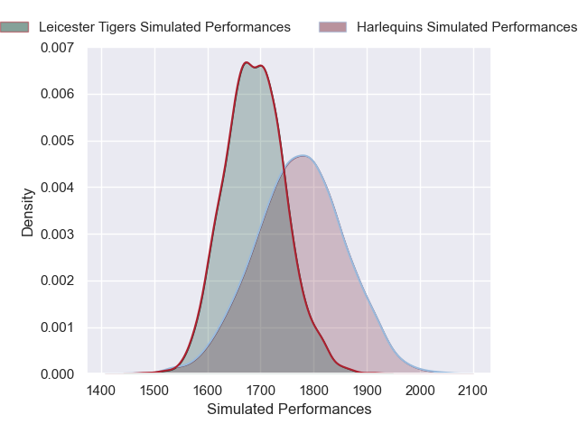
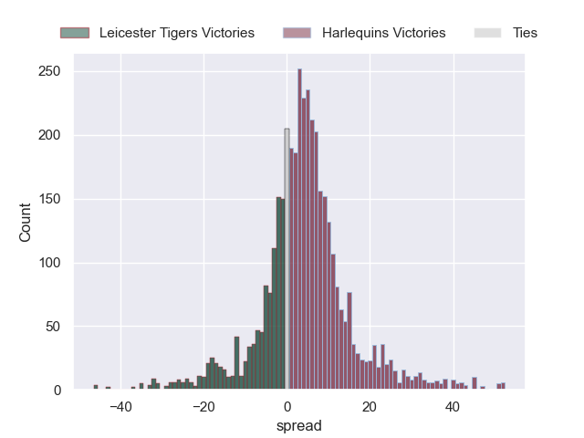
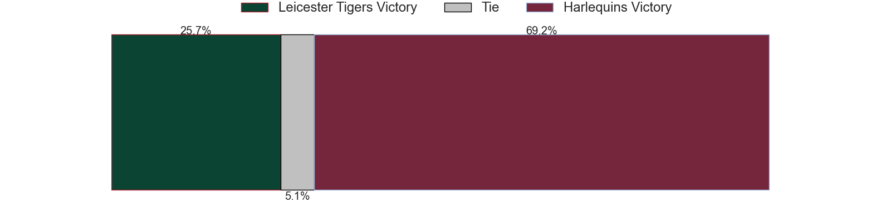
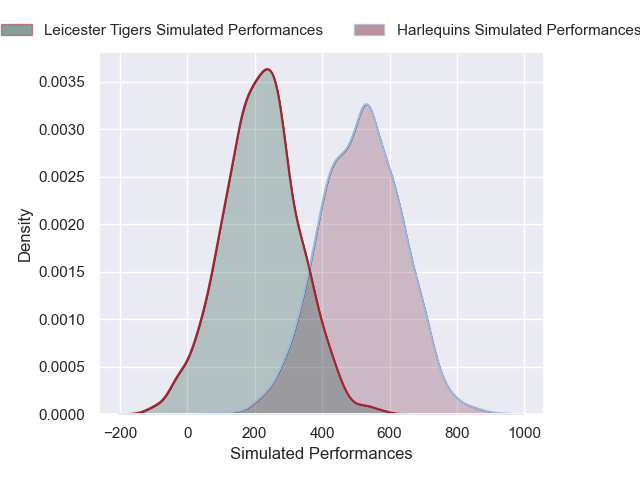
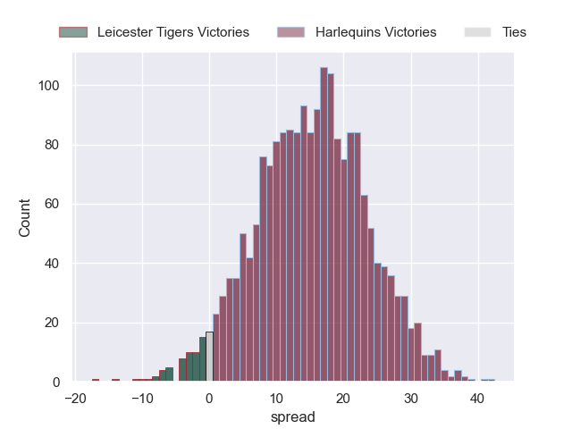
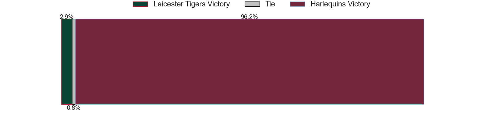

---  
layout: page  
title: Leicester Tigers at Harlequins; 34-34  
date: 2024-12-28 18:00:00 -0500  
categories: "Gallagher Premiership 2024" match review  
---
# Leicester Tigers at Harlequins; 34-34

# Club Level Predictions

The first set of predictions treats a club as the smallest object, as the club develops its members, organizes a gameplan, and deploys its players as needed for each match. This club model has a prediction of 0.616, which translates to predicting Harlequins to win by 4.2.

Our Over/Under is 51.5 - and combined with the spread above, we have a predicted scoreline of 23 to 28

Each club has a rating and a rating deviation (similar to a Glicko rating), and expected performances can be generated. This allows for simulated matches and spreads like the ones below.
## Projected Performances - Club Model

## Projected Spreads - Club Model

## Projected Results - Club Model

# Player Level Predictions

Treating teams instead as an entity made up of the currently active players, I have ratings for each player in an altogether different system. These can be combined to form team ratings once teamsheets are announced, weighting starters a bit higher than the reserves. After the match is played, players can be weighted by their minutes on the field, allowing for an accurate measure of the team's composition. With these compiled team ratings, we can make predictions, measure inaccuracy, and update the individual player ratings.
## Prediction without Player Minutes: Harlequins by 13.6

Leicester Tigers by 0.2 on a neutral pitch

## Projected Performances - Player Model

## Projected Spreads - Player Model

## Projected Results - Player Model

|   Away Minutes | Away Player           |   Away Percentile |   Number |   Home Percentile | Home Player               |   Home Minutes |
|---------------:|:----------------------|------------------:|---------:|------------------:|:--------------------------|---------------:|
|             48 | Nicky Smith           |             60.56 |        1 |             16.26 | Fin Baxter                |             52 |
|             59 | Julian Montoya        |             92.72 |        2 |              7.44 | Jack Walker               |             41 |
|             18 | Joe Heyes             |             80.01 |        3 |             37.71 | Titi Lamositele           |             80 |
|             67 | Cameron Henderson     |             82.06 |        4 |             27.44 | Irne Herbst               |             80 |
|             80 | George Martin         |             93.82 |        5 |             46.34 | Dino Lamb                 |             62 |
|             59 | Hanro Liebenberg      |             68.32 |        6 |             94.71 | James Chisholm            |             80 |
|              9 | Tommy Reffell         |             16.65 |        7 |             91.97 | Jack Kenningham           |             31 |
|             12 | Olly Cracknell        |             10.03 |        8 |             54.35 | Alex Dombrandt            |             25 |
|             17 | Jack van Poortvliet   |             70.05 |        9 |             98.39 | Danny Care                |             39 |
|             80 | Handre Pollard        |             89.18 |       10 |             58.12 | Marcus Smith              |             80 |
|             80 | Ollie Hassell-Collins |             77.16 |       11 |             23.78 | Cadan Murley              |             80 |
|             70 | Solomone Kata         |             58.91 |       12 |             76.73 | Luke Northmore            |             62 |
|             10 | Dan Kelly             |             35.15 |       13 |             29.31 | Oscar Beard               |             21 |
|             10 | Mike Brown            |             90.44 |       14 |             85.94 | Rodrigo Isgro             |             70 |
|             80 | Freddie Steward       |              4.92 |       15 |             79.55 | Nick David                |             16 |
|             71 | James Whitcombe       |             65.76 |       16 |             82.68 | Wyn Jones                 |             80 |
|             32 | Dan Cole              |             30.51 |       17 |             81.68 | Dillon Lewis              |             72 |
|              8 | Charlie Clare         |             18.2  |       18 |             97.04 | Joe Launchbury            |             17 |
|             71 | Jed Holloway          |             17.16 |       19 |             59.44 | Will Evans                |             40 |
|             40 | Emeka Ilione          |             57.47 |       20 |             64.73 | Chandler Cunningham-South |             67 |
|             14 | Ben Youngs            |             52.66 |       21 |             11.11 | Will Porter               |             63 |
|             65 | Joseph Woodward       |             61.98 |       22 |             61.92 | Jarrod Evans              |             80 |

