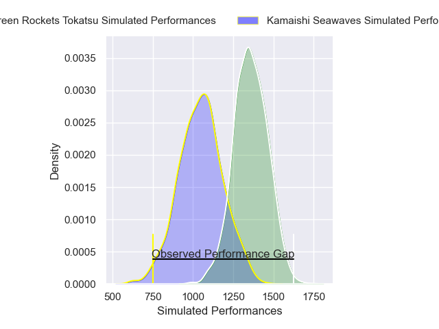
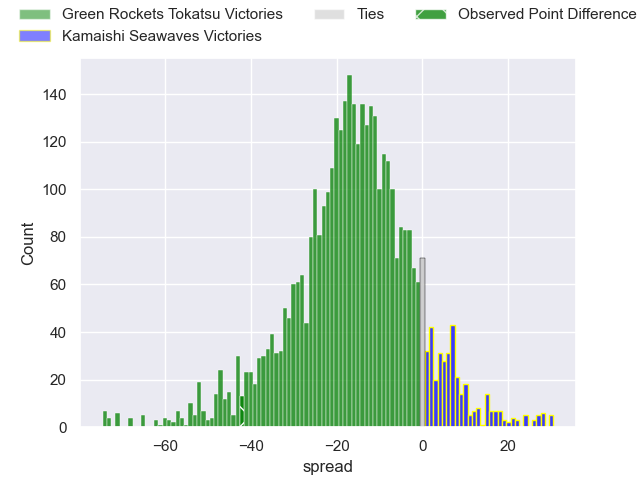
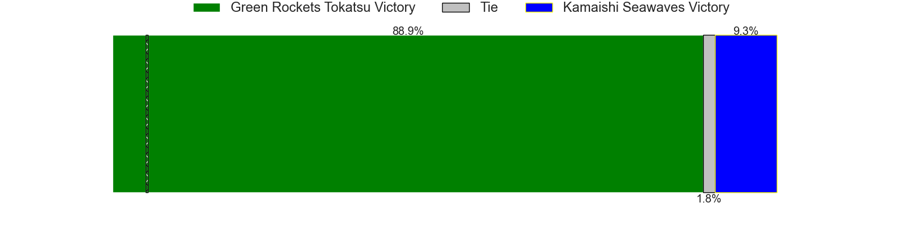
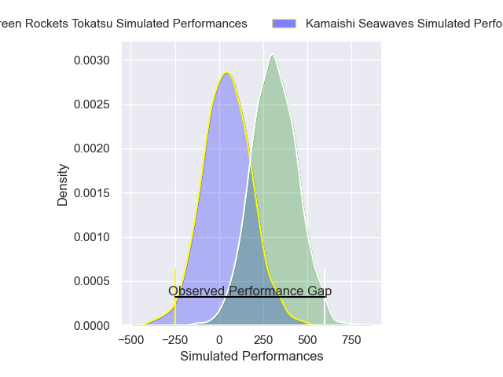
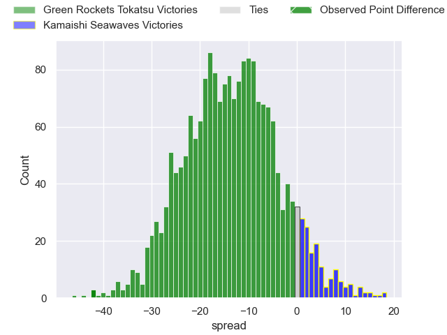
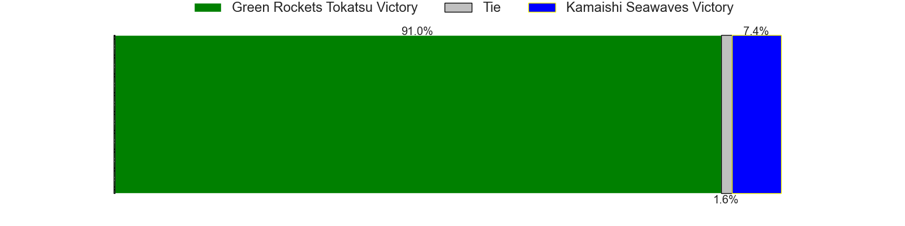

---  
layout: page  
title: Green Rockets Tokatsu at Kamaishi Seawaves; 59-17  
date: 2024-12-28 18:00:00 -0500  
categories: "Japan Rugby League One D2 2024" match review  
---
# Green Rockets Tokatsu at Kamaishi Seawaves; 59-17

# Club Level Predictions

The first set of predictions treats a club as the smallest object, as the club develops its members, organizes a gameplan, and deploys its players as needed for each match. This club model has a prediction of 0.157, which translates to predicting Green Rockets Tokatsu to win by 15.4.

Our Over/Under is 63.5 - and combined with the spread above, we have a predicted scoreline of 40 to 24

Each club has a rating and a rating deviation (similar to a Glicko rating), and expected performances can be generated. This allows for simulated matches and spreads like the ones below.
## Projected Performances - Club Model

## Projected Spreads - Club Model

## Projected Results - Club Model

# Player Level Predictions

Treating teams instead as an entity made up of the currently active players, I have ratings for each player in an altogether different system. These can be combined to form team ratings once teamsheets are announced, weighting starters a bit higher than the reserves. After the match is played, players can be weighted by their minutes on the field, allowing for an accurate measure of the team's composition. With these compiled team ratings, we can make predictions, measure inaccuracy, and update the individual player ratings.
## Prediction without Player Minutes: Green Rockets Tokatsu by 13.2

Green Rockets Tokatsu by 16.0 on a neutral pitch

## Projected Performances - Player Model

## Projected Spreads - Player Model

## Projected Results - Player Model

|   Away Minutes | Away Player           |   Away Percentile |   Number |   Home Percentile | Home Player         |   Home Minutes |
|---------------:|:----------------------|------------------:|---------:|------------------:|:--------------------|---------------:|
|             80 | Kosei Yamamoto        |             75.68 |        1 |             22.45 | Yusuke Yamada       |             80 |
|             80 | Ren Osawa             |             15.66 |        2 |              3.16 | Daiki Ito           |             80 |
|             80 | Keisuke Kikuta        |             82.08 |        3 |             14.92 | Taiki Noguchi       |             80 |
|             50 | Daiki Yamagiwa        |             70.91 |        4 |             37.37 | Satoshi Hatazawa    |             80 |
|             63 | Pari Pari Parkinson   |             96.25 |        5 |              5.23 | Dallas Tatana       |             64 |
|             80 | Viliami Lutua Ahofono |             71.65 |        6 |             19.73 | Ben Nee Nee         |             40 |
|             34 | Ryoi Kamei            |             55.25 |        7 |             28.69 | Ryota Kono          |             57 |
|             25 | Aseri Masivou         |             61.21 |        8 |              5.41 | Sam Henwood         |             40 |
|              8 | Nick Phipps           |             90.18 |        9 |              3.7  | Youhei Murakami     |             80 |
|             80 | Rhys Patchell         |             95.59 |       10 |             65.13 | Mitch Hunt          |             50 |
|             19 | Hiroyuki Miyajima     |             10.1  |       11 |             79.02 | Jamie Henry         |             80 |
|             80 | Orbyn Leger           |              4.26 |       12 |             13.47 | Gerdus van der Walt |             50 |
|             17 | Maritino Nemani       |              4.65 |       13 |              7.82 | Mosese Tonga        |             80 |
|             50 | Ryosei Takai          |             54.16 |       14 |             17.48 | Ryuji Abe           |             62 |
|             15 | Keagan Faria          |             55.87 |       15 |             32.2  | Kaisei Takai        |             80 |
|             50 | Keita Kobayashi       |            nan    |       16 |             69.15 | Satoshi Ueda        |             74 |
|             80 | Mitieli Tuinakauvadra |             82.58 |       17 |             42.08 | Katsuto Hatanaka    |             40 |
|             80 | Ko Yoshimura          |            nan    |       18 |             22.71 | Atsushi Minami      |             80 |
|             61 | Kanta Higashionna     |             78.08 |       19 |             10.2  | Kohei Ishigaki      |             80 |
|             17 | Suguru Kubo           |            nan    |       20 |            nan    | Shoichiro Inada     |             61 |
|             13 | Edward Annandale      |            nan    |       21 |             37.27 | Kazuki Ochi         |             46 |
|             61 | Ika Motulalr Takau    |            nan    |       22 |             12.97 | Naoki Ouno          |             80 |
|             69 | Yusuke Maruo          |             66.99 |       23 |            nan    | nan                 |            nan |

