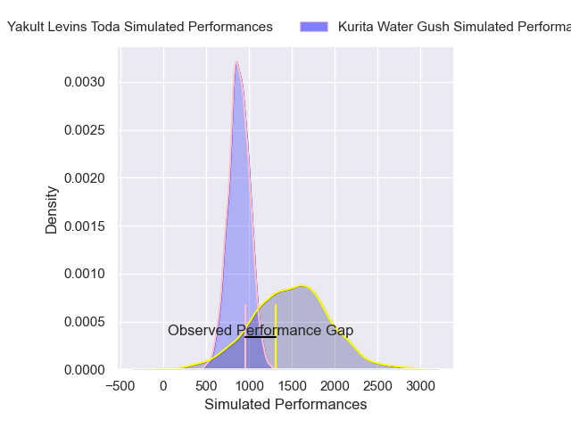
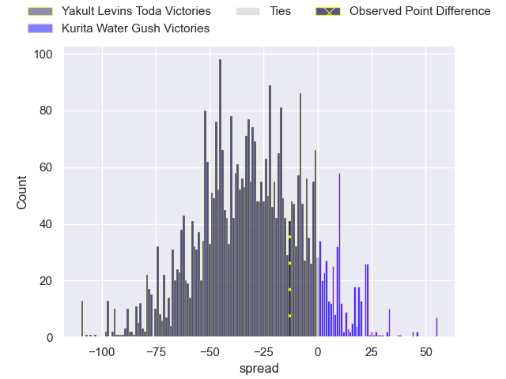
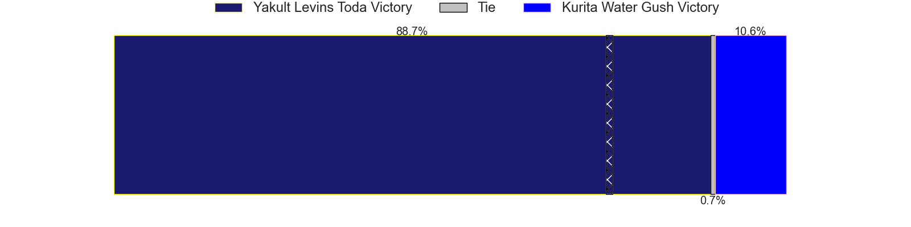
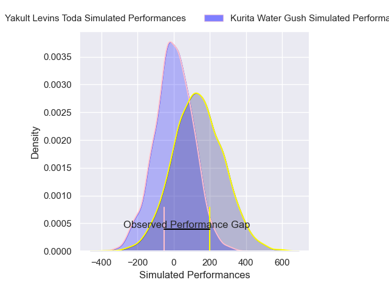
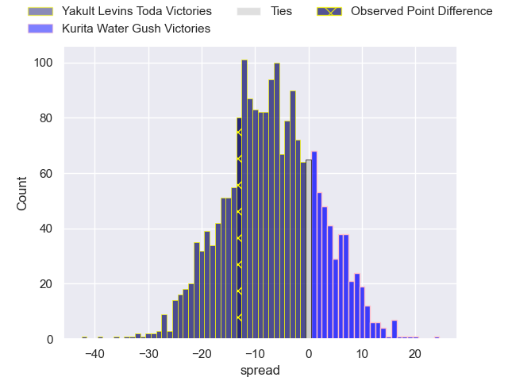
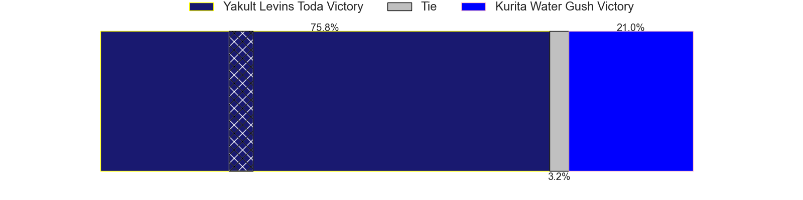

---  
layout: page  
title: Yakult Levins Toda at Kurita Water Gush; 29-16  
date: 2024-12-28 18:00:00 -0500  
categories: "Japan Rugby League One D3 2024" match review  
---
# Yakult Levins Toda at Kurita Water Gush; 29-16

# Club Level Predictions

The first set of predictions treats a club as the smallest object, as the club develops its members, organizes a gameplan, and deploys its players as needed for each match. This club model has a prediction of 0.111, which translates to predicting Yakult Levins Toda to win by 31.0.

Our Over/Under is 47.5 - and combined with the spread above, we have a predicted scoreline of 39 to 8

Each club has a rating and a rating deviation (similar to a Glicko rating), and expected performances can be generated. This allows for simulated matches and spreads like the ones below.
## Projected Performances - Club Model

## Projected Spreads - Club Model

## Projected Results - Club Model

# Player Level Predictions

Treating teams instead as an entity made up of the currently active players, I have ratings for each player in an altogether different system. These can be combined to form team ratings once teamsheets are announced, weighting starters a bit higher than the reserves. After the match is played, players can be weighted by their minutes on the field, allowing for an accurate measure of the team's composition. With these compiled team ratings, we can make predictions, measure inaccuracy, and update the individual player ratings.
## Prediction without Player Minutes: Yakult Levins Toda by 6.8

Yakult Levins Toda by 9.6 on a neutral pitch

## Projected Performances - Player Model

## Projected Spreads - Player Model

## Projected Results - Player Model

|   Away Minutes | Away Player          |   Away Percentile |   Number |   Home Percentile | Home Player      |   Home Minutes |
|---------------:|:---------------------|------------------:|---------:|------------------:|:-----------------|---------------:|
|             53 | Kiyoshi Ischii       |             55.16 |        1 |             16.79 | Kei Shibuya      |             16 |
|             80 | Shunsuke Tani        |             66.14 |        2 |             27.06 | Kota Hojo        |             12 |
|             80 | Atsushi Furuya       |             61.89 |        3 |             45.24 | Rui Kuriyama     |              7 |
|             63 | Masashi Ogawa        |             63.94 |        4 |              2.35 | Kota Nakamura    |             56 |
|             60 | James Tucker         |             83.97 |        5 |              0.61 | Daymon Leasuasu  |             68 |
|             80 | Masaya Makino        |             63.36 |        6 |              9.74 | Kengo Nakamura   |             80 |
|             53 | Kosuke Urabe         |             65.5  |        7 |             37.06 | Taisei Nakao     |             49 |
|             53 | Ryusei Isaka         |             45.12 |        8 |             15.44 | Tebita Oto       |             49 |
|             80 | Junpei Tada          |             56.04 |        9 |              6.6  | Sho Nakamura     |             80 |
|             27 | Nick Evemy           |             51.1  |       10 |              4.81 | Takuro Hayashida |             65 |
|             80 | Kagechika Ota        |             66.2  |       11 |             13.13 | Keigo Hamazoe    |              8 |
|             40 | Antonio Mikaele-Tu'u |             28.71 |       12 |             41.49 | Leo Gordon       |             20 |
|             44 | Atomu Shirai         |             52.38 |       13 |             41.09 | Katsuki Ishizuka |             20 |
|             40 | Takuya Takahashi     |             62.32 |       14 |             47.09 | Ryo Hosomoto     |             24 |
|             80 | Masatoshi Doi        |             62.12 |       15 |             31.44 | Yuta Sugiyama    |             60 |
|             80 | Kosetu Kawachi       |             52.37 |       16 |             45.89 | Ren Shinwada     |             19 |
|             80 | Hikaru Ishikawa      |             62.08 |       17 |            nan    | Yoji Shiina      |             30 |
|             56 | Yuto Usuda           |             64.05 |       18 |             13.56 | Jamie Vakalahi   |             80 |
|             72 | Daichi Kono          |             51.43 |       19 |             33.66 | Daiki Yokota     |             80 |
|             70 | Takumi Hurukawa      |            nan    |       20 |            nan    | Shohei Tsujimura |             24 |
|             44 | Ryosuke Nakashima    |            nan    |       21 |            nan    | Kei Takusagawa   |             30 |
|             31 | Song Yong Lee        |            nan    |       22 |             48.3  | Hiroki Handa     |             30 |
|             36 | Takudo Okazaki       |            nan    |       23 |            nan    | Jun Kaneko       |             80 |

