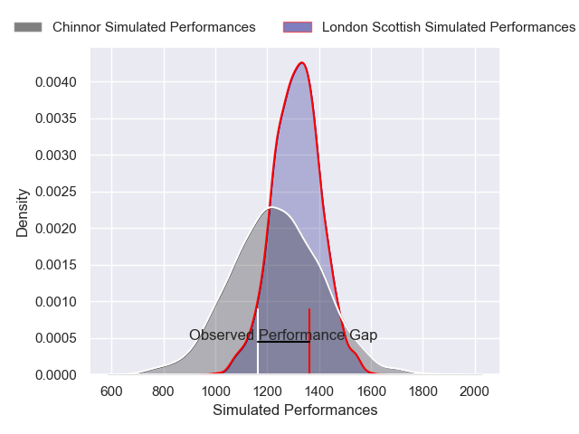
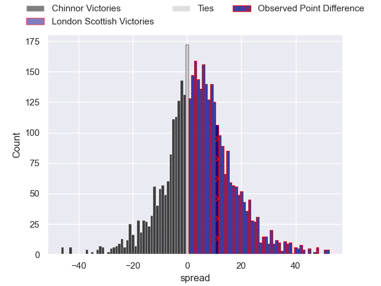
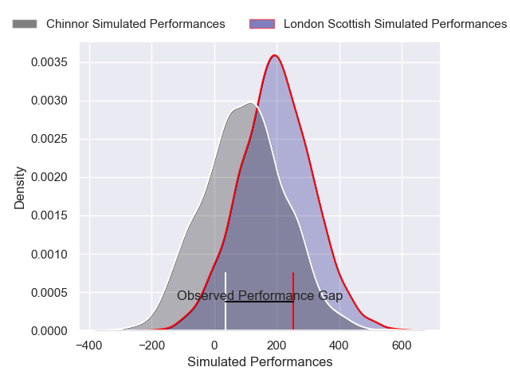
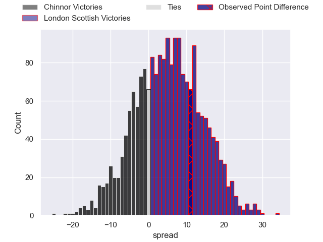

---  
layout: page  
title: Chinnor at London Scottish; 15-26  
date: 2024-12-28 18:00:00 -0500  
categories: "RFU Championship 2024" match review  
---
# Chinnor at London Scottish; 15-26

# Club Level Predictions

The first set of predictions treats a club as the smallest object, as the club develops its members, organizes a gameplan, and deploys its players as needed for each match. This club model has a prediction of 0.599, which translates to predicting London Scottish to win by 4.0.

Our Over/Under is 39.5 - and combined with the spread above, we have a predicted scoreline of 18 to 22

Each club has a rating and a rating deviation (similar to a Glicko rating), and expected performances can be generated. This allows for simulated matches and spreads like the ones below.
## Projected Performances - Club Model

## Projected Spreads - Club Model

## Projected Results - Club Model

# Player Level Predictions

Treating teams instead as an entity made up of the currently active players, I have ratings for each player in an altogether different system. These can be combined to form team ratings once teamsheets are announced, weighting starters a bit higher than the reserves. After the match is played, players can be weighted by their minutes on the field, allowing for an accurate measure of the team's composition. With these compiled team ratings, we can make predictions, measure inaccuracy, and update the individual player ratings.
## Prediction without Player Minutes: London Scottish by 4.3

Chinnor by 0.2 on a neutral pitch

## Projected Performances - Player Model

## Projected Spreads - Player Model

## Projected Results - Player Model

|   Away Minutes | Away Player           |   Away Percentile |   Number |   Home Percentile | Home Player           |   Home Minutes |
|---------------:|:----------------------|------------------:|---------:|------------------:|:----------------------|---------------:|
|             24 | Keston Lines          |             35.31 |        1 |             24.92 | Tom Osborne           |             10 |
|             63 | Will Cave             |             66.3  |        2 |             26.11 | Austin Wallis         |             80 |
|             22 | Rob Hardwick          |             54.83 |        3 |             79.35 | William Hobson        |             80 |
|             70 | Scott Hall            |             14.55 |        4 |             20.47 | Matt Wilkinson        |             56 |
|             22 | Charlie Irvine        |             50.87 |        5 |             77    | Harry Browne          |             39 |
|             80 | Harry Dugmore         |             67.55 |        6 |              8.54 | Ioan Rhys Davies      |             18 |
|             79 | George Richard Stokes |             47.31 |        7 |             12.13 | Will Trenholm         |             10 |
|             26 | Izzy Wharton          |             27.7  |        8 |             17.02 | Zach Carr             |             43 |
|             80 | Callum Pascoe         |             53.95 |        9 |             10.31 | Jonny Law             |             20 |
|             80 | Connor Slevin         |             39.88 |       10 |             14.43 | Tom Wilstead          |             33 |
|             12 | Kieran Goss           |             58.74 |       11 |              9.17 | Noah Ferdinand        |             80 |
|             80 | Morgan Passman        |             46.63 |       12 |             84.46 | Bryn Bradley          |             80 |
|             65 | Grant Hughes          |             39.6  |       13 |             54.95 | Ben Waghorn           |             54 |
|             47 | Ryan Crowley          |             37.14 |       14 |             55.63 | Roma Zheng            |             80 |
|             33 | William Feeney        |             39.96 |       15 |             50    | Cameron Anderson      |             51 |
|             80 | Alfie North           |             43.47 |       16 |             64.09 | Archie Stanley        |             49 |
|             37 | Sam Clark             |            nan    |       17 |              8.73 | Ashley Challenger     |             20 |
|             29 | Mark Darlington       |            nan    |       18 |             41.3  | George Head           |             80 |
|             80 | Ted Johnson           |            nan    |       19 |             11.85 | Jonny Green           |             20 |
|             80 | Nick Smith            |            nan    |       20 |             21.86 | Bailey Ransom         |             55 |
|             80 | Charlie Watson        |            nan    |       21 |              3.86 | Robert David McCallum |             61 |
|             53 | Charles James-Carter  |            nan    |       22 |             84.54 | Will Brown            |             80 |
|            nan | nan                   |            nan    |       23 |            nan    | Jake Murray           |             19 |

