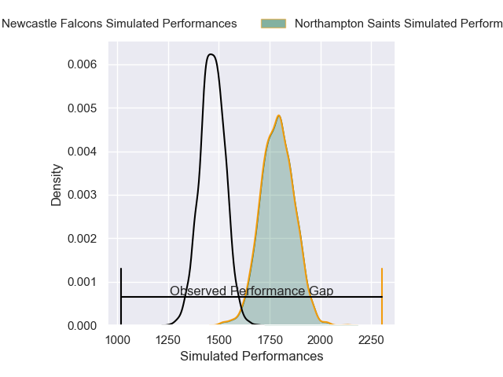
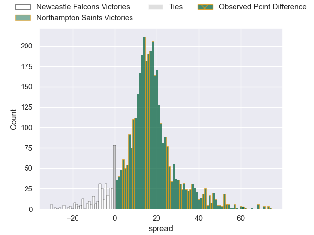
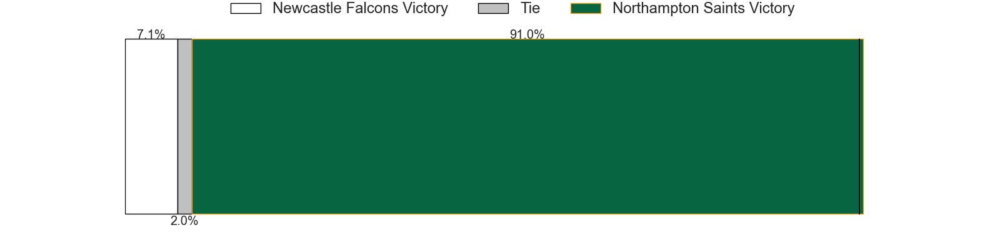
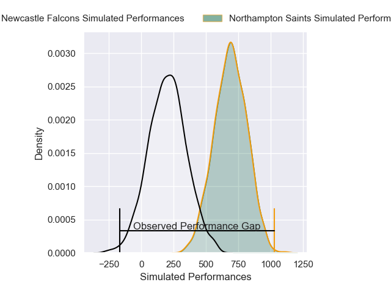
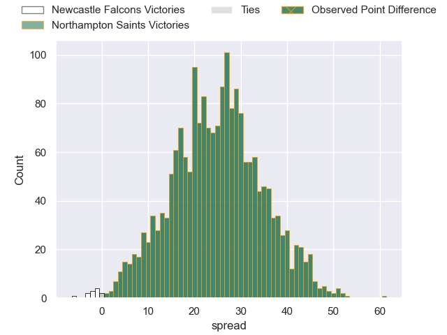
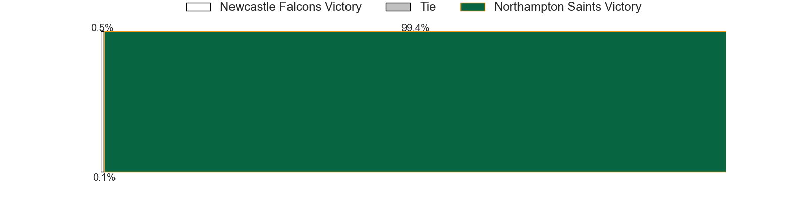

---  
layout: page  
title: Newcastle Falcons at Northampton Saints; 0-61  
date: 2024-12-28 18:00:00 -0500  
categories: "Gallagher Premiership 2024" match review  
---
# Newcastle Falcons at Northampton Saints; 0-61

# Club Level Predictions

The first set of predictions treats a club as the smallest object, as the club develops its members, organizes a gameplan, and deploys its players as needed for each match. This club model has a prediction of 0.857, which translates to predicting Northampton Saints to win by 15.8.

Our Over/Under is 44.5 - and combined with the spread above, we have a predicted scoreline of 14 to 30

Each club has a rating and a rating deviation (similar to a Glicko rating), and expected performances can be generated. This allows for simulated matches and spreads like the ones below.
## Projected Performances - Club Model

## Projected Spreads - Club Model

## Projected Results - Club Model

# Player Level Predictions

Treating teams instead as an entity made up of the currently active players, I have ratings for each player in an altogether different system. These can be combined to form team ratings once teamsheets are announced, weighting starters a bit higher than the reserves. After the match is played, players can be weighted by their minutes on the field, allowing for an accurate measure of the team's composition. With these compiled team ratings, we can make predictions, measure inaccuracy, and update the individual player ratings.
## Prediction without Player Minutes: Northampton Saints by 35.6

Northampton Saints by 20.5 on a neutral pitch

## Projected Performances - Player Model

## Projected Spreads - Player Model

## Projected Results - Player Model

|   Away Minutes | Away Player         |   Away Percentile |   Number |   Home Percentile | Home Player        |   Home Minutes |
|---------------:|:--------------------|------------------:|---------:|------------------:|:-------------------|---------------:|
|             57 | Murray McCallum     |             41.24 |        1 |             33.31 | Tom West           |             80 |
|             53 | Ollie Fletcher      |             34.02 |        2 |             72.31 | Henry Walker       |             80 |
|             80 | Richard Palframan   |             56.36 |        3 |             88.81 | Trevor Davison     |             80 |
|             61 | Sebastian de Chaves |              2.53 |        4 |             75.17 | Chunya Munga       |             80 |
|             80 | Kiran McDonald      |             16.99 |        5 |             13.59 | Alex Coles         |             80 |
|             80 | Freddie Lockwood    |             38.68 |        6 |             27.5  | Josh Kemeny        |             33 |
|             65 | Tom Gordon          |             95.13 |        7 |             95.64 | Tom Pearson        |             18 |
|             80 | Tom Gordon          |             95.13 |        7 |             95.64 | Tom Pearson        |             18 |
|             80 | Callum Chick        |              2.24 |        8 |             68.47 | Henry Pollock      |             80 |
|             30 | Sam Stuart          |              0.16 |        9 |             94.69 | Alex Mitchell      |             40 |
|             80 | Brett Connon        |              1.8  |       10 |             81.96 | Fin Smith          |             59 |
|             61 | Ben Stevenson       |             32.09 |       11 |             91.38 | Ollie Sleightholme |             65 |
|             40 | Connor Doherty      |             55.54 |       12 |             81.88 | Fraser Dingwall    |             47 |
|             80 | Alex Hearle         |             34.36 |       13 |             83.17 | Tom Litchfield     |             47 |
|             80 | Adam Radwan         |             17.64 |       14 |             95.1  | Tommy Freeman      |             22 |
|             56 | Louis Brown         |             78.6  |       15 |             93.94 | George Hendy       |             80 |
|             80 | Mike Rewcastle      |            nan    |       16 |             64.96 | Tarek Haffar       |             80 |
|             40 | Bryan Byrne         |             71.68 |       17 |             95.89 | Curtis Langdon     |             17 |
|             52 | Callum Hancock      |             43.24 |       18 |             72.75 | Luke Green         |             79 |
|             19 | Philip van der Walt |             10.45 |       19 |             58.5  | Angus Scott-Young  |             80 |
|             22 | John Hawkins        |             23.69 |       20 |            nan    | Iakopo Petelo Mapu |             80 |
|             54 | Hugh O'Sullivan     |             43.96 |       21 |             92.75 | Archie McParland   |             59 |
|             18 | Oliver Spencer      |             76.3  |       22 |             82.48 | Rory Hutchinson    |             24 |
|             80 | Jack Metcalf        |             21.37 |       23 |            nan    | nan                |            nan |

