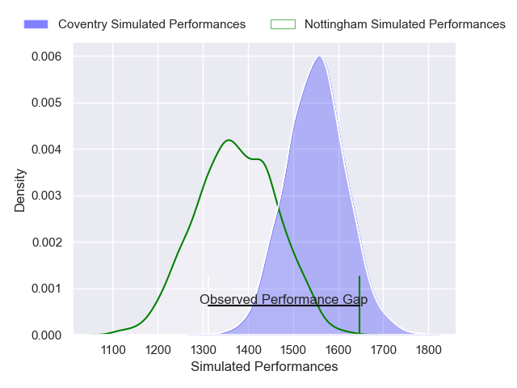
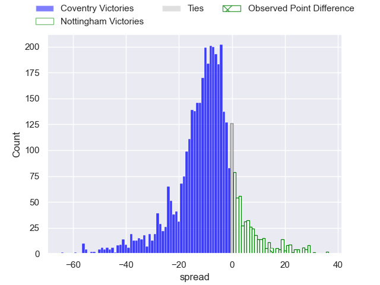
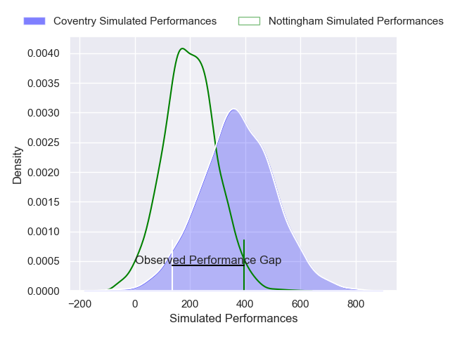
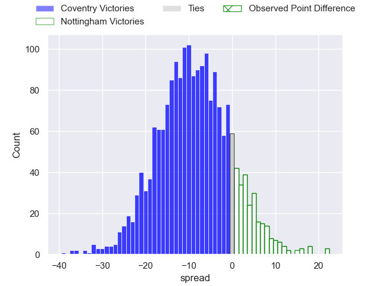

---  
layout: page  
title: Coventry at Nottingham; 26-41  
date: 2024-12-28 18:00:00 -0500  
categories: "RFU Championship 2024" match review  
---
# Coventry at Nottingham; 26-41

# Club Level Predictions

The first set of predictions treats a club as the smallest object, as the club develops its members, organizes a gameplan, and deploys its players as needed for each match. This club model has a prediction of 0.271, which translates to predicting Coventry to win by 8.8.

Our Over/Under is 56.5 - and combined with the spread above, we have a predicted scoreline of 33 to 24

Each club has a rating and a rating deviation (similar to a Glicko rating), and expected performances can be generated. This allows for simulated matches and spreads like the ones below.
## Projected Performances - Club Model

## Projected Spreads - Club Model

## Projected Results - Club Model

# Player Level Predictions

Treating teams instead as an entity made up of the currently active players, I have ratings for each player in an altogether different system. These can be combined to form team ratings once teamsheets are announced, weighting starters a bit higher than the reserves. After the match is played, players can be weighted by their minutes on the field, allowing for an accurate measure of the team's composition. With these compiled team ratings, we can make predictions, measure inaccuracy, and update the individual player ratings.
## Prediction without Player Minutes: Coventry by 9.3

Coventry by 13.9 on a neutral pitch

## Projected Performances - Player Model

## Projected Spreads - Player Model

## Projected Results - Player Model

|   Away Minutes | Away Player          |   Away Percentile |   Number |   Home Percentile | Home Player          |   Home Minutes |
|---------------:|:---------------------|------------------:|---------:|------------------:|:---------------------|---------------:|
|             71 | Toby Trinder         |             85.54 |        1 |             40.11 | Kai Owen             |             11 |
|             60 | Jordon Poole         |             80.22 |        2 |             90.66 | Harry Clayton        |             58 |
|             33 | Steven Longwell      |             74.68 |        3 |             79.61 | Dan Richardson       |             22 |
|             55 | Obinna Nkwocha       |             73.87 |        4 |              7.58 | Sebastien Ferreira   |             10 |
|             17 | James Tyas           |             81.79 |        5 |             70.38 | Jack Shine           |             19 |
|             33 | Tom Ball             |             93.25 |        6 |             76.77 | Kody Vereti          |              4 |
|             80 | Matt Kvesic          |             59.86 |        7 |             56.28 | Sam Williams         |             19 |
|             80 | Chester Owen         |             44.33 |        8 |             56.73 | James Cherry         |             22 |
|             53 | Josh Barton          |             60.71 |        9 |             34.62 | Josh Goodwin         |             61 |
|             60 | Liam Richman         |              9.82 |       10 |             89.38 | Matthew Arden        |             80 |
|             80 | James Martin         |             86.25 |       11 |             82.36 | Ryan Olowofela       |             31 |
|              6 | Thomas Hitchcock     |             77.72 |       12 |             16.63 | Gwyn Parks           |              3 |
|             27 | Dafydd-Rhys Tiueti   |             23.76 |       13 |             78.32 | Kegan Christian-Goss |             31 |
|             55 | Ryan Hutler          |             72.18 |       14 |             68.45 | David Williams       |             29 |
|             80 | Charlie Robson       |             24.24 |       15 |              5.11 | Jack Stapley         |             49 |
|             49 | Jevaughn Warren      |             25.32 |       16 |             74.82 | Aniseko Sio          |             23 |
|             80 | Will Biggs           |            nan    |       17 |             63.61 | Jack Dickinson       |             49 |
|             80 | Eliot Salt           |             32.31 |       18 |             84.21 | Ale Loman            |             49 |
|             61 | Dan Green            |            nan    |       19 |             44.24 | Sam Green            |             80 |
|             80 | Daniel Okeke         |             55.8  |       20 |             82.13 | Toby Venner          |             80 |
|             80 | Finlay Ogden         |            nan    |       21 |            nan    | Aman Johal           |             10 |
|             10 | David Opoku-Fordjour |             19.81 |       22 |             29.76 | Malelili Satala      |             80 |
|             74 | Tommy Mathews        |             54.51 |       23 |            nan    | nan                  |            nan |

