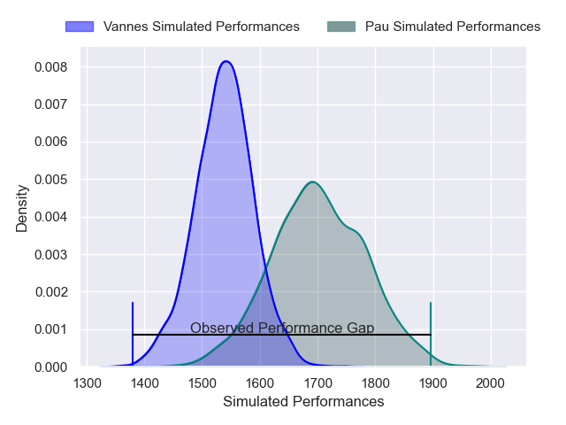
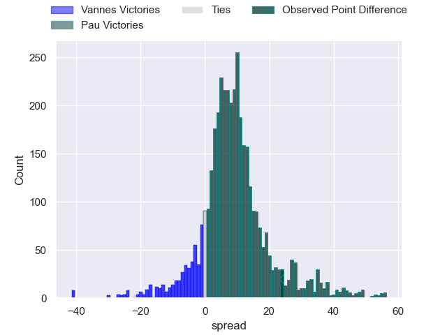
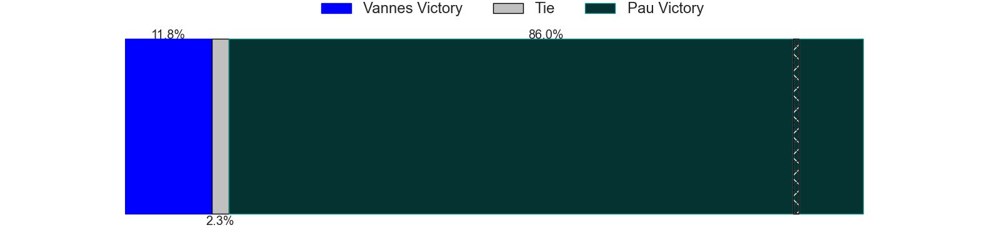
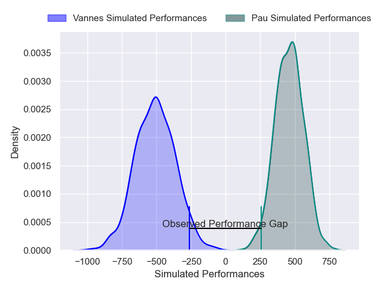
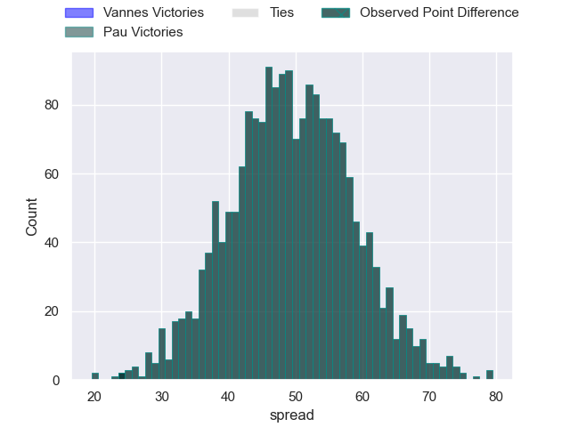

---  
layout: page  
title: Vannes at Pau; 24-48  
date: 2024-12-28 18:00:00 -0500  
categories: "Top 14 Orange 2024" match review  
---
# Vannes at Pau; 24-48

# Club Level Predictions

The first set of predictions treats a club as the smallest object, as the club develops its members, organizes a gameplan, and deploys its players as needed for each match. This club model has a prediction of 0.717, which translates to predicting Pau to win by 8.2.

Our Over/Under is 50.5 - and combined with the spread above, we have a predicted scoreline of 21 to 29

Each club has a rating and a rating deviation (similar to a Glicko rating), and expected performances can be generated. This allows for simulated matches and spreads like the ones below.
## Projected Performances - Club Model

## Projected Spreads - Club Model

## Projected Results - Club Model

# Player Level Predictions

Treating teams instead as an entity made up of the currently active players, I have ratings for each player in an altogether different system. These can be combined to form team ratings once teamsheets are announced, weighting starters a bit higher than the reserves. After the match is played, players can be weighted by their minutes on the field, allowing for an accurate measure of the team's composition. With these compiled team ratings, we can make predictions, measure inaccuracy, and update the individual player ratings.
## Prediction without Player Minutes: Pau by 19.7

Pau by 6.2 on a neutral pitch

## Projected Performances - Player Model

## Projected Spreads - Player Model

## Projected Results - Player Model

|   Away Minutes | Away Player         |   Away Percentile |   Number |   Home Percentile | Home Player         |   Home Minutes |
|---------------:|:--------------------|------------------:|---------:|------------------:|:--------------------|---------------:|
|             15 | Mako Vunipola       |             92.74 |        1 |             35.44 | Ignacio Calles      |             22 |
|             28 | Cyril Blanchard     |             87.18 |        2 |             63.92 | Youri Delhommel     |             65 |
|             46 | Santiago Medrano    |            100    |        3 |             18.72 | Jon Zabala          |             28 |
|             55 | Santiago Medrano    |            100    |        3 |             18.72 | Jon Zabala          |             28 |
|             62 | Santiago Medrano    |            100    |        3 |             18.72 | Jon Zabala          |             28 |
|             70 | Santiago Medrano    |            100    |        3 |             18.72 | Jon Zabala          |             28 |
|             70 | Anton Bresler       |             88.94 |        4 |             30.31 | Hugo Auradou        |             26 |
|             22 | Fabrice Metz        |             87.8  |        5 |             34.67 | Jimi Maximin        |             54 |
|             70 | Simon Augry         |             55.85 |        6 |             28.01 | Sacha Zegueur       |             52 |
|             80 | Francisco Gorrissen |             99.23 |        7 |             17.51 | Loic Credoz         |             52 |
|             52 | Sione Kalamafoni    |             50.4  |        8 |             44.46 | Beka Gorgadze       |             52 |
|             28 | Michael Ruru        |             97.75 |        9 |             84.86 | Thibault Daubagna   |             28 |
|             67 | Thibault Debaes     |             59.12 |       10 |             64.13 | Joe Simmonds        |             34 |
|             54 | Romaric Camou       |             77.62 |       11 |             51.67 | Aaron Grandidier    |             52 |
|             80 | Francis Saili       |              3.37 |       12 |             56.73 | Nathan Decron       |             28 |
|             80 | Theo Costosseque    |             48.12 |       13 |             62.48 | Emilien Gailleton   |             80 |
|             25 | Inaki Ayarza        |             24.32 |       14 |             14.3  | Aymeric Luc         |             80 |
|             55 | Paul Surano         |             69.32 |       15 |             74.05 | Jack Maddocks       |             80 |
|             80 | Hugo Djehi          |             69.89 |       16 |             64.69 | Remi Seneca         |             25 |
|              1 | Theo Beziat         |             81.96 |       17 |             49.3  | Lekima Tagitagivalu |             52 |
|             14 | Pagakalasio Tafili  |             83.81 |       18 |             17.85 | Guram Papidze       |             52 |
|             48 | Stephen Varney      |              2.74 |       19 |             78.74 | Reece Hewat         |             52 |
|             40 | Maxime Lafage       |             95.19 |       20 |             59.18 | Romain Ruffenach    |             31 |
|             28 | Eric Marks          |              6.62 |       21 |             80.96 | Axel Desperes       |             26 |
|             58 | Timothe Mezou       |             77.61 |       22 |             98.23 | Dan Robson          |             80 |
|             80 | Joe Edwards         |             88.5  |       23 |             68.83 | Joel Kpoku          |             49 |

