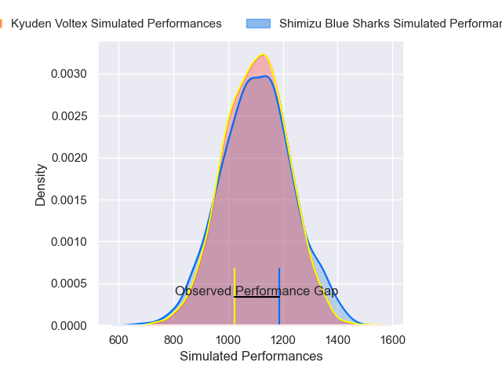
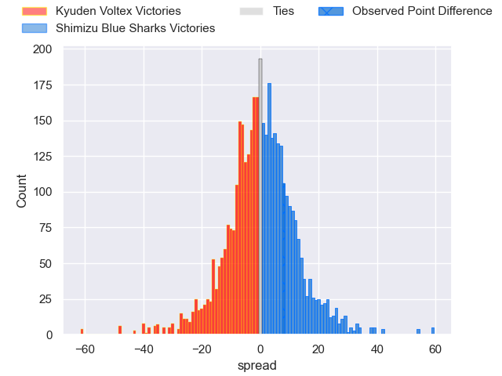
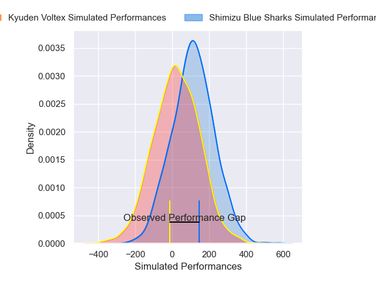
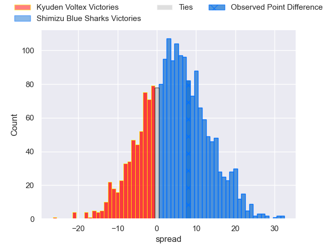
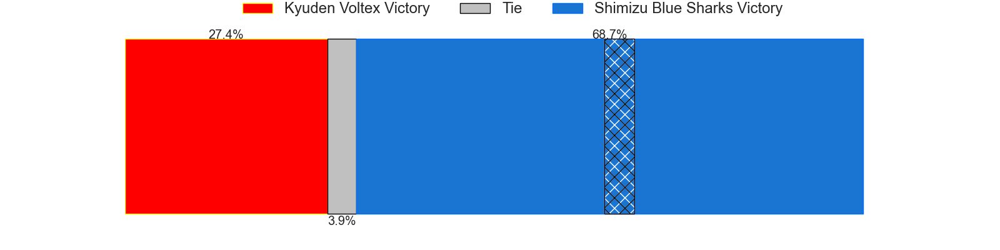

---  
layout: page  
title: Kyuden Voltex at Shimizu Blue Sharks; 33-41  
date: 2024-12-28 18:00:00 -0500  
categories: "Japan Rugby League One D2 2024" match review  
---
# Kyuden Voltex at Shimizu Blue Sharks; 33-41

# Club Level Predictions

The first set of predictions treats a club as the smallest object, as the club develops its members, organizes a gameplan, and deploys its players as needed for each match. This club model has a prediction of 0.501, which translates to predicting Shimizu Blue Sharks to win by 0.0.

Our Over/Under is 42.5 - and combined with the spread above, we have a predicted scoreline of 21 to 21

Each club has a rating and a rating deviation (similar to a Glicko rating), and expected performances can be generated. This allows for simulated matches and spreads like the ones below.
## Projected Performances - Club Model

## Projected Spreads - Club Model

## Projected Results - Club Model

# Player Level Predictions

Treating teams instead as an entity made up of the currently active players, I have ratings for each player in an altogether different system. These can be combined to form team ratings once teamsheets are announced, weighting starters a bit higher than the reserves. After the match is played, players can be weighted by their minutes on the field, allowing for an accurate measure of the team's composition. With these compiled team ratings, we can make predictions, measure inaccuracy, and update the individual player ratings.
## Prediction without Player Minutes: Shimizu Blue Sharks by 9.5

Shimizu Blue Sharks by 6.9 on a neutral pitch

## Projected Performances - Player Model

## Projected Spreads - Player Model

## Projected Results - Player Model

|   Away Minutes | Away Player            |   Away Percentile |   Number |   Home Percentile | Home Player         |   Home Minutes |
|---------------:|:-----------------------|------------------:|---------:|------------------:|:--------------------|---------------:|
|             80 | Samuel Nozomu Faialaga |             26.38 |        1 |             71.75 | Sanshiro Nomura     |             80 |
|             64 | Kyungmun Wang          |              2.22 |        2 |             70.09 | Naomichi Tatekawa   |             30 |
|             80 | Kosuke Oike            |             27.71 |        3 |             76.55 | Uha Lee             |             80 |
|             64 | Aaron Carroll          |             87.37 |        4 |             59.23 | Ed Holmes           |             67 |
|             80 | Ray Tatafu             |             15.42 |        5 |             55.49 | Suguru Hidaka       |             25 |
|             11 | Masahiro Eriguchi      |             56.53 |        6 |             65.84 | Koyo Adachi         |             19 |
|             16 | Colby Fainga'a         |             10.85 |        7 |             52.18 | Josh Basham         |             19 |
|             13 | Walker Alex Takuya     |             12.8  |        8 |             13.32 | Michael Va'a Toloke |             19 |
|             15 | Spencer Jeans          |             62.48 |        9 |             37.84 | Tatsuya Kanetsuki   |             11 |
|             16 | Kohei Kire             |             42.48 |       10 |             94.99 | Lima Sopoaga        |             10 |
|             11 | Ren Hagiwara           |             25.72 |       11 |             13.44 | Naoki Moriya        |             80 |
|              3 | Hayato Kojo            |             22.28 |       12 |             13.07 | Soichiro Kuwata     |             61 |
|             80 | Sione Likuata          |             14.36 |       13 |             74.46 | Siale Piutau        |             24 |
|             55 | Yasunari Isoda         |             21.45 |       14 |             12.2  | Tatsuhiro Ozaki     |             55 |
|             56 | Makoto Kato            |              3.22 |       15 |             74.62 | Coenie van Wyk      |             27 |
|             73 | Keisuke Yamzoe         |             50.38 |       16 |            nan    | Ryota Saito         |             27 |
|             24 | Tom Taylor             |             83.17 |       17 |             73.55 | Hayden Cripps       |             69 |
|             77 | Yasuo Saruwatari       |             17.79 |       18 |             52.3  | Fumiyake Mato       |             69 |
|             50 | Taro Uesugi            |            nan    |       19 |             15.54 | Murphy Taramai      |             80 |
|             80 | Shunta Takenouchi      |             40.1  |       20 |             20.92 | Ryo Sato            |             80 |
|             80 | Naoki Takaya           |             28.05 |       21 |            nan    | Yasuyuki Yamamoto   |             65 |
|             80 | Hayato Yoshida         |            nan    |       22 |            nan    | Essendon Tuitupou   |             64 |

