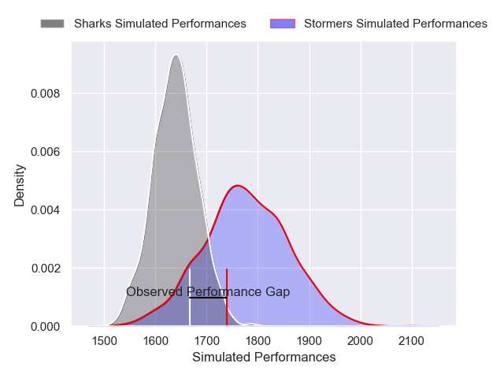
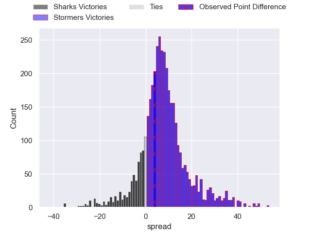
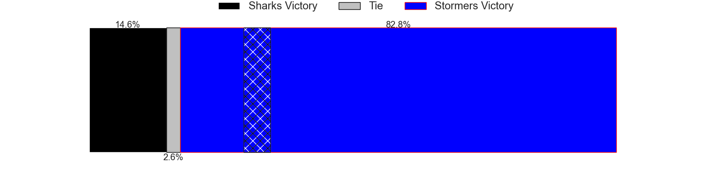
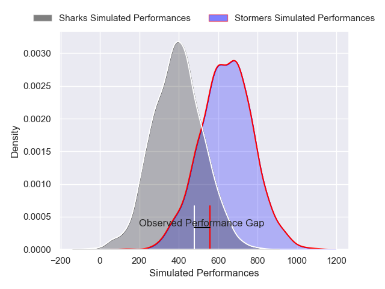
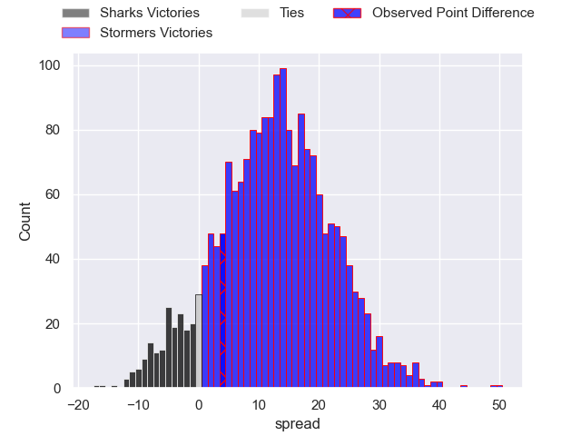
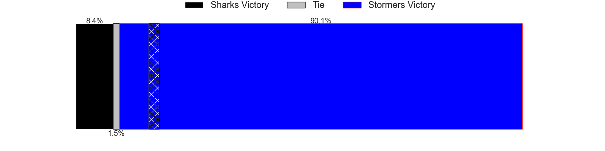

---  
layout: page  
title: Sharks at Stormers; 20-24  
date: 2024-12-28 18:00:00 -0500  
categories: "United Rugby Championship 2024" match review  
---
# Sharks at Stormers; 20-24

# Club Level Predictions

The first set of predictions treats a club as the smallest object, as the club develops its members, organizes a gameplan, and deploys its players as needed for each match. This club model has a prediction of 0.689, which translates to predicting Stormers to win by 7.0.

Our Over/Under is 53.5 - and combined with the spread above, we have a predicted scoreline of 23 to 30

Each club has a rating and a rating deviation (similar to a Glicko rating), and expected performances can be generated. This allows for simulated matches and spreads like the ones below.
## Projected Performances - Club Model

## Projected Spreads - Club Model

## Projected Results - Club Model

# Player Level Predictions

Treating teams instead as an entity made up of the currently active players, I have ratings for each player in an altogether different system. These can be combined to form team ratings once teamsheets are announced, weighting starters a bit higher than the reserves. After the match is played, players can be weighted by their minutes on the field, allowing for an accurate measure of the team's composition. With these compiled team ratings, we can make predictions, measure inaccuracy, and update the individual player ratings.
## Prediction without Player Minutes: Stormers by 6.6

Sharks by 1.9 on a neutral pitch

## Projected Performances - Player Model

## Projected Spreads - Player Model

## Projected Results - Player Model

|   Away Minutes | Away Player       |   Away Percentile |   Number |   Home Percentile | Home Player               |   Home Minutes |
|---------------:|:------------------|------------------:|---------:|------------------:|:--------------------------|---------------:|
|             80 | Ox Nche           |             92.87 |        1 |             69.42 | Alistair Vermaak          |             80 |
|             28 | Dylan Richardson  |             44.78 |        2 |             75.47 | Andre-Hugo Venter         |             49 |
|             80 | Vincent Koch      |             87.61 |        3 |             76.75 | Frans Malherbe            |             80 |
|             41 | Jason Jenkins     |             71.17 |        4 |             79.7  | Salmaan Moerat            |             31 |
|             56 | Emile van Heerden |             64.72 |        5 |              3.14 | JD Schickerling           |             30 |
|             62 | Phepsi Buthelezi  |             80.1  |        6 |             94.36 | Deon Fourie               |             80 |
|             80 | Emmanuel Tshituka |             87.7  |        7 |             82.24 | Ben-Jason Dixon           |             37 |
|             80 | Siya Kolisi       |             66.49 |        8 |             23.22 | Marcel Theunissen         |             80 |
|             76 | Jaden Hendrikse   |             95.01 |        9 |             91.79 | Herschel Jantjies         |             33 |
|             56 | Jordan Hendrikse  |             87.78 |       10 |             83.97 | Manie Libbok              |             49 |
|             50 | Ethan Hooker      |             69.39 |       11 |             77.78 | Seabelo Senatla           |             80 |
|             19 | Andre Esterhuizen |             99.5  |       12 |             76.63 | Sacha Feinberg-Mngomezulu |             68 |
|             31 | Jurenzo Julius    |             72.87 |       13 |             39.5  | Ruhan Nel                 |             80 |
|             80 | Yaw Penxe         |             13.91 |       14 |             71.02 | Suleiman Hartzenberg      |             39 |
|             80 | Aphelele Fassi    |             95.83 |       15 |             98.3  | Warrick Gelant            |             80 |
|             80 | Corne Rahl        |             18.99 |       16 |             83.09 | Paul de Wet               |             80 |
|             21 | Francois Venter   |             66.24 |       17 |             88.12 | Daniel du Plessis         |             80 |
|             50 | Hanru Jacobs      |             53.63 |       18 |             92.67 | Brok Harris               |             80 |
|             50 | Siya Masuku       |             73.75 |       19 |             77.28 | Neethling Fouche          |             80 |
|             33 | Ruan Dreyer       |             91.61 |       20 |              3.01 | JJ Kotze                  |             15 |
|             80 | Nick Hatton       |             34.3  |       21 |             89.72 | Ruben van Heerden         |             80 |
|              5 | Bryce Calvert     |            nan    |       22 |             15.97 | Paul De Villiers          |             80 |
|             15 | Bradley Davids    |             58.94 |       23 |            nan    | nan                       |            nan |

