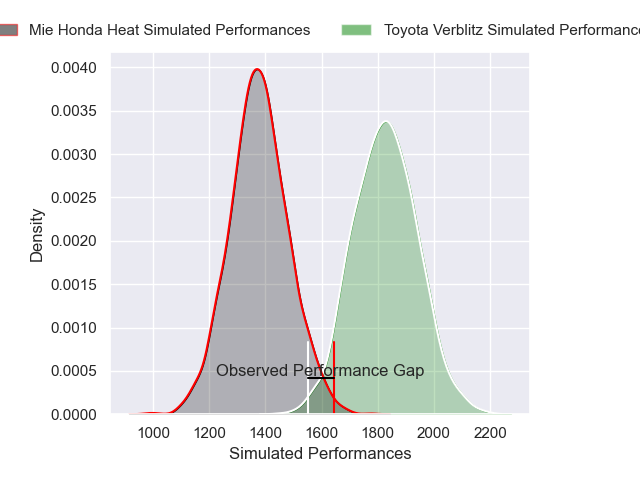
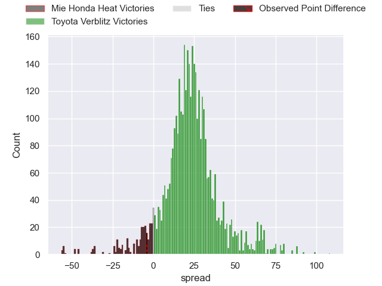
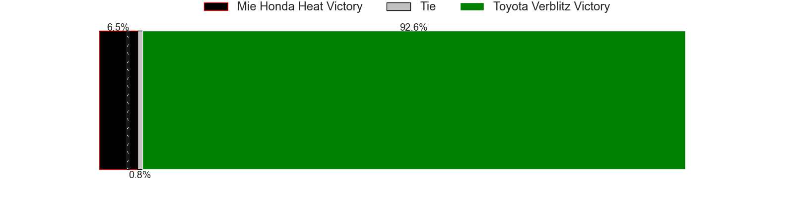
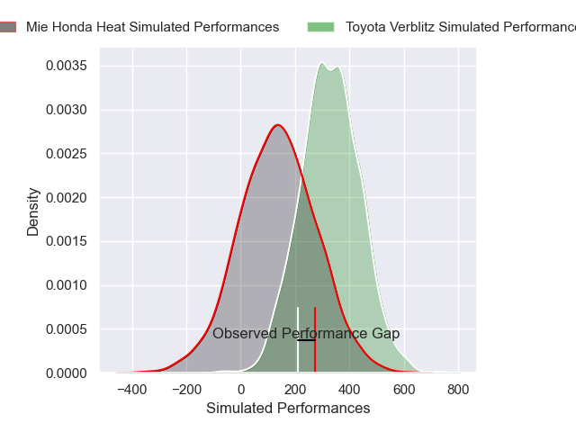
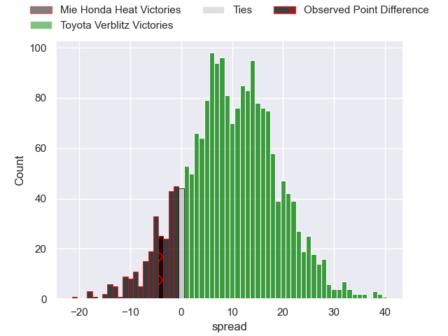
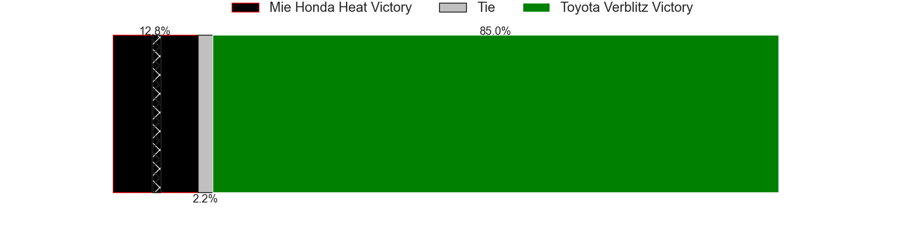

---  
layout: page  
title: Mie Honda Heat at Toyota Verblitz; 21-17  
date: 2024-12-28 18:00:00 -0500  
categories: "Japan Rugby League One 2024" match review  
---
# Mie Honda Heat at Toyota Verblitz; 21-17

# Club Level Predictions

The first set of predictions treats a club as the smallest object, as the club develops its members, organizes a gameplan, and deploys its players as needed for each match. This club model has a prediction of 0.919, which translates to predicting Toyota Verblitz to win by 22.2.

Our Over/Under is 62.5 - and combined with the spread above, we have a predicted scoreline of 20 to 43

Each club has a rating and a rating deviation (similar to a Glicko rating), and expected performances can be generated. This allows for simulated matches and spreads like the ones below.
## Projected Performances - Club Model

## Projected Spreads - Club Model

## Projected Results - Club Model

# Player Level Predictions

Treating teams instead as an entity made up of the currently active players, I have ratings for each player in an altogether different system. These can be combined to form team ratings once teamsheets are announced, weighting starters a bit higher than the reserves. After the match is played, players can be weighted by their minutes on the field, allowing for an accurate measure of the team's composition. With these compiled team ratings, we can make predictions, measure inaccuracy, and update the individual player ratings.
## Prediction without Player Minutes: Toyota Verblitz by 15.8

Toyota Verblitz by 11.4 on a neutral pitch

## Projected Performances - Player Model

## Projected Spreads - Player Model

## Projected Results - Player Model

|   Away Minutes | Away Player            |   Away Percentile |   Number |   Home Percentile | Home Player         |   Home Minutes |
|---------------:|:-----------------------|------------------:|---------:|------------------:|:--------------------|---------------:|
|             19 | Tatsuhiko Tsurukawa    |              9.73 |        1 |             85.81 | Shogo Miura         |             64 |
|             80 | Koki Hida              |             50.63 |        2 |             94.46 | Yoshikatsu Hikosaka |             17 |
|             23 | Taiki Yoshioka         |             17.06 |        3 |             80.41 | Genki Sudo          |              5 |
|             80 | Ryoma Nishimura        |             87.02 |        4 |             54.88 | Josh Dickson        |             63 |
|             23 | Franco Mostert         |             92.86 |        5 |             71.43 | Daichi Akiyama      |             61 |
|             23 | Tevita Tupou           |             72.93 |        6 |             89.24 | Isaiah Mapusua      |             29 |
|              4 | Ryota Kobayashi        |              9.65 |        7 |             36.55 | Kosei Miki          |             61 |
|             23 | Pablo Matera           |             72.03 |        8 |             51.32 | Kazuki Himeno       |             13 |
|             80 | Taichi Takenaka        |             27.38 |        9 |             96.94 | Aaron Smith         |             23 |
|             80 | Hayata Nakao           |             78.16 |       10 |             97.39 | Rikiya Matsuda      |             23 |
|             53 | Tevita Li              |             92.62 |       11 |             81.43 | Viliame Tuidraki    |             80 |
|             80 | Fraser Quirk           |              5.84 |       12 |             80.3  | Nicholas McCurran   |             61 |
|             80 | Jonathan Faauli        |             83.76 |       13 |              1.09 | Siosaia Fifita      |             57 |
|             80 | Larry Steven Sulunga   |             69.54 |       14 |             86.56 | Taichi Takahashi    |             80 |
|             80 | FC du Plessis          |             59.47 |       15 |             84.09 | Tiaan Falcon        |             61 |
|             69 | Mark Abbott            |             25.44 |       16 |             50.3  | Joseph Manu         |             75 |
|             80 | Feinga Kihe Lotu Fakai |            nan    |       17 |             91.46 | Richie Gray         |             16 |
|             51 | Ikuma Yamada           |            nan    |       18 |             31.4  | Kaito Shigeno       |             51 |
|             80 | Kanato Hirano          |            nan    |       19 |            nan    | Shunsuke Asaoka     |             80 |
|             80 | Manu Vunipola          |             35.27 |       20 |            nan    | Lautaimi Fetuani    |             29 |
|             80 | Waimana Kapa           |             24.77 |       21 |             64.57 | Shuhei Yamaguchi    |             19 |
|             80 | Azuma Doei             |            nan    |       22 |             42.5  | Ryunosuke Momoji    |             19 |
|            nan | nan                    |            nan    |       23 |             80.54 | Ryusei Kato         |             19 |

