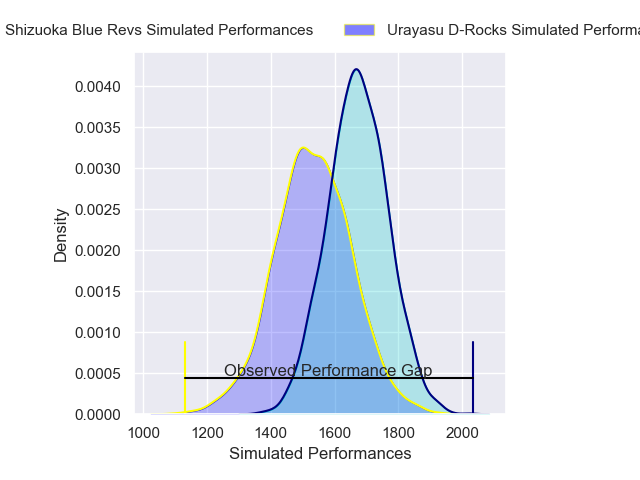
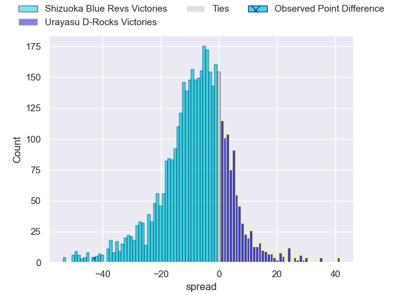
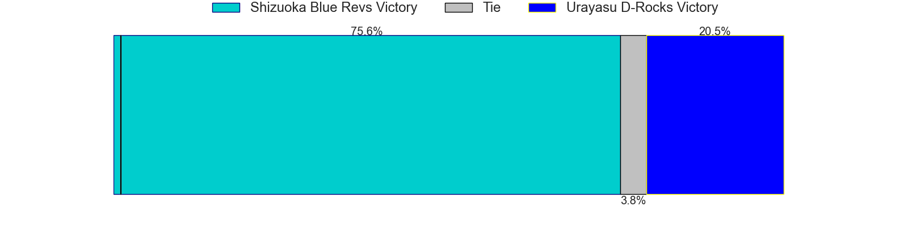
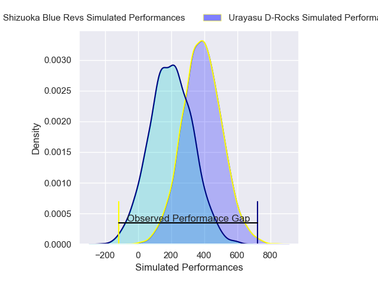
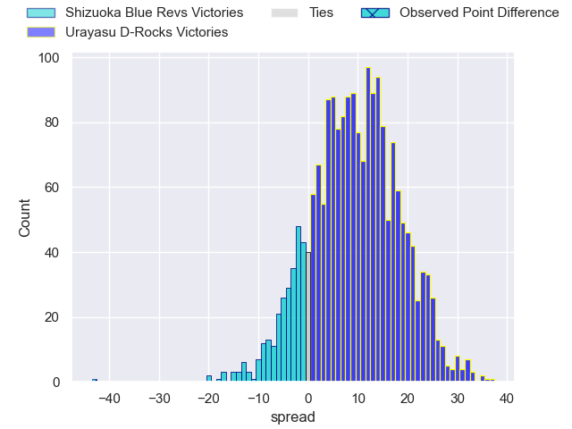
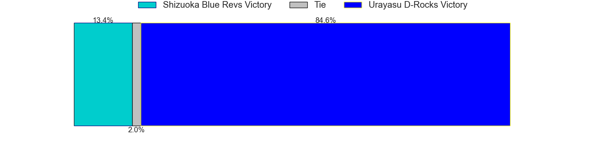

---  
layout: page  
title: Shizuoka Blue Revs at Urayasu D-Rocks; 62-19  
date: 2024-12-28 18:00:00 -0500  
categories: "Japan Rugby League One 2024" match review  
---
# Shizuoka Blue Revs at Urayasu D-Rocks; 62-19

# Club Level Predictions

The first set of predictions treats a club as the smallest object, as the club develops its members, organizes a gameplan, and deploys its players as needed for each match. This club model has a prediction of 0.318, which translates to predicting Shizuoka Blue Revs to win by 6.9.

Our Over/Under is 53.5 - and combined with the spread above, we have a predicted scoreline of 30 to 23

Each club has a rating and a rating deviation (similar to a Glicko rating), and expected performances can be generated. This allows for simulated matches and spreads like the ones below.
## Projected Performances - Club Model

## Projected Spreads - Club Model

## Projected Results - Club Model

# Player Level Predictions

Treating teams instead as an entity made up of the currently active players, I have ratings for each player in an altogether different system. These can be combined to form team ratings once teamsheets are announced, weighting starters a bit higher than the reserves. After the match is played, players can be weighted by their minutes on the field, allowing for an accurate measure of the team's composition. With these compiled team ratings, we can make predictions, measure inaccuracy, and update the individual player ratings.
## Prediction without Player Minutes: Urayasu D-Rocks by 6.9

Urayasu D-Rocks by 2.7 on a neutral pitch

## Projected Performances - Player Model

## Projected Spreads - Player Model

## Projected Results - Player Model

|   Away Minutes | Away Player             |   Away Percentile |   Number |   Home Percentile | Home Player          |   Home Minutes |
|---------------:|:------------------------|------------------:|---------:|------------------:|:---------------------|---------------:|
|             80 | Kenta Yamashita         |             63.49 |        1 |             13.19 | Hidetomo Nabeshima   |             53 |
|              5 | Takeshi Hino            |             95.57 |        2 |             44.62 | Ryuji Fujimura       |             31 |
|             69 | Heiichiro Ito           |             85.48 |        3 |             45.64 | Shuhei Takeuchi      |             27 |
|             80 | Yuya Odo                |             94.77 |        4 |             41.29 | Uwe Helu             |             80 |
|             60 | Murray Douglas          |             92.25 |        5 |             72.74 | Lourens Erasmus      |             34 |
|             40 | Simon Miller            |             33.22 |        6 |             45.18 | Hendrik Tui          |             34 |
|             80 | Shoji Takuma            |             76.09 |        7 |             65.24 | Shinya Osugi         |             11 |
|             47 | Kwagga Smith            |             71.11 |        8 |             58.97 | Jasper Wiese         |             40 |
|             23 | Shuntaro Kitamura       |             54.59 |        9 |             58.13 | Ren Iinuma           |             40 |
|             80 | Kenta Iemura            |             75.75 |       10 |             72.34 | Luteru Laulala       |             62 |
|             11 | Malo Tuitama            |             83.92 |       11 |             36.13 | Caleb Cavubati       |             27 |
|             57 | Viliami Tahitu'a        |             79.6  |       12 |             95.05 | Samu Kerevi          |             80 |
|             80 | Sylvian Mahuza          |             69.21 |       13 |             44.55 | Shane Gates          |             40 |
|             40 | Damian Markus           |             68.84 |       14 |             84.46 | Takuhei Yasuda       |             80 |
|             80 | Sam Greene              |             11.74 |       15 |             20.27 | Israel Folau         |             30 |
|             80 | Takayoshi Mohara        |             21.85 |       16 |            nan    | Sekonaia Pole        |             80 |
|             53 | Sean Vete               |             55.1  |       17 |              4.35 | Norifumi Hashimoto   |             30 |
|             49 | Richmond Tongatama      |            nan    |       18 |             93.42 | Brody MacAskill      |             75 |
|             53 | Eishin Kuwano           |             87.63 |       19 |             79.93 | Tom Parsons          |             80 |
|             49 | Vueti Tupou             |             43.04 |       20 |             29.53 | Kai Ishii            |             59 |
|             16 | Valynce Te Whare-Crosby |            nan    |       21 |             61.43 | Gakuto Ishida        |             53 |
|             20 | Kodai Okazaki           |             41.71 |       22 |            nan    | Junichiro Matsushita |             80 |
|             80 | Richard Goh Jones       |             46.54 |       23 |            nan    | Tana Tuhakaraina     |             80 |

