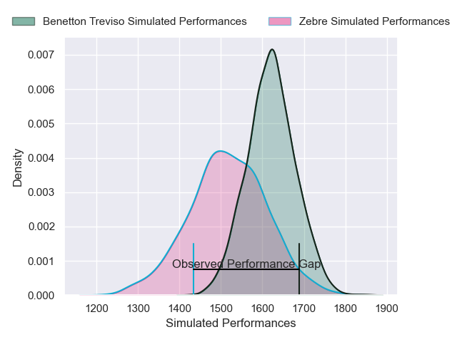
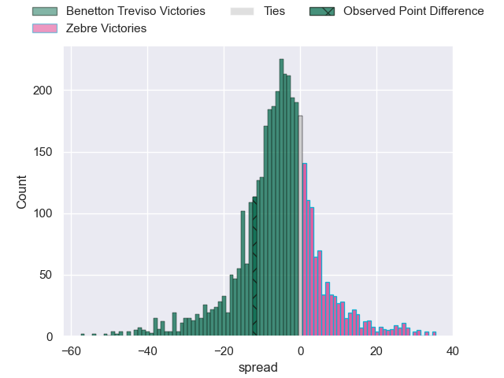
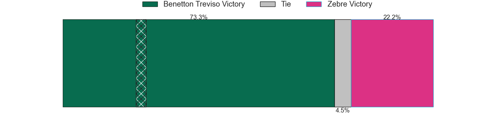
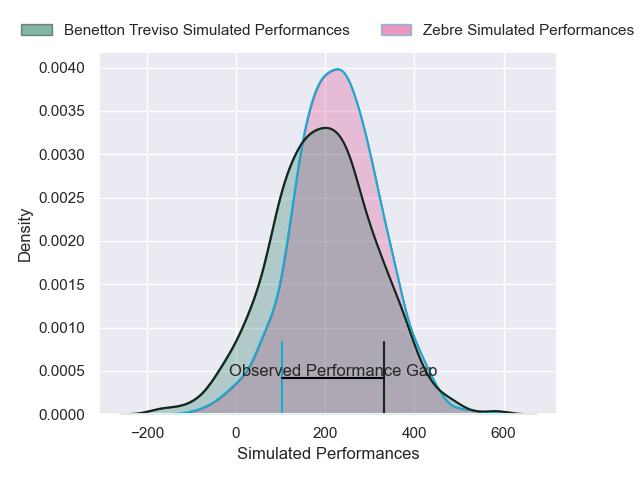
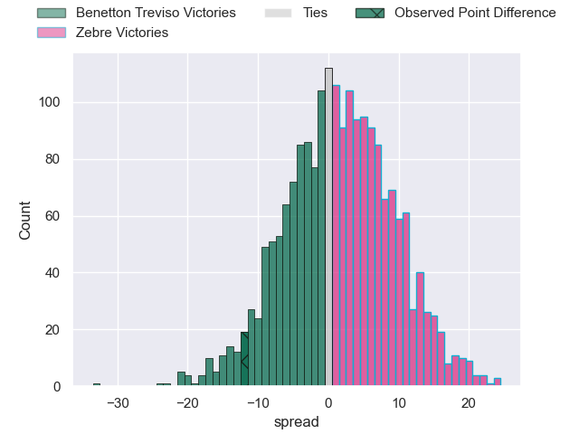

---  
layout: page  
title: Benetton Treviso at Zebre; 24-12  
date: 2024-12-28 18:00:00 -0500  
categories: "United Rugby Championship 2024" match review  
---
# Benetton Treviso at Zebre; 24-12

# Club Level Predictions

The first set of predictions treats a club as the smallest object, as the club develops its members, organizes a gameplan, and deploys its players as needed for each match. This club model has a prediction of 0.355, which translates to predicting Benetton Treviso to win by 5.3.

Our Over/Under is 40.5 - and combined with the spread above, we have a predicted scoreline of 23 to 17

Each club has a rating and a rating deviation (similar to a Glicko rating), and expected performances can be generated. This allows for simulated matches and spreads like the ones below.
## Projected Performances - Club Model

## Projected Spreads - Club Model

## Projected Results - Club Model

# Player Level Predictions

Treating teams instead as an entity made up of the currently active players, I have ratings for each player in an altogether different system. These can be combined to form team ratings once teamsheets are announced, weighting starters a bit higher than the reserves. After the match is played, players can be weighted by their minutes on the field, allowing for an accurate measure of the team's composition. With these compiled team ratings, we can make predictions, measure inaccuracy, and update the individual player ratings.
## Prediction without Player Minutes: Benetton Treviso by 2.6

Benetton Treviso by 8.8 on a neutral pitch

## Projected Performances - Player Model

## Projected Spreads - Player Model

## Projected Results - Player Model

|   Away Minutes | Away Player        |   Away Percentile |   Number |   Home Percentile | Home Player            |   Home Minutes |
|---------------:|:-------------------|------------------:|---------:|------------------:|:-----------------------|---------------:|
|             30 | Thomas Gallo       |             89.21 |        1 |             40.84 | Danilo Fischetti       |             28 |
|             80 | Siua Maile         |              0.63 |        2 |             58.07 | Tommaso Di Bartolomeo  |             19 |
|             68 | Giosue Zilocchi    |             65.09 |        3 |             14.86 | Ion Neculai            |             19 |
|             80 | Niccolo Cannone    |             70.03 |        4 |              9.76 | Leonard Krumov         |             22 |
|             13 | Federico Ruzza     |             92.68 |        5 |             34.58 | Andrea Zambonin        |             80 |
|             80 | Alessandro Izekor  |             54.31 |        6 |             28.86 | Giacomo Ferrari        |             80 |
|             58 | Manuel Zuliani     |             54.48 |        7 |             26.81 | Bautista Stavile       |             29 |
|             30 | Michele Lamaro     |             68.34 |        8 |              9.63 | Giovanni Licata        |             51 |
|             12 | Alessandro Garbisi |             43.16 |        9 |             85.02 | Gonzalo Garcia         |             80 |
|             12 | Tomas Albornoz     |             86.57 |       10 |             16.23 | Giacomo Da Re          |             25 |
|             48 | Onisi Ratave       |             57.58 |       11 |             22.14 | Simone Gesi            |             19 |
|             80 | Malakai Fekitoa    |             79.5  |       12 |             19.9  | Fetuli Paea            |             27 |
|             14 | Tommaso Menoncello |             88.22 |       13 |             70.5  | Giulio Bertaccini      |             27 |
|             29 | Louis Lynagh       |             44.76 |       14 |             34.81 | Scott Gregory          |             27 |
|             28 | Rhyno Smith        |             88.64 |       15 |             94.13 | Geronimo Prisciantelli |             23 |
|             13 | Mirco Spagnolo     |             28.38 |       16 |             19.12 | Muhamed Hasa           |             23 |
|             28 | Lorenzo Cannone    |             67.02 |       17 |             93.12 | Matteo Canali          |             19 |
|             61 | Simone Ferrari     |             84.48 |       18 |              8.14 | Giovanni Montemauri    |             61 |
|             48 | Riccardo Favretto  |             17.68 |       19 |             75.15 | Samuele Locatelli      |             80 |
|             32 | Agustin Creevy     |             93.83 |       20 |             83.07 | Luca Bigi              |             80 |
|             58 | Juan Ignacio Brex  |             92.38 |       21 |             74.75 | Luca Rizzoli           |             24 |
|             80 | Andy Uren          |             11.76 |       22 |             31.08 | Thomas Dominguez       |             43 |
|             80 | Leonardo Marin     |             57.39 |       23 |             29.9  | Filippo Drago          |             80 |

