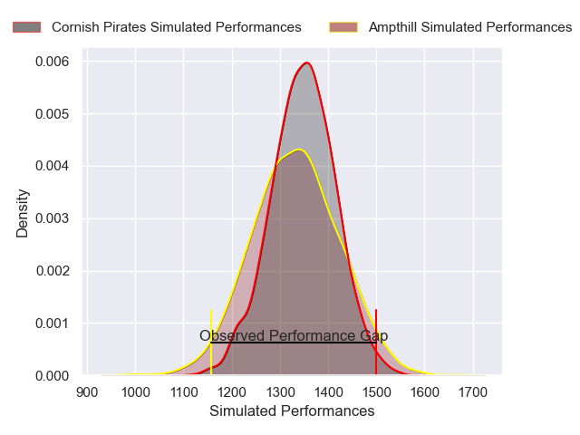
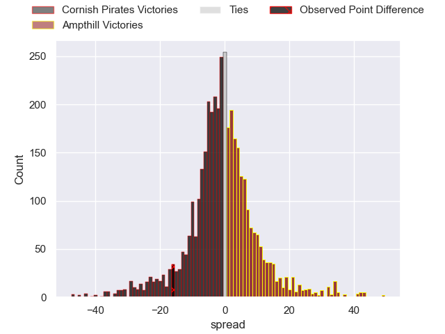
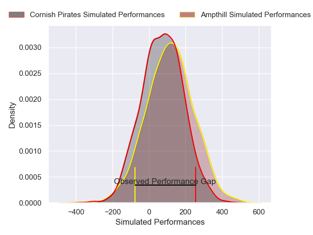
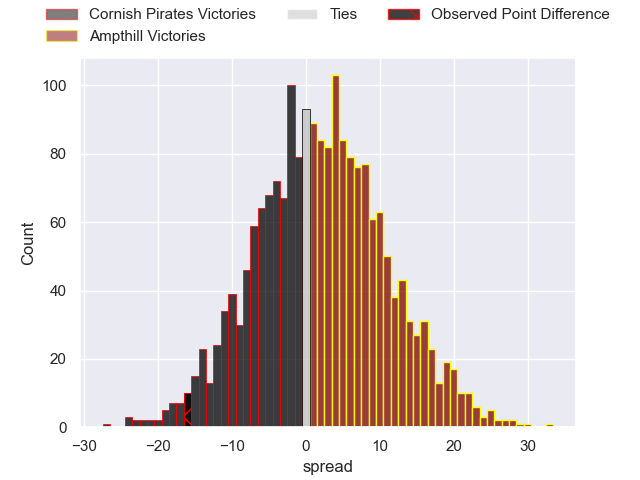

---  
layout: page  
title: Cornish Pirates at Ampthill; 33-17  
date: 2024-12-29 18:00:00 -0500  
categories: "RFU Championship 2024" match review  
---
# Cornish Pirates at Ampthill; 33-17

# Club Level Predictions

The first set of predictions treats a club as the smallest object, as the club develops its members, organizes a gameplan, and deploys its players as needed for each match. This club model has a prediction of 0.478, which translates to predicting Cornish Pirates to win by 0.8.

Our Over/Under is 55.5 - and combined with the spread above, we have a predicted scoreline of 28 to 27

Each club has a rating and a rating deviation (similar to a Glicko rating), and expected performances can be generated. This allows for simulated matches and spreads like the ones below.
## Projected Performances - Club Model

## Projected Spreads - Club Model

## Projected Results - Club Model

# Player Level Predictions

Treating teams instead as an entity made up of the currently active players, I have ratings for each player in an altogether different system. These can be combined to form team ratings once teamsheets are announced, weighting starters a bit higher than the reserves. After the match is played, players can be weighted by their minutes on the field, allowing for an accurate measure of the team's composition. With these compiled team ratings, we can make predictions, measure inaccuracy, and update the individual player ratings.
## Prediction without Player Minutes: Cornish Pirates by 0.7

Cornish Pirates by 4.1 on a neutral pitch

## Projected Performances - Player Model

## Projected Spreads - Player Model

## Projected Results - Player Model

|   Away Minutes | Away Player       |   Away Percentile |   Number |   Home Percentile | Home Player                 |   Home Minutes |
|---------------:|:------------------|------------------:|---------:|------------------:|:----------------------------|---------------:|
|             33 | Billy Young       |             39.57 |        1 |             37.18 | Harrison Courtney           |             40 |
|             80 | Harry Hocking     |             85.76 |        2 |             16.61 | Samson Adejimi              |             24 |
|             40 | Alfie Petch       |             14.12 |        3 |             27.51 | Harvey Beaton               |             24 |
|             63 | Josh King         |             78.75 |        4 |             27.79 | Kaden Pearce-Paul           |             80 |
|             17 | Lewis Pearson     |             92.6  |        5 |             29.62 | Max Eke                     |             80 |
|             24 | Martin Moloney    |             92.91 |        6 |             31.08 | Reggie Hammick              |             71 |
|             35 | Will Gibson       |             91.55 |        7 |             13.32 | Charles Rylands             |              7 |
|              9 | Hugh Bokenham     |             56.86 |        8 |              9.1  | Lekima Ravuvu               |             80 |
|              9 | Dan Hiscocks      |             76.01 |        9 |             61.35 | Charlie Bracken             |              9 |
|              8 | Bruce Houston     |             85.57 |       10 |             11.02 | Josh Barton                 |             40 |
|             80 | Will Trewin       |             89.04 |       11 |             18.41 | Sione Va'enuku              |             73 |
|             52 | Harry Yates       |             67.72 |       12 |             73.07 | Fraser James Kevin Strachan |             80 |
|             47 | Charlie McCaig    |             67.23 |       13 |             27.62 | Josh Hallett                |             80 |
|             80 | Arthur Relton     |             85.63 |       14 |             49.11 | Jack Bracken                |             80 |
|             67 | Iwan Price-Thomas |             33.33 |       15 |              8.71 | Oran McNulty                |             71 |
|             33 | Tomiwa Agbongbon  |             25.02 |       16 |             12.12 | Evan Mitchell               |             28 |
|             80 | Oisin Michel      |            nan    |       17 |             21.25 | Arthur Thomas               |             80 |
|             71 | Chester Ribbons   |             59.11 |       18 |             55.43 | Richard Barrington          |             63 |
|             80 | Sol Moody         |             13.29 |       19 |             56.17 | James Isaacs                |             80 |
|             33 | Robin Wedlake     |             80.26 |       20 |             14.52 | James Johnston              |             80 |
|             63 | Matt Cannon       |             47.56 |       21 |             19.04 | Mason Cullen                |             80 |
|             80 | Will Rigelsford   |            nan    |       22 |             23.48 | Karl Main                   |             80 |
|            nan | nan               |            nan    |       23 |             21.1  | Rory Morgan                 |             45 |

