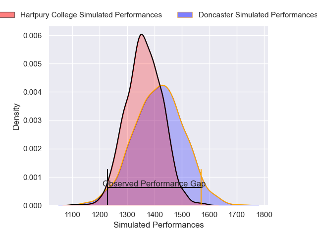
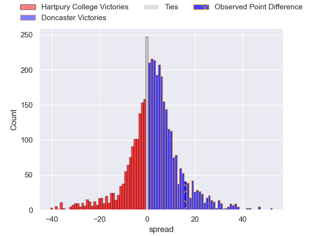
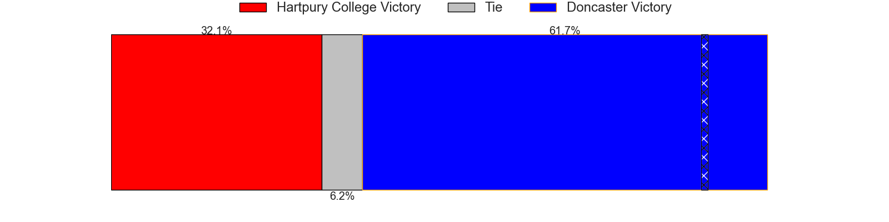
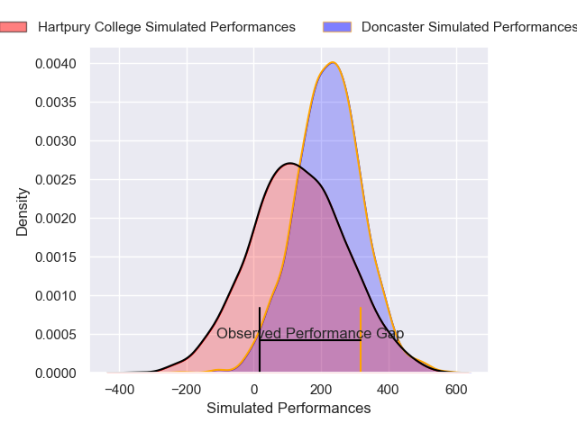
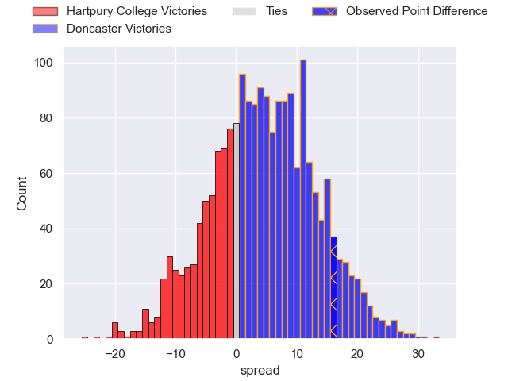
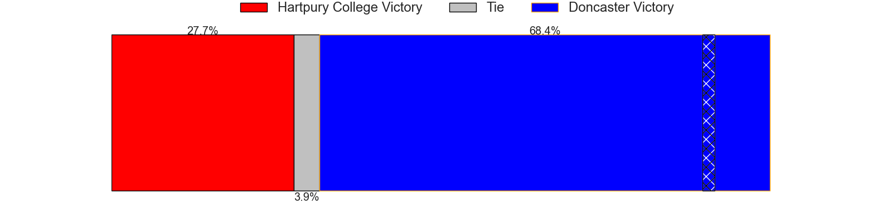

---  
layout: page  
title: Hartpury College at Doncaster; 22-38  
date: 2024-12-29 18:00:00 -0500  
categories: "RFU Championship 2024" match review  
---
# Hartpury College at Doncaster; 22-38

# Club Level Predictions

The first set of predictions treats a club as the smallest object, as the club develops its members, organizes a gameplan, and deploys its players as needed for each match. This club model has a prediction of 0.573, which translates to predicting Doncaster to win by 2.6.

Our Over/Under is 46.5 - and combined with the spread above, we have a predicted scoreline of 22 to 25

Each club has a rating and a rating deviation (similar to a Glicko rating), and expected performances can be generated. This allows for simulated matches and spreads like the ones below.
## Projected Performances - Club Model

## Projected Spreads - Club Model

## Projected Results - Club Model

# Player Level Predictions

Treating teams instead as an entity made up of the currently active players, I have ratings for each player in an altogether different system. These can be combined to form team ratings once teamsheets are announced, weighting starters a bit higher than the reserves. After the match is played, players can be weighted by their minutes on the field, allowing for an accurate measure of the team's composition. With these compiled team ratings, we can make predictions, measure inaccuracy, and update the individual player ratings.
## Prediction without Player Minutes: Doncaster by 2.3

Hartpury College by 2.4 on a neutral pitch

## Projected Performances - Player Model

## Projected Spreads - Player Model

## Projected Results - Player Model

|   Away Minutes | Away Player           |   Away Percentile |   Number |   Home Percentile | Home Player       |   Home Minutes |
|---------------:|:----------------------|------------------:|---------:|------------------:|:------------------|---------------:|
|             57 | Aristot Benz-Salomon  |             84.01 |        1 |             87.94 | Logovi'i Mulipola |             69 |
|             45 | William Crane         |             46.2  |        2 |             22.31 | Fred Davies       |             35 |
|             63 | Jonathan Benz-Salomon |             83.08 |        3 |             49.43 | Joe Jones         |             80 |
|             80 | Dale Lemon            |             68.99 |        4 |              4.09 | Ben Murphy        |             51 |
|             80 | Jack Rees Davies      |             64.11 |        5 |             42.6  | Adam Hopkinson    |             12 |
|             80 | Samuel Lewis          |             30.4  |        6 |              7.77 | Thom Smith        |              9 |
|             47 | Harry Short           |             80.87 |        7 |             45.69 | Rhys Tait         |             13 |
|             80 | Tom Cowan             |             60.29 |        8 |             49.74 | Arthur Green      |             13 |
|             52 | Michael Austin        |             67.47 |        9 |              4.83 | Ollie Fox         |             67 |
|             17 | Harry Bazalgette      |             86.77 |       10 |             92.59 | Russell Bennett   |             80 |
|             80 | Oliver Holliday       |             39.01 |       11 |             84.38 | Maliq Holden      |             71 |
|             17 | Robbie Smith          |             22.18 |       12 |              4.85 | Connor Edwards    |             11 |
|             49 | Josiah Edwards-Giraud |             53.37 |       13 |              2.38 | George Wacokecoke |              9 |
|             63 | Bradley Denty         |             78.09 |       14 |             23.47 | Jordan Olowofela  |             17 |
|             63 | Alex Forrester        |             28.03 |       15 |             98.67 | Telusa Veainu     |             28 |
|             69 | Cameron Cobbett       |             25    |       16 |             27.03 | Zach Kerr         |             17 |
|             80 | Jarrad Hayler         |             17.81 |       17 |             74.56 | Josh Williams     |             17 |
|             80 | James Gibbons         |             66.96 |       18 |             54.88 | Morgan Strong     |             68 |
|             80 | Alex Gibson           |            nan    |       19 |             34.78 | Andrew Turner     |             80 |
|             63 | Rory Taylor           |             78.96 |       20 |             72.3  | Alex Dolly        |             47 |
|             80 | Matty Jones           |              9.02 |       21 |            nan    | Calvin Mitchell   |             80 |
|             47 | Ethan Hunt            |             66.93 |       22 |            nan    | nan               |            nan |
|             63 | Wilf McCarthy         |            nan    |       23 |            nan    | nan               |            nan |

