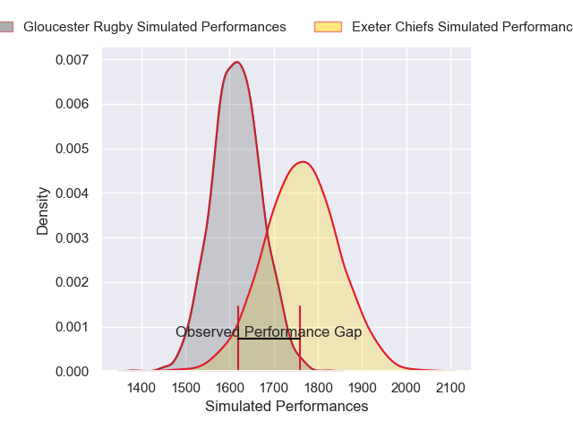
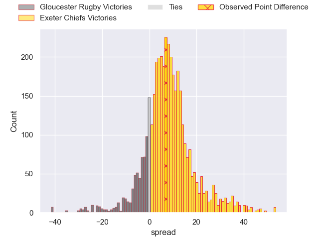
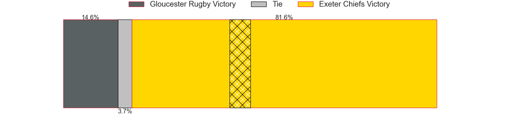
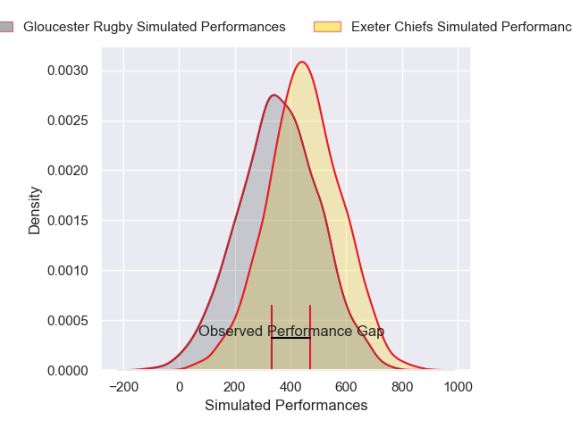
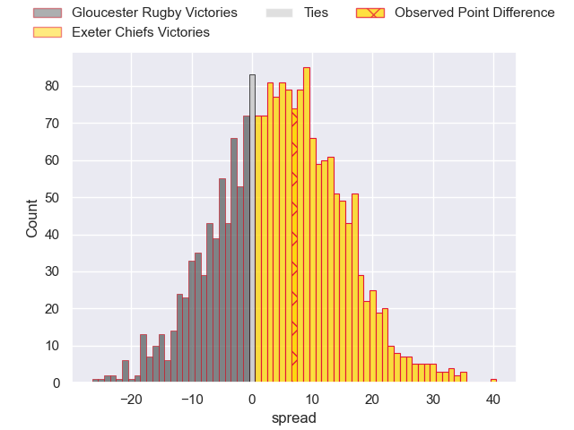

---  
layout: page  
title: Gloucester Rugby at Exeter Chiefs; 15-22  
date: 2024-12-29 18:00:00 -0500  
categories: "Gallagher Premiership 2024" match review  
---
# Gloucester Rugby at Exeter Chiefs; 15-22

# Club Level Predictions

The first set of predictions treats a club as the smallest object, as the club develops its members, organizes a gameplan, and deploys its players as needed for each match. This club model has a prediction of 0.697, which translates to predicting Exeter Chiefs to win by 7.3.

Our Over/Under is 62.5 - and combined with the spread above, we have a predicted scoreline of 28 to 35

Each club has a rating and a rating deviation (similar to a Glicko rating), and expected performances can be generated. This allows for simulated matches and spreads like the ones below.
## Projected Performances - Club Model

## Projected Spreads - Club Model

## Projected Results - Club Model

# Player Level Predictions

Treating teams instead as an entity made up of the currently active players, I have ratings for each player in an altogether different system. These can be combined to form team ratings once teamsheets are announced, weighting starters a bit higher than the reserves. After the match is played, players can be weighted by their minutes on the field, allowing for an accurate measure of the team's composition. With these compiled team ratings, we can make predictions, measure inaccuracy, and update the individual player ratings.
## Prediction without Player Minutes: Exeter Chiefs by 5.8

Gloucester Rugby by 2.2 on a neutral pitch

## Projected Performances - Player Model

## Projected Spreads - Player Model

## Projected Results - Player Model

|   Away Minutes | Away Player         |   Away Percentile |   Number |   Home Percentile | Home Player          |   Home Minutes |
|---------------:|:--------------------|------------------:|---------:|------------------:|:---------------------|---------------:|
|             80 | Mayco Vivas         |             11.26 |        1 |             82.54 | Scott Sio            |             51 |
|             47 | Sebastian Blake     |             72.94 |        2 |             87.66 | Dan Frost            |             80 |
|              7 | Kirill Gotovtsev    |             80.88 |        3 |              8.59 | Marcus Street        |             80 |
|             80 | Freddie Thomas      |             51.74 |        4 |             84.67 | Dafydd Jenkins       |             40 |
|             80 | Matias Alemanno     |             89.02 |        5 |              1.92 | Richard Capstick     |             47 |
|             78 | Jack Clement        |             31.51 |        6 |              5.55 | Ethan Roots          |             51 |
|             45 | Lewis Ludlow        |             26.47 |        7 |             90.18 | Jacques Vermeulen    |             80 |
|             11 | Ruan Ackermann      |             58.18 |        8 |             58.71 | Greg Fisilau         |             47 |
|             64 | Tomos Williams      |             81.8  |        9 |             91.63 | Stu Townsend         |             80 |
|             80 | Gareth Anscombe     |             78.36 |       10 |             94.19 | Henry Slade          |             49 |
|             68 | Josh Hathaway       |             82.44 |       11 |             92.07 | Tom Wyatt            |             80 |
|             80 | Sebastien Atkinson  |             20.69 |       12 |             76.83 | Tamati Tua           |             80 |
|             51 | Max Llewellyn       |             81.78 |       13 |             19.01 | Ben Hammersley       |             26 |
|             69 | Christian Wade      |             92.39 |       14 |             54.39 | Olly Woodburn        |              9 |
|             59 | Santiago Carreras   |             87.12 |       15 |              1.52 | Josh Hodge           |             80 |
|             80 | Jamal Ford-Robinson |             19.85 |       16 |             67.69 | Will Goodrick-Clarke |             26 |
|             68 | Jack Singleton      |             94.15 |       17 |             86.81 | Josh Iosefa-Scott    |             51 |
|             68 | Ciaran Knight       |             18.12 |       18 |            nan    | Jack Innard          |             54 |
|             80 | Cameron Jordan      |             78.66 |       19 |             64.9  | Rusiate Tuima        |             54 |
|             40 | Albert Tuisue       |             70.84 |       20 |             60.98 | Franco Molina        |             71 |
|             40 | Albert Tuisue       |             70.84 |       20 |             60.98 | Franco Molina        |             65 |
|             80 | Caolan Englefield   |             79.23 |       21 |             85.35 | Tom Cairns           |             63 |
|             80 | Chris Harris        |             12.18 |       22 |             26.05 | Will Haydon-Wood     |             80 |
|             55 | George Barton       |             64.33 |       23 |             41.98 | Zack Wimbush         |             54 |

