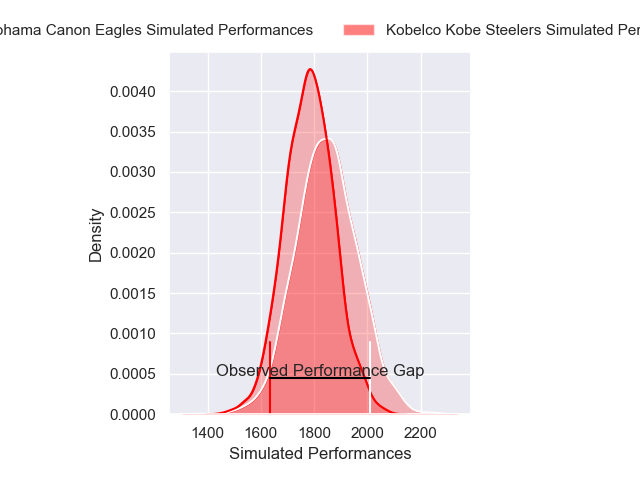
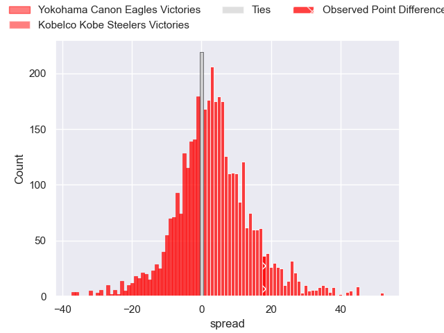
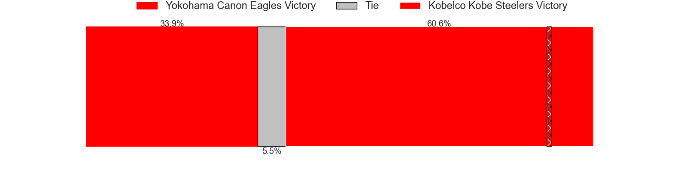
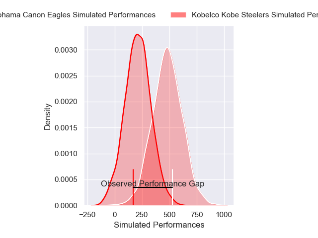
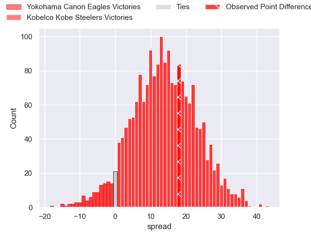
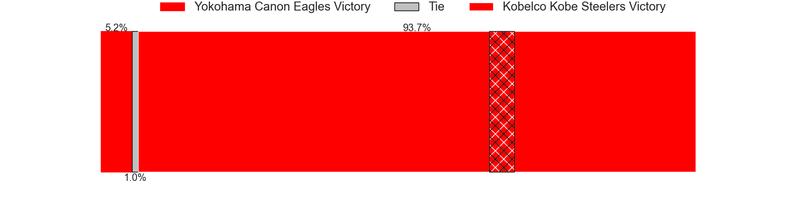

---  
layout: page  
title: Yokohama Canon Eagles at Kobelco Kobe Steelers; 18-36  
date: 2024-12-29 18:00:00 -0500  
categories: "Japan Rugby League One 2024" match review  
---
# Yokohama Canon Eagles at Kobelco Kobe Steelers; 18-36

# Club Level Predictions

The first set of predictions treats a club as the smallest object, as the club develops its members, organizes a gameplan, and deploys its players as needed for each match. This club model has a prediction of 0.584, which translates to predicting Kobelco Kobe Steelers to win by 3.1.

Our Over/Under is 57.5 - and combined with the spread above, we have a predicted scoreline of 27 to 30

Each club has a rating and a rating deviation (similar to a Glicko rating), and expected performances can be generated. This allows for simulated matches and spreads like the ones below.
## Projected Performances - Club Model

## Projected Spreads - Club Model

## Projected Results - Club Model

# Player Level Predictions

Treating teams instead as an entity made up of the currently active players, I have ratings for each player in an altogether different system. These can be combined to form team ratings once teamsheets are announced, weighting starters a bit higher than the reserves. After the match is played, players can be weighted by their minutes on the field, allowing for an accurate measure of the team's composition. With these compiled team ratings, we can make predictions, measure inaccuracy, and update the individual player ratings.
## Prediction without Player Minutes: Yokohama Canon Eagles by 1.0

Yokohama Canon Eagles by 5.7 on a neutral pitch

## Projected Performances - Player Model

## Projected Spreads - Player Model

## Projected Results - Player Model

|   Away Minutes | Away Player       |   Away Percentile |   Number |   Home Percentile | Home Player          |   Home Minutes |
|---------------:|:------------------|------------------:|---------:|------------------:|:---------------------|---------------:|
|             40 | Takato Okabe      |             89.07 |        1 |             51.17 | Shigure Takao        |              2 |
|             80 | Shunta Nakamura   |             88.29 |        2 |             99.68 | George Turner        |             80 |
|             80 | Tatsuro Sugimoto  |             10.53 |        3 |             42.97 | Sho Maeda            |             80 |
|             80 | Lekima Nasamila   |             31.53 |        4 |             80.92 | Gerard Cowley-Tuioti |             65 |
|             65 | Matt Philip       |             38.33 |        5 |             99.83 | Brodie Retallick     |             80 |
|             16 | Billy Harmon      |             81.55 |        6 |             80.36 | Tiennan Costley      |             80 |
|              9 | Naoto Shimada     |             71.9  |        7 |             28.1  | Willie Potgieter     |             56 |
|             15 | Sione Halasili    |             52.9  |        8 |             35.49 | Amanaki Saumaki      |             56 |
|             15 | Faf de Klerk      |             94.04 |        9 |             90.5  | Atsushi Hiwasa       |             56 |
|             11 | Yu Tamura         |             81.76 |       10 |              3.61 | Seungsin Lee         |             80 |
|             23 | Viliame Takayawa  |             91.76 |       11 |             73.35 | Kanta Matsunaga      |             57 |
|             11 | Yusuke Kajimura   |             94.85 |       12 |             45.64 | Timothy Lafaele      |             17 |
|             15 | Jesse Kriel       |             98.81 |       13 |             66.83 | Michael Little       |             80 |
|             23 | Kippei Ishida     |             43.28 |       14 |             25.64 | Ataata Moeakiola     |             63 |
|             11 | Jumpei Ogura      |             97.16 |       15 |             61.74 | Ryohei Yamanaka      |              9 |
|             57 | Masato Furukawa   |             67.12 |       16 |             76.22 | Kauvaka Kaivelata    |             80 |
|             80 | Yusuke Niwai      |             81.65 |       17 |             84.49 | Takuya Kitade        |             71 |
|             57 | Kafazumi Yamasuga |             64.25 |       18 |             88.87 | Hiroshi Yamashita    |             80 |
|             69 | Cormac Daly       |             57.32 |       19 |             57.64 | Takara Imamura       |             65 |
|             80 | Chihito Matsui    |             70.86 |       20 |             85.35 | Ngani Laumape        |             80 |
|             69 | Sioeli Vakalahi   |             83.01 |       21 |             90.29 | Rakuhei Yamashita    |             63 |
|             64 | Shouta Matsuoka   |            nan    |       22 |             26.25 | Daiki Nakajima       |             69 |
|             63 | Ryo Tabata        |             31.58 |       23 |            nan    | Sosefo Fakatava      |             80 |

