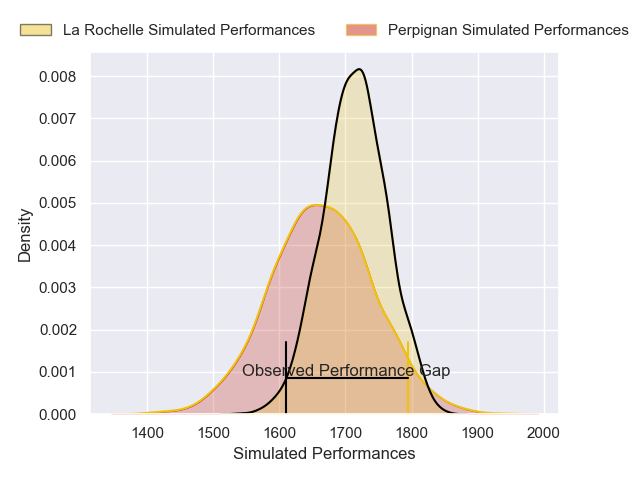
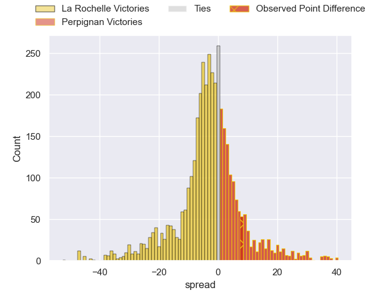
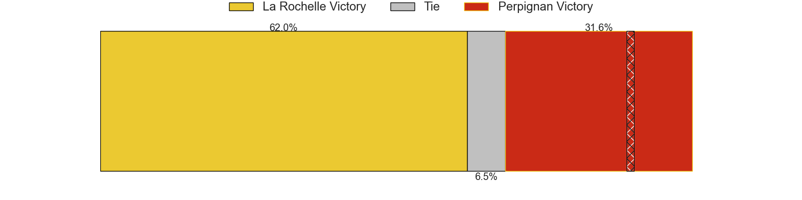
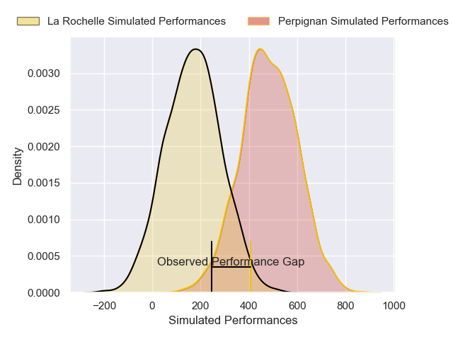
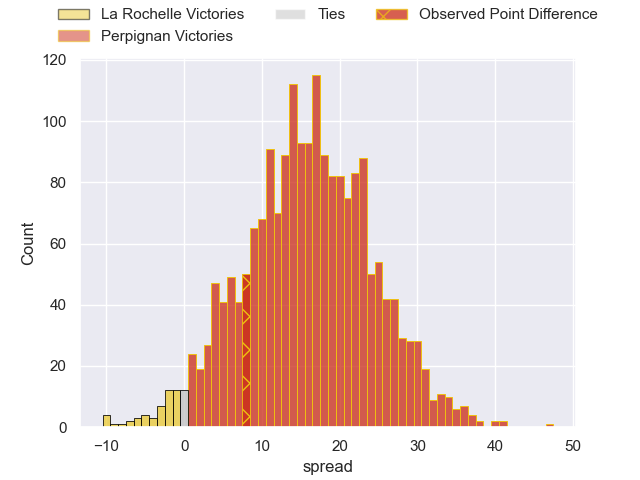
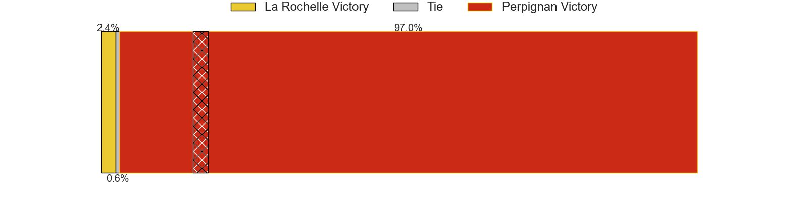

---  
layout: page  
title: La Rochelle at Perpignan; 13-21  
date: 2024-12-29 18:00:00 -0500  
categories: "Top 14 Orange 2024" match review  
---
# La Rochelle at Perpignan; 13-21

# Club Level Predictions

The first set of predictions treats a club as the smallest object, as the club develops its members, organizes a gameplan, and deploys its players as needed for each match. This club model has a prediction of 0.432, which translates to predicting La Rochelle to win by 2.4.

Our Over/Under is 40.5 - and combined with the spread above, we have a predicted scoreline of 22 to 19

Each club has a rating and a rating deviation (similar to a Glicko rating), and expected performances can be generated. This allows for simulated matches and spreads like the ones below.
## Projected Performances - Club Model

## Projected Spreads - Club Model

## Projected Results - Club Model

# Player Level Predictions

Treating teams instead as an entity made up of the currently active players, I have ratings for each player in an altogether different system. These can be combined to form team ratings once teamsheets are announced, weighting starters a bit higher than the reserves. After the match is played, players can be weighted by their minutes on the field, allowing for an accurate measure of the team's composition. With these compiled team ratings, we can make predictions, measure inaccuracy, and update the individual player ratings.
## Prediction without Player Minutes: Perpignan by 10.1

La Rochelle by 4.8 on a neutral pitch

## Projected Performances - Player Model

## Projected Spreads - Player Model

## Projected Results - Player Model

|   Away Minutes | Away Player         |   Away Percentile |   Number |   Home Percentile | Home Player           |   Home Minutes |
|---------------:|:--------------------|------------------:|---------:|------------------:|:----------------------|---------------:|
|             19 | Thierry Paiva       |             69.62 |        1 |             74.02 | Giorgi Beria          |             80 |
|             80 | Quentin Lespiaucq   |             73.58 |        2 |             96.52 | Ignacio Ruiz          |             80 |
|             80 | Joel Sclavi         |             89.81 |        3 |             10.79 | Kieran Brookes        |             41 |
|             23 | Thomas Lavault      |             89.9  |        4 |              6.45 | Tristan Labouteley    |             21 |
|             12 | Kane Douglas        |             86.32 |        5 |             22.91 | Adrien Warion         |             80 |
|             55 | Judicael Cancoriet  |             15.46 |        6 |             24.85 | Lucas Velarte         |             39 |
|             73 | Levani Botia        |             98.29 |        7 |             37.32 | Max Hicks             |             54 |
|             12 | Paul Boudehent      |              2.77 |        8 |             64.25 | Joaquin Oviedo        |             80 |
|             26 | Thomas Berjon       |             94.2  |        9 |             40.26 | Tom Ecochard          |             41 |
|             32 | Antoine Hastoy      |             74.75 |       10 |             57.92 | Tommaso Allan         |             80 |
|             16 | Jules Favre         |             90.21 |       11 |             10.96 | Ali Crossdale         |             12 |
|             21 | Jonathan Danty      |             86.73 |       12 |             97.92 | Jeronimo de la Fuente |             40 |
|             80 | Simeli Daunivucu    |             54.85 |       13 |              3.07 | Alivereti Duguivalu   |             61 |
|             80 | Suliasi Vunivalu    |             38.15 |       14 |             63.48 | Tavite Veredamu       |             59 |
|              2 | Brice Dulin         |             98.86 |       15 |             71.02 | Louis Dupichot        |             80 |
|             54 | Hoani Bosmorin      |             65.42 |       16 |             88.24 | James Hall            |             59 |
|             54 | Aleksandre Kuntelia |             25.25 |       17 |             46.52 | Seilala Lam           |             39 |
|             54 | Teddy Thomas        |             88.71 |       18 |             39.24 | Pietro Ceccarelli     |             80 |
|             48 | Reda Wardi          |             88.21 |       19 |             32.28 | Apisai Naqalevu       |             26 |
|             54 | Matthias Haddad     |             84.03 |       20 |             63.19 | So'otala Fa'aso'o     |             74 |
|             80 | Hugo Reus           |             68.94 |       21 |             17.32 | Bruce Devaux          |             54 |
|              6 | Ultan Dillane       |             82.93 |       22 |             83.77 | Lucas Bachelier       |             25 |
|             80 | Nika Sutidze        |             44.3  |       23 |            nan    | nan                   |            nan |

