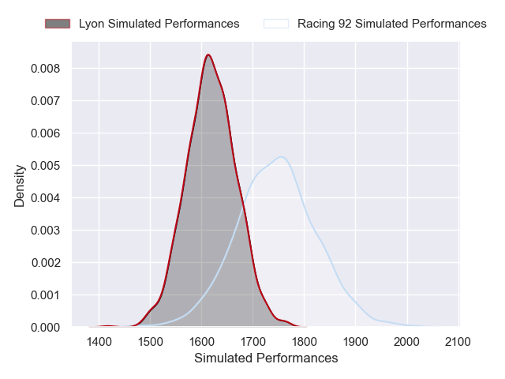
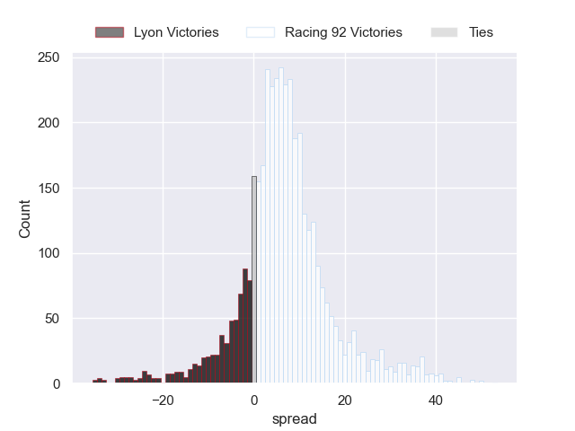
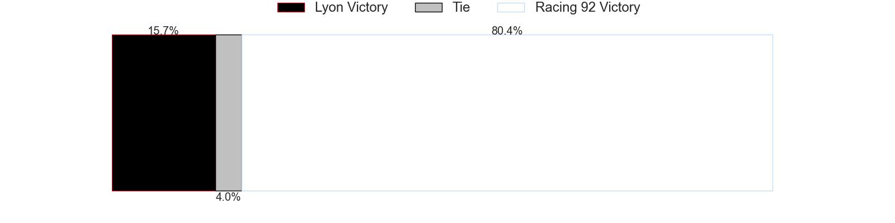
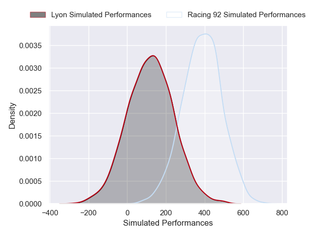
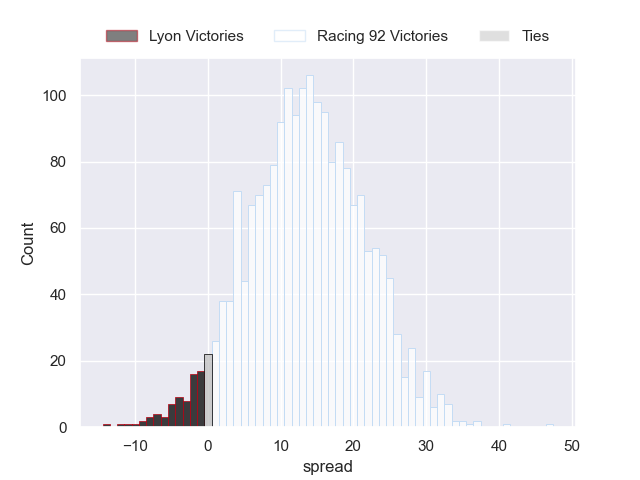
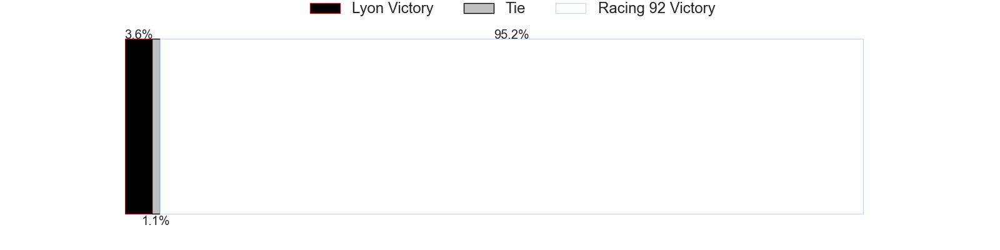

---  
layout: page  
title: Lyon at Racing 92; 25-25  
date: 2024-12-29 18:00:00 -0500  
categories: "Top 14 Orange 2024" match review  
---
# Lyon at Racing 92; 25-25

# Club Level Predictions

The first set of predictions treats a club as the smallest object, as the club develops its members, organizes a gameplan, and deploys its players as needed for each match. This club model has a prediction of 0.674, which translates to predicting Racing 92 to win by 6.4.

Our Over/Under is 50.5 - and combined with the spread above, we have a predicted scoreline of 22 to 28

Each club has a rating and a rating deviation (similar to a Glicko rating), and expected performances can be generated. This allows for simulated matches and spreads like the ones below.
## Projected Performances - Club Model

## Projected Spreads - Club Model

## Projected Results - Club Model

# Player Level Predictions

Treating teams instead as an entity made up of the currently active players, I have ratings for each player in an altogether different system. These can be combined to form team ratings once teamsheets are announced, weighting starters a bit higher than the reserves. After the match is played, players can be weighted by their minutes on the field, allowing for an accurate measure of the team's composition. With these compiled team ratings, we can make predictions, measure inaccuracy, and update the individual player ratings.
## Prediction without Player Minutes: Racing 92 by 15.7

Racing 92 by 4.5 on a neutral pitch

## Projected Performances - Player Model

## Projected Spreads - Player Model

## Projected Results - Player Model

|   Away Minutes | Away Player          |   Away Percentile |   Number |   Home Percentile | Home Player                       |   Home Minutes |
|---------------:|:---------------------|------------------:|---------:|------------------:|:----------------------------------|---------------:|
|             80 | Sebastien Taofifenua |             13.86 |        1 |             21.52 | Hassane Kolingar                  |             11 |
|             20 | Guillaume Marchand   |             18.67 |        2 |             14.24 | Feleti Kaitu'u                    |             23 |
|             80 | Cedate Gomes Sa      |             62.76 |        3 |             60.96 | Thomas Laclayat                   |             35 |
|             80 | Theo William         |             12.54 |        4 |             11.41 | Will Rowlands                     |             40 |
|             31 | Killian Geraci       |             32.67 |        5 |             34.06 | Romain Taofifenua                 |             33 |
|             31 | Dylan Cretin         |             65.58 |        6 |             89.5  | Cameron Woki                      |             33 |
|             17 | Arno Botha           |             90.95 |        7 |             18.19 | Ibrahim Diallo                    |             33 |
|             54 | Liam Allen           |             57.12 |        8 |             56.6  | Jordan Joseph                     |             80 |
|             17 | Baptiste Couilloud   |             91.14 |        9 |             47.02 | Nolann Le Garrec                  |             29 |
|             80 | Leo Berdeu           |             84.17 |       10 |             88.98 | Antoine Gibert                    |             26 |
|             80 | Davit Niniashvili    |             84.62 |       11 |              8.16 | Henry Arundell                    |             60 |
|             80 | Davit Niniashvili    |             84.62 |       11 |              8.16 | Henry Arundell                    |             29 |
|             80 | Theo Millet          |             70.2  |       12 |             95.94 | Josua Tuisova                     |             80 |
|             17 | Josiah Maraku        |              3.17 |       13 |             97.82 | Gael Fickou                       |             33 |
|             17 | Semi Radradra        |             95.26 |       14 |             48.48 | Vinaya Habosi                     |             80 |
|             15 | Martin Meliande      |              7.58 |       15 |              7.77 | Max Spring                        |             25 |
|             80 | Alban Roussel        |             73.34 |       16 |              1    | Dan Lancaster                     |             57 |
|             40 | Jerome Rey           |             16.39 |       17 |             61.35 | Hacjivah Dayimani                 |             25 |
|             26 | Jermaine Ainsley     |             28.58 |       18 |             67.88 | Robin Couly                       |             29 |
|             80 | Xavier Mignot        |             62.78 |       19 |             28.18 | Guram Gogichashvili               |             51 |
|             63 | Marvin Okuya         |             34.84 |       20 |             67.62 | Lee-Marvin Lofty Siyanda Mazibuko |             80 |
|             29 | Alfred Parisien      |             63.86 |       21 |             56.71 | Fabien Sanconnie                  |             29 |
|             29 | Yanis Charcosset     |             21.36 |       22 |             10.98 | Tristan Tedder                    |              2 |
|             80 | Charlie Cassang      |             77.94 |       23 |             87.28 | Boris Palu                        |             80 |

