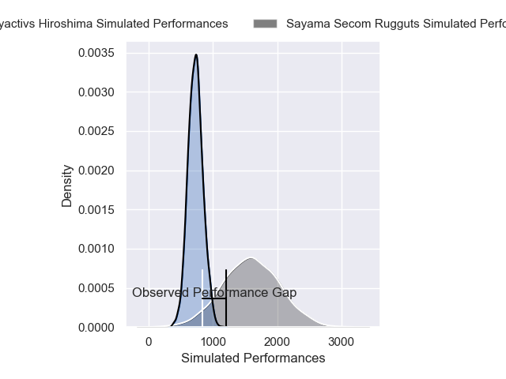
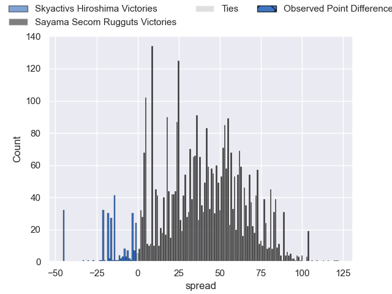
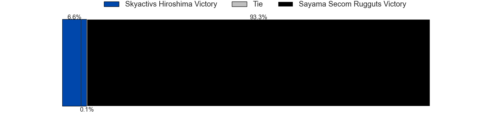
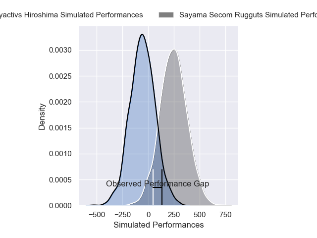
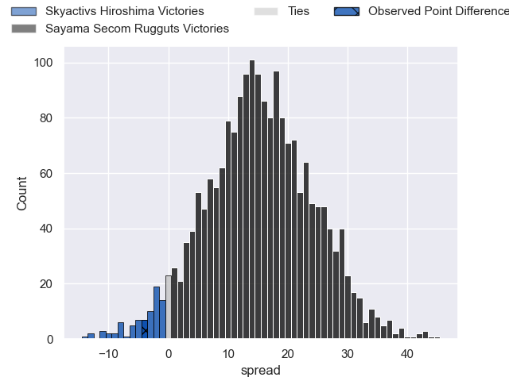
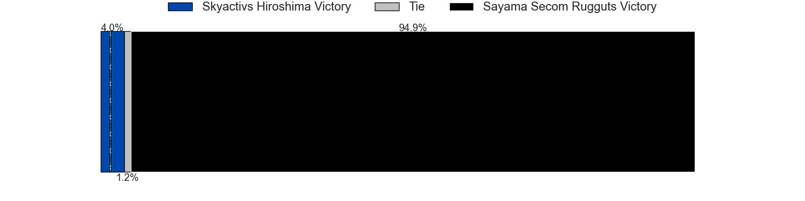

---  
layout: page  
title: Skyactivs Hiroshima at Sayama Secom Rugguts; 31-27  
date: 2024-12-29 18:00:00 -0500  
categories: "Japan Rugby League One D3 2024" match review  
---
# Skyactivs Hiroshima at Sayama Secom Rugguts; 31-27

# Club Level Predictions

The first set of predictions treats a club as the smallest object, as the club develops its members, organizes a gameplan, and deploys its players as needed for each match. This club model has a prediction of 0.99, which translates to predicting Sayama Secom Rugguts to win by 42.8.

Our Over/Under is 56.5 - and combined with the spread above, we have a predicted scoreline of 7 to 50

Each club has a rating and a rating deviation (similar to a Glicko rating), and expected performances can be generated. This allows for simulated matches and spreads like the ones below.
## Projected Performances - Club Model

## Projected Spreads - Club Model

## Projected Results - Club Model

# Player Level Predictions

Treating teams instead as an entity made up of the currently active players, I have ratings for each player in an altogether different system. These can be combined to form team ratings once teamsheets are announced, weighting starters a bit higher than the reserves. After the match is played, players can be weighted by their minutes on the field, allowing for an accurate measure of the team's composition. With these compiled team ratings, we can make predictions, measure inaccuracy, and update the individual player ratings.
## Prediction without Player Minutes: Sayama Secom Rugguts by 18.1

Sayama Secom Rugguts by 15.9 on a neutral pitch

## Projected Performances - Player Model

## Projected Spreads - Player Model

## Projected Results - Player Model

|   Away Minutes | Away Player        |   Away Percentile |   Number |   Home Percentile | Home Player       |   Home Minutes |
|---------------:|:-------------------|------------------:|---------:|------------------:|:------------------|---------------:|
|             30 | Koshi Kato         |              8.39 |        1 |             26.58 | Kentaro Ueno      |             64 |
|             42 | Taichi Yoko        |             78.32 |        2 |             24.05 | Tatsuki Tanina    |             80 |
|             16 | Tadatsugu Kanayama |             62.29 |        3 |             23.92 | Motoki Kaneko     |             80 |
|             16 | Tye Nash           |             76.48 |        4 |             28.66 | Kazuki Asakura    |             80 |
|             16 | Andrew Davidson    |             26.66 |        5 |             73.17 | Troy Callander    |             35 |
|             16 | Tevin Ferris       |             14.35 |        6 |             41.42 | Paker Ash         |             22 |
|             13 | Tomoki Ashida      |              7.51 |        7 |             40.14 | Ryoga Sukeda      |             28 |
|             64 | Jackson Pugh       |             35.75 |        8 |             44.99 | Whetu Douglas     |             40 |
|             64 | Taiyo Fukuyama     |             75.2  |        9 |             24.15 | Rikuya Takashima  |             80 |
|              6 | Issen Kano         |             59.72 |       10 |              6.41 | Daniel Waite      |             62 |
|             30 | Kouhei Kamei       |             13.21 |       11 |             44.52 | Musashi Matsuda   |              4 |
|             80 | Clinton Knox       |              7.72 |       12 |             96.14 | TJ Faiane         |             27 |
|             30 | Kaito Sasaoka      |             37.52 |       13 |             20.2  | Fisipuna Tuiaki   |             40 |
|             80 | Yuto Nakamura      |             19.97 |       14 |             29.37 | Yoshihiro Noguchi |             80 |
|             53 | Ginjiro Sakiguchi  |              1.14 |       15 |             58.14 | Chase Tiatia      |             66 |
|             80 | Jacob Abel         |             62.67 |       16 |            nan    | Haruya Nakasu     |             80 |
|             80 | Yusuke Kitabayashi |             61.39 |       17 |            nan    | Toshiki Sato      |             80 |
|             70 | Ryoto Tomita       |            nan    |       18 |            nan    | Kento Mizutani    |             80 |
|             80 | Iori Suzuki        |             38.77 |       19 |            nan    | Shogo Murakami    |             80 |
|             53 | Shota Kasai        |            nan    |       20 |            nan    | Minato Jinnouchi  |             64 |
|             80 | Hitaka Inoue       |             54.31 |       21 |            nan    | Yosuke Okuma      |             80 |
|             80 | Rame Sato          |            nan    |       22 |            nan    | Cory Hill         |             80 |
|            nan | nan                |            nan    |       23 |            nan    | Eito Tsutsumi     |             27 |

