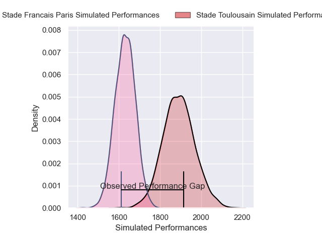
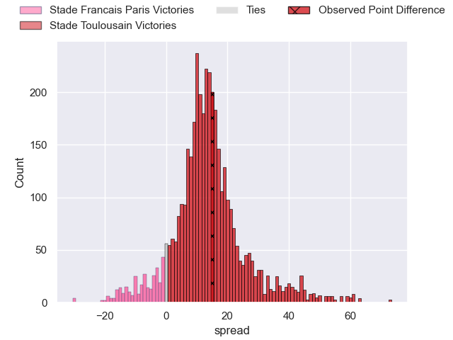
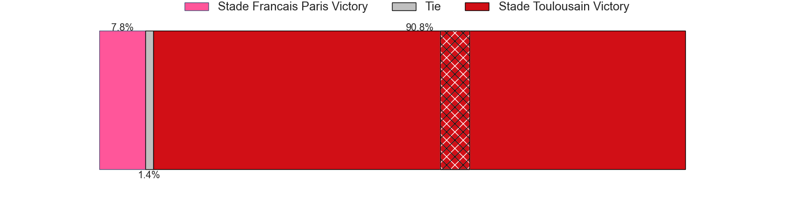
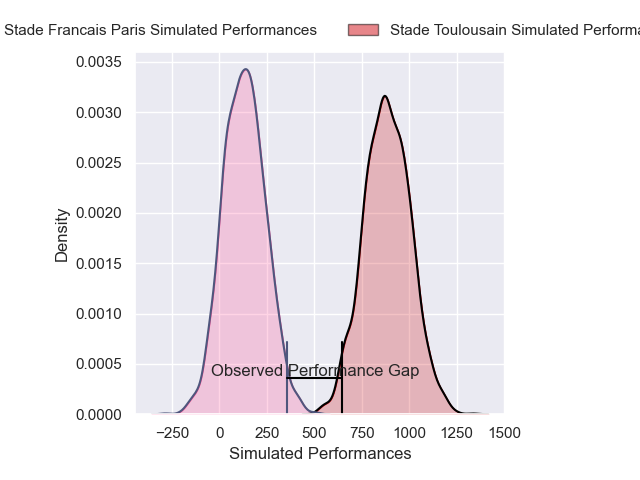
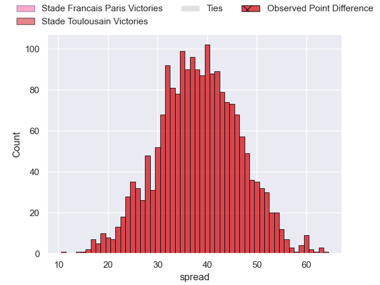

---  
layout: page  
title: Stade Francais Paris at Stade Toulousain; 23-38  
date: 2024-12-29 18:00:00 -0500  
categories: "Top 14 Orange 2024" match review  
---
# Stade Francais Paris at Stade Toulousain; 23-38

# Club Level Predictions

The first set of predictions treats a club as the smallest object, as the club develops its members, organizes a gameplan, and deploys its players as needed for each match. This club model has a prediction of 0.815, which translates to predicting Stade Toulousain to win by 13.0.

Our Over/Under is 52.5 - and combined with the spread above, we have a predicted scoreline of 20 to 33

Each club has a rating and a rating deviation (similar to a Glicko rating), and expected performances can be generated. This allows for simulated matches and spreads like the ones below.
## Projected Performances - Club Model

## Projected Spreads - Club Model

## Projected Results - Club Model

# Player Level Predictions

Treating teams instead as an entity made up of the currently active players, I have ratings for each player in an altogether different system. These can be combined to form team ratings once teamsheets are announced, weighting starters a bit higher than the reserves. After the match is played, players can be weighted by their minutes on the field, allowing for an accurate measure of the team's composition. With these compiled team ratings, we can make predictions, measure inaccuracy, and update the individual player ratings.
## Prediction without Player Minutes: Stade Toulousain by 38.5

Stade Toulousain by 25.7 on a neutral pitch

## Projected Performances - Player Model

## Projected Spreads - Player Model

## Projected Results - Player Model

|   Away Minutes | Away Player              |   Away Percentile |   Number |   Home Percentile | Home Player          |   Home Minutes |
|---------------:|:-------------------------|------------------:|---------:|------------------:|:---------------------|---------------:|
|             80 | Isaac Koffi              |             59.96 |        1 |             83.74 | Rodrigue Neti        |             26 |
|             33 | Luka Petriashvili        |             75.32 |        2 |             99.37 | Julien Marchand      |             26 |
|             26 | Francisco Gomez Kodela   |             81.28 |        3 |             91.01 | Dorian Aldegheri     |             26 |
|             80 | Pierre-Henri Azagoh      |             85.37 |        4 |             93.21 | Thibaud Flament      |             80 |
|             11 | JJ van der Mescht        |             87.54 |        5 |             89.46 | Emmanuel Meafou      |             40 |
|             80 | Ryan Chapuis             |             25.7  |        6 |             97.44 | Francois Cros        |             47 |
|              9 | Juan Martin Scelzo       |             32.54 |        7 |             99.4  | Jack Willis          |             21 |
|             33 | Yoan Tanga               |             44.59 |        8 |             70.18 | Alexandre Roumat     |             80 |
|             33 | Louis Foursans-Bourdette |             15.94 |        9 |             69.4  | Paul Graou           |             80 |
|             12 | Louis Carbonel           |             27.45 |       10 |             96.79 | Romain Ntamack       |             66 |
|             66 | Raffaele Storti          |             86.4  |       11 |             97.13 | Matthis Lebel        |             47 |
|             66 | Joe Marchant             |             22.48 |       12 |             73.47 | Santiago Chocobares  |             60 |
|             66 | Samuel Ezeala            |              5.54 |       13 |             98.22 | Pierre-Louis Barassi |             47 |
|             66 | Charles Laloi            |             42.35 |       14 |             97.98 | Blair Kinghorn       |             80 |
|             66 | Joe Jonas                |             21.02 |       15 |             97.73 | Thomas Ramos         |             71 |
|             30 | Moses Alo-Emile          |             34.71 |       16 |             90.61 | David Ainu'u         |             69 |
|             30 | Mamoudou Meite           |            nan    |       17 |             95.25 | Peato Mauvaka        |             78 |
|             30 | Hugo Ndiaye              |             33.91 |       18 |             90.67 | Joel Merkler         |             20 |
|             30 | Baptiste Pesenti         |             59.15 |       19 |             71.9  | Anthony Jelonch      |             30 |
|             30 | Andy Timo                |             18.36 |       20 |             94.25 | Joshua Brennan       |             68 |
|             30 | Tanginoa Halaifonua      |             15.29 |       21 |              8.53 | Naoto Saito          |             80 |
|             30 | Leo Monin                |             28.41 |       22 |             94.95 | Ange Capuozzo        |             80 |
|             80 | Martin Blum              |            nan    |       23 |             61.29 | Pita Ahki            |             80 |

