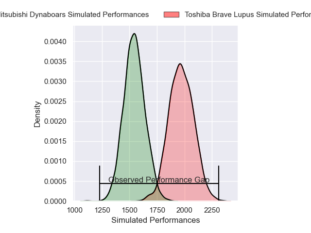
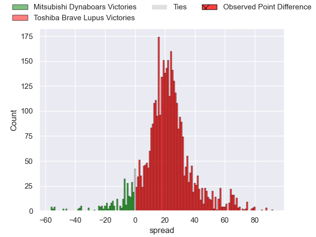
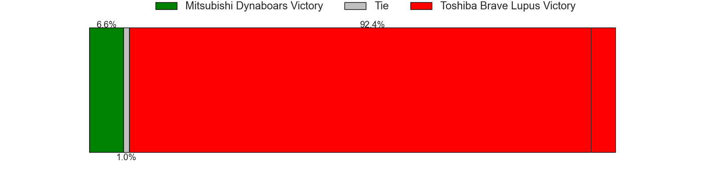
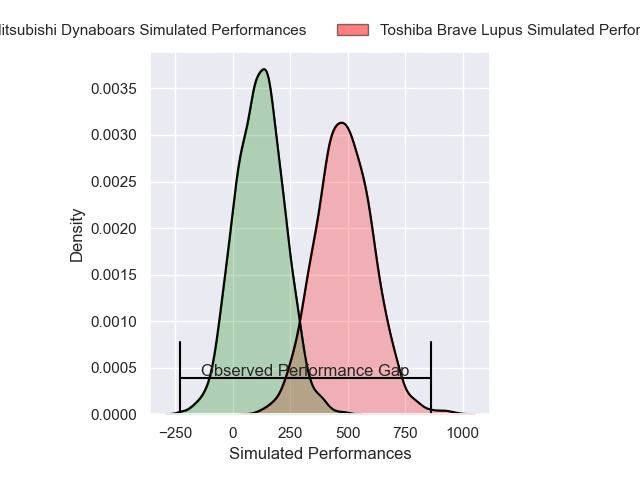
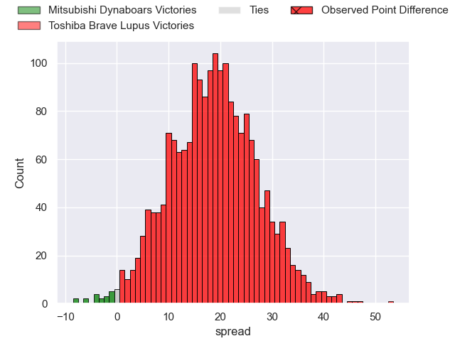
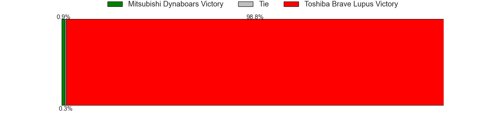

---  
layout: page  
title: Mitsubishi Dynaboars at Toshiba Brave Lupus; 8-61  
date: 2024-12-29 18:00:00 -0500  
categories: "Japan Rugby League One 2024" match review  
---
# Mitsubishi Dynaboars at Toshiba Brave Lupus; 8-61

# Club Level Predictions

The first set of predictions treats a club as the smallest object, as the club develops its members, organizes a gameplan, and deploys its players as needed for each match. This club model has a prediction of 0.914, which translates to predicting Toshiba Brave Lupus to win by 21.5.

Our Over/Under is 62.5 - and combined with the spread above, we have a predicted scoreline of 20 to 42

Each club has a rating and a rating deviation (similar to a Glicko rating), and expected performances can be generated. This allows for simulated matches and spreads like the ones below.
## Projected Performances - Club Model

## Projected Spreads - Club Model

## Projected Results - Club Model

# Player Level Predictions

Treating teams instead as an entity made up of the currently active players, I have ratings for each player in an altogether different system. These can be combined to form team ratings once teamsheets are announced, weighting starters a bit higher than the reserves. After the match is played, players can be weighted by their minutes on the field, allowing for an accurate measure of the team's composition. With these compiled team ratings, we can make predictions, measure inaccuracy, and update the individual player ratings.
## Prediction without Player Minutes: Toshiba Brave Lupus by 18.7

Toshiba Brave Lupus by 14.5 on a neutral pitch

## Projected Performances - Player Model

## Projected Spreads - Player Model

## Projected Results - Player Model

|   Away Minutes | Away Player         |   Away Percentile |   Number |   Home Percentile | Home Player        |   Home Minutes |
|---------------:|:--------------------|------------------:|---------:|------------------:|:-------------------|---------------:|
|             40 | Jun Morimoto        |             66.22 |        1 |             80.08 | Sena Kimura        |             40 |
|             28 | Lee Seung Hyok      |              6.96 |        2 |             65.98 | Daigo Hashimoto    |             80 |
|             14 | Rento Tsukayama     |             87.28 |        3 |             85.41 | Yuta Kokaji        |             40 |
|             40 | Daniel Linde        |             25.52 |        4 |             97.74 | Jacob Pierce       |             80 |
|             26 | Epineri Uluiviti    |              6.97 |        5 |             90.07 | Warner Dearns      |             28 |
|             25 | Jackson Hemopo      |             70.2  |        6 |             93.77 | Shannon Frizell    |             52 |
|             52 | Kyo Yoshida         |             75.49 |        7 |             81.13 | Shin Ito           |             52 |
|             80 | Marino Mikaele-Tu'u |             21.5  |        8 |             67.94 | Michael Leitch     |             31 |
|             80 | Kota Iwamura        |             77.29 |        9 |             84.7  | Yuhei Sugiyama     |             80 |
|             76 | James Grayson       |             56.51 |       10 |             98.8  | Richie Mo'unga     |             52 |
|             80 | Satoshi Koizumi     |             72.88 |       11 |             82.75 | Atsuki Kuwayama    |             28 |
|             18 | Charlie Lawrence    |             90.1  |       12 |             78.12 | Taichi Mano        |             55 |
|             67 | Tonishio Vaiahu     |             24.26 |       13 |             96.73 | Seta Tamanivalu    |             80 |
|             71 | Ben Paltridge       |             50.89 |       14 |             75.91 | Jone Naikabula     |             65 |
|             23 | Kurt-Lee Arendse    |             99.05 |       15 |             90.15 | Takuro Matsunaga   |             49 |
|             13 | Yuki Miyazato       |             32.44 |       16 |             37.22 | Futoshi Mori       |             80 |
|             15 | Tomoaki Ishii       |             90.01 |       17 |             76.15 | Masataka Mikami    |             54 |
|             15 | Kohki Sato          |             62.34 |       18 |             90.98 | Mamoru Harada      |             80 |
|             17 | Curtis Rona         |             81.09 |       19 |             79.55 | Teruo Makabe       |             40 |
|             40 | Timote Tavalea      |            nan    |       20 |             34.65 | Rob Thompson       |             40 |
|             23 | Jack Stratton       |             91.95 |       21 |             39.9  | Samuela Anise      |             80 |
|             80 | Kazuki Ishida       |             18.18 |       22 |             31.85 | Yoshitaka Tokunaga |             57 |
|            nan | nan                 |            nan    |       23 |            nan    | Shotaro Ikedo      |             80 |

