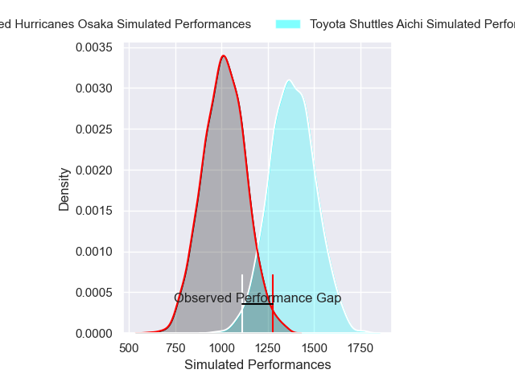
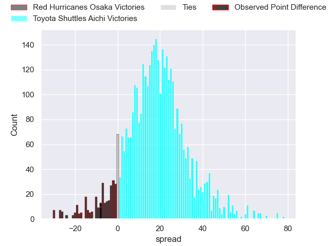
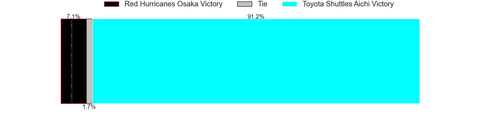
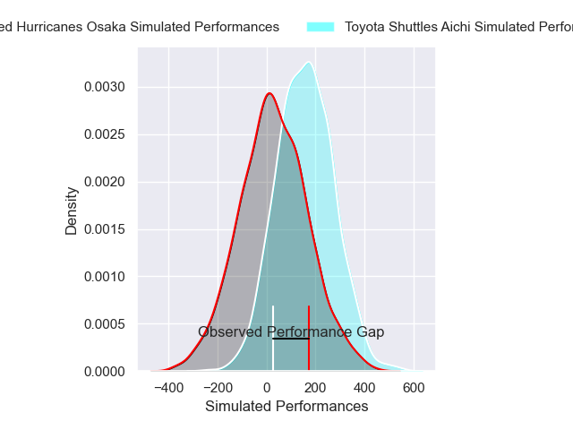
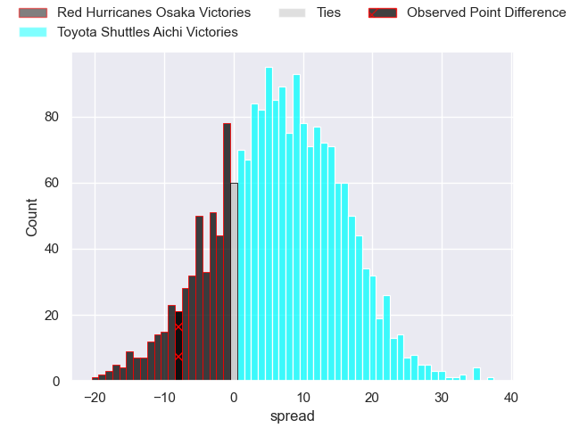
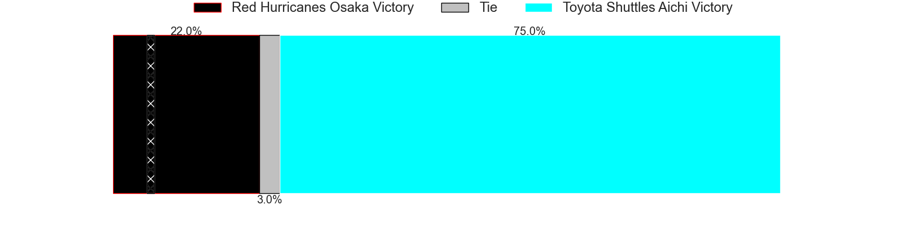

---  
layout: page  
title: Red Hurricanes Osaka at Toyota Shuttles Aichi; 30-22  
date: 2024-12-29 18:00:00 -0500  
categories: "Japan Rugby League One D2 2024" match review  
---
# Red Hurricanes Osaka at Toyota Shuttles Aichi; 30-22

# Club Level Predictions

The first set of predictions treats a club as the smallest object, as the club develops its members, organizes a gameplan, and deploys its players as needed for each match. This club model has a prediction of 0.878, which translates to predicting Toyota Shuttles Aichi to win by 18.3.

Our Over/Under is 54.5 - and combined with the spread above, we have a predicted scoreline of 18 to 36

Each club has a rating and a rating deviation (similar to a Glicko rating), and expected performances can be generated. This allows for simulated matches and spreads like the ones below.
## Projected Performances - Club Model

## Projected Spreads - Club Model

## Projected Results - Club Model

# Player Level Predictions

Treating teams instead as an entity made up of the currently active players, I have ratings for each player in an altogether different system. These can be combined to form team ratings once teamsheets are announced, weighting starters a bit higher than the reserves. After the match is played, players can be weighted by their minutes on the field, allowing for an accurate measure of the team's composition. With these compiled team ratings, we can make predictions, measure inaccuracy, and update the individual player ratings.
## Prediction without Player Minutes: Toyota Shuttles Aichi by 8.1

Toyota Shuttles Aichi by 4.4 on a neutral pitch

## Projected Performances - Player Model

## Projected Spreads - Player Model

## Projected Results - Player Model

|   Away Minutes | Away Player          |   Away Percentile |   Number |   Home Percentile | Home Player          |   Home Minutes |
|---------------:|:---------------------|------------------:|---------:|------------------:|:---------------------|---------------:|
|             58 | Hiromichi Sakamoto   |             19.19 |        1 |             30.71 | Tomoki Yamaguchi     |             43 |
|             65 | Hisamitsu Shimada    |             42.56 |        2 |             38.29 | Takuma Oyama         |             80 |
|             80 | Munekata Sashida     |             55.7  |        3 |             28.31 | Ryota Fukamura       |             37 |
|             16 | Michael Allardice    |             22.3  |        4 |             54.53 | Taishi Nakamura      |             80 |
|             80 | Elliott Stooke       |             93.64 |        5 |             36.32 | James Gaskell        |             38 |
|             22 | Isono Kaito          |             63.02 |        6 |             63.96 | Tama Kapene          |             56 |
|             40 | Blake Gibson         |             87.87 |        7 |             57.56 | Chang Chao Yi        |             15 |
|             74 | Jack O'Sullivan      |             63.59 |        8 |             62.53 | Taleni Seu           |             45 |
|             50 | Tatsuya Hamano       |             54.91 |        9 |             90.82 | Keita Fujiwara       |             70 |
|             53 | Dobashi Fumiya       |             57.52 |       10 |             88.38 | Freddie Burns        |             80 |
|             53 | Kenya Nishikawa      |             65.58 |       11 |             25.56 | Go Nakano            |              6 |
|             80 | Mifiposeti Paea      |              8.51 |       12 |              0.69 | Tiaan Thomas-Wheeler |             80 |
|             73 | Henry Taefu          |             66.34 |       13 |             44.65 | Ken Tonobe           |             56 |
|             80 | Kouki Shigeno        |             24.16 |       14 |             14.53 | Hiroaki Saito        |             16 |
|             80 | Taiki Yamaguchi      |             76.89 |       15 |             75.57 | Josua Kerevi         |             10 |
|             80 | Hiroki Hanada        |             22.03 |       16 |             64.16 | Nobuyuki Takahashi   |             16 |
|             50 | Yuma Fujino          |            nan    |       17 |            nan    | Atsushi Yumoto       |             27 |
|             50 | Yo Sato              |            nan    |       18 |             10.67 | Isi Manu             |             27 |
|             74 | Shota Takai          |            nan    |       19 |             26.18 | Jone Kerevi          |             67 |
|             80 | Toshihiro Yamamouchi |             24.48 |       20 |            nan    | Suguru Igarashi      |             80 |
|             70 | Taichi Yoshizawa     |              2.27 |       21 |             12.57 | Keita Ichikawa       |             80 |
|              7 | Tatsunari Fujita     |              9.49 |       22 |             55.05 | Shoma Makinouchi     |             16 |
|             58 | Daisuke Iba          |             22.57 |       23 |              9.22 | James Mollentze      |             80 |

