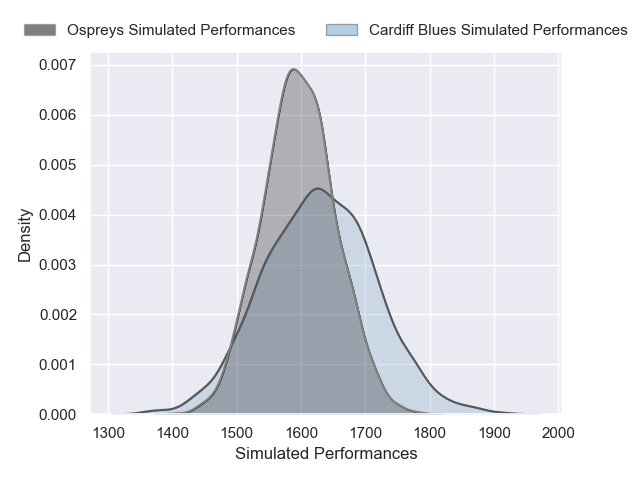
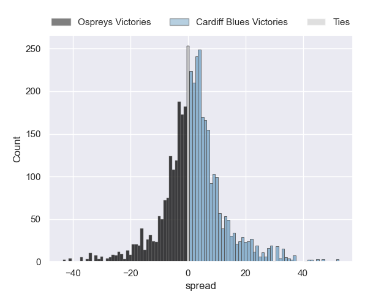
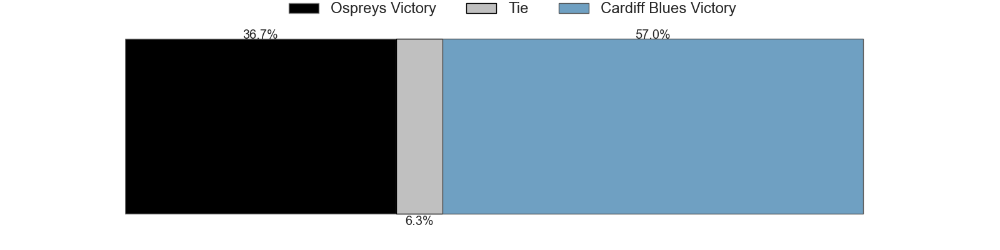
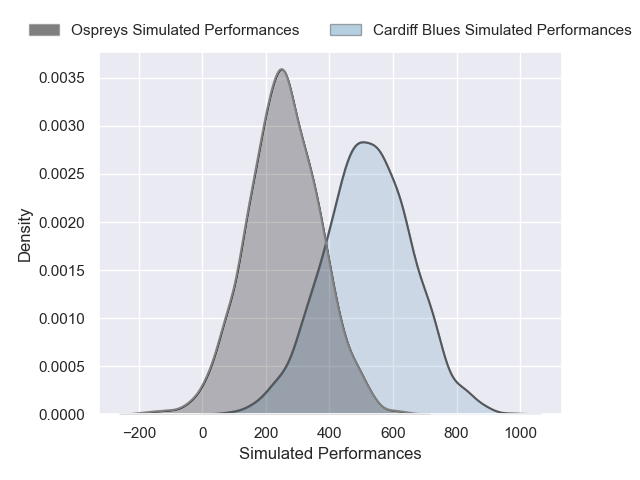
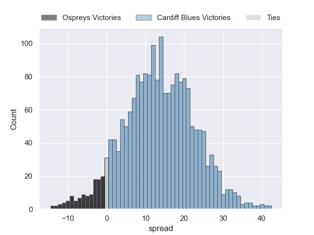
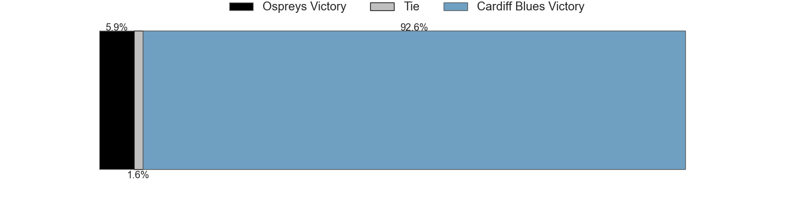

---  
layout: page  
title: Ospreys at Cardiff Blues; 13-13  
date: 2025-01-01 18:00:00 -0500  
categories: "United Rugby Championship 2024" match review  
---
# Ospreys at Cardiff Blues; 13-13

# Club Level Predictions

The first set of predictions treats a club as the smallest object, as the club develops its members, organizes a gameplan, and deploys its players as needed for each match. This club model has a prediction of 0.548, which translates to predicting Cardiff Blues to win by 1.7.

Our Over/Under is 50.5 - and combined with the spread above, we have a predicted scoreline of 25 to 26

Each club has a rating and a rating deviation (similar to a Glicko rating), and expected performances can be generated. This allows for simulated matches and spreads like the ones below.
## Projected Performances - Club Model

## Projected Spreads - Club Model

## Projected Results - Club Model

# Player Level Predictions

Treating teams instead as an entity made up of the currently active players, I have ratings for each player in an altogether different system. These can be combined to form team ratings once teamsheets are announced, weighting starters a bit higher than the reserves. After the match is played, players can be weighted by their minutes on the field, allowing for an accurate measure of the team's composition. With these compiled team ratings, we can make predictions, measure inaccuracy, and update the individual player ratings.
## Prediction without Player Minutes: Cardiff Blues by 8.5

Ospreys by 3.7 on a neutral pitch

## Projected Performances - Player Model

## Projected Spreads - Player Model

## Projected Results - Player Model

|   Away Minutes | Away Player            |   Away Percentile |   Number |   Home Percentile | Home Player        |   Home Minutes |
|---------------:|:-----------------------|------------------:|---------:|------------------:|:-------------------|---------------:|
|             17 | Gareth Thomas          |             28.81 |        1 |             44.41 | Danny Southworth   |             80 |
|             80 | Sam Parry              |             39.86 |        2 |             16.9  | Evan Lloyd         |             58 |
|             80 | Tom Botha              |             77.8  |        3 |             10.08 | Keiron Assiratti   |             80 |
|             32 | Rhys Davies            |             88.86 |        4 |             14.06 | Seb Davies         |              2 |
|             72 | James Fender           |             84.44 |        5 |             15.96 | Teddy Williams     |             80 |
|             62 | Jac Morgan             |             92.62 |        6 |             80.53 | James Botham       |             22 |
|             13 | Justin Tipuric         |             97.75 |        7 |             79.61 | Daniel Thomas      |              7 |
|              5 | Morgan Morris          |              4.99 |        8 |             81.7  | Alun Lawrence      |             80 |
|             18 | Reuben Morgan-Williams |             87.16 |        9 |             27.49 | Ellis Bevan        |             80 |
|             48 | Dan Edwards            |             71.05 |       10 |             92.54 | Callum Sheedy      |             80 |
|             40 | Keelan Giles           |             24.73 |       11 |             89.26 | Gabriel Hamer-Webb |             80 |
|             40 | Keiran Williams        |             91.45 |       12 |             58.93 | Ben Thomas         |             80 |
|             72 | Owen Watkin            |             98.34 |       13 |             10.65 | Louie Hennessey    |             22 |
|             80 | Iestyn Hopkins         |             72.41 |       14 |             88.18 | Josh Adams         |             48 |
|             48 | Max Nagy               |             72.59 |       15 |             12.28 | Cameron Winnett    |             65 |
|             56 | James Ratti            |             68.78 |       16 |             35.18 | Rory Jennings      |             48 |
|             32 | Kieran Hardy           |             46.47 |       17 |             63.7  | Dafydd Hughes      |             48 |
|             80 | Rhys Henry             |             89.49 |       18 |             83.05 | Corey Domachowski  |             75 |
|             59 | Garyn Phillips         |             60.68 |       19 |             18.81 | Rhys Litterick     |             80 |
|             48 | Jack Walsh             |             58.77 |       20 |             86.14 | Josh McNally       |             80 |
|             48 | Morgan Morse           |             38.05 |       21 |             79.42 | Taulupe Faletau    |             48 |
|             49 | Lewis Lloyd            |             61.57 |       22 |             87.7  | Thomas Young       |             80 |
|            nan | nan                    |            nan    |       23 |             84.63 | Aled Davies        |             73 |

