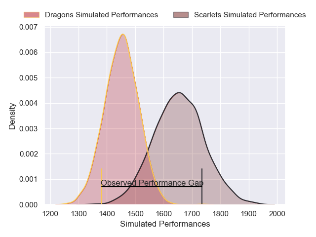
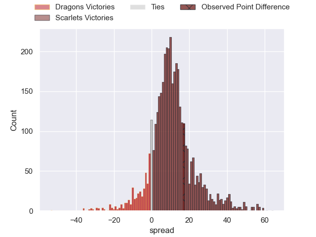
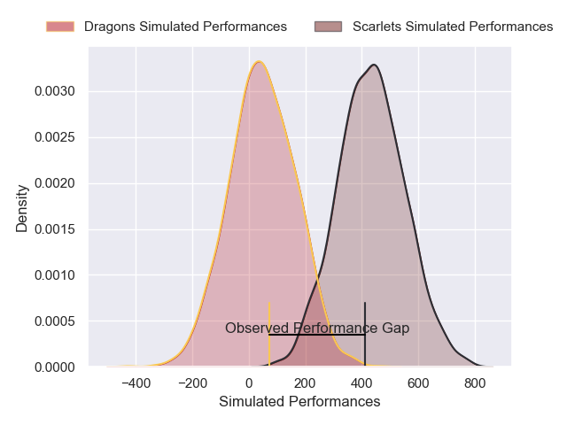
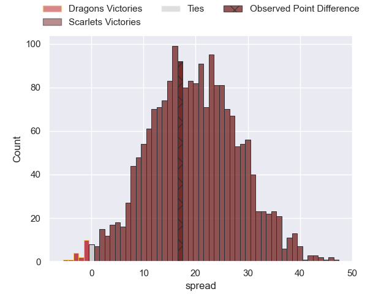

---  
layout: page  
title: Dragons at Scarlets; 15-32  
date: 2025-01-01 18:00:00 -0500  
categories: "United Rugby Championship 2024" match review  
---
# Dragons at Scarlets; 15-32

# Club Level Predictions

The first set of predictions treats a club as the smallest object, as the club develops its members, organizes a gameplan, and deploys its players as needed for each match. This club model has a prediction of 0.764, which translates to predicting Scarlets to win by 10.4.

Our Over/Under is 47.5 - and combined with the spread above, we have a predicted scoreline of 18 to 29

Each club has a rating and a rating deviation (similar to a Glicko rating), and expected performances can be generated. This allows for simulated matches and spreads like the ones below.
## Projected Performances - Club Model

## Projected Spreads - Club Model

## Projected Results - Club Model

# Player Level Predictions

Treating teams instead as an entity made up of the currently active players, I have ratings for each player in an altogether different system. These can be combined to form team ratings once teamsheets are announced, weighting starters a bit higher than the reserves. After the match is played, players can be weighted by their minutes on the field, allowing for an accurate measure of the team's composition. With these compiled team ratings, we can make predictions, measure inaccuracy, and update the individual player ratings.
## Prediction without Player Minutes: Scarlets by 19.1

Scarlets by 9.9 on a neutral pitch

## Projected Performances - Player Model

## Projected Spreads - Player Model

## Projected Results - Player Model

|   Away Minutes | Away Player              |   Away Percentile |   Number |   Home Percentile | Home Player          |   Home Minutes |
|---------------:|:-------------------------|------------------:|---------:|------------------:|:---------------------|---------------:|
|             77 | Rodrigo Martinez         |             74.32 |        1 |             85.51 | Alec Hepburn         |             80 |
|             80 | Brodie Coghlan           |             54.27 |        2 |             95.73 | Marnus van der Merwe |             80 |
|             27 | Dimitri Arhip            |             83.64 |        3 |             82.8  | Henry Thomas         |             61 |
|             56 | Joseph Davies            |              6.33 |        4 |             30.32 | Alex Craig           |             31 |
|             26 | Ryan Woodman             |             44.28 |        5 |             69.88 | Sam Lousi            |             43 |
|              9 | Shane Lewis-Hughes       |              3.38 |        6 |             90.27 | Max Douglas          |             80 |
|             54 | Taine Basham             |             33.5  |        7 |             68.75 | Josh MacLeod         |             19 |
|              8 | Aaron Wainwright         |             67.15 |        8 |             88.15 | Taine Plumtree       |             19 |
|             27 | Rhodri Williams          |             88.79 |        9 |             50.45 | Gareth Davies        |             30 |
|             50 | Angus O'Brien            |             14.25 |       10 |             50.22 | Sam Costelow         |             80 |
|             67 | Huw Anderson             |             27    |       11 |             19.31 | Blair Murray         |             80 |
|              8 | Aneurin Owen             |             72.36 |       12 |             79.25 | Johnny Williams      |             80 |
|             32 | Jared Rosser             |              0.89 |       13 |             17.98 | Joe Roberts          |             18 |
|             24 | Rio Dyer                 |              5.02 |       14 |             59.31 | Ellis Mee            |             30 |
|             21 | Cai Evans                |             16.67 |       15 |             38.38 | Tom Rogers           |             32 |
|             40 | Chris Coleman            |             25    |       16 |             14.47 | Ioan Lloyd           |             37 |
|             50 | Dan Lydiate              |             38.52 |       17 |             90.85 | Vaea Fifita          |             80 |
|             80 | Che Hope                 |             56.42 |       18 |             18.81 | Archie Hughes        |             80 |
|             40 | Nick Thomas              |             32.63 |       19 |             84.24 | Kemsley Mathias      |             64 |
|             80 | James Benjamin           |             12.46 |       20 |             56.49 | Eddie James          |             80 |
|             80 | Will Reed                |             25    |       21 |            nan    | Archer Holz          |             16 |
|             61 | Harry Wilson             |             55.6  |       22 |              5.16 | Shaun Evans          |              4 |
|             80 | Dylan Kelleher-Griffiths |            nan    |       23 |             55.84 | Jarrod Taylor        |             53 |

