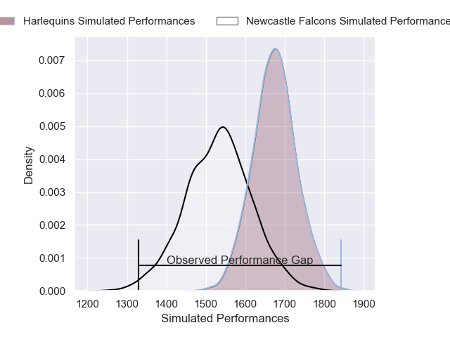
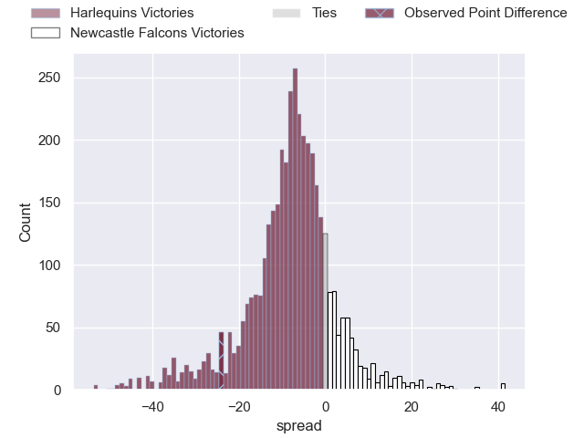
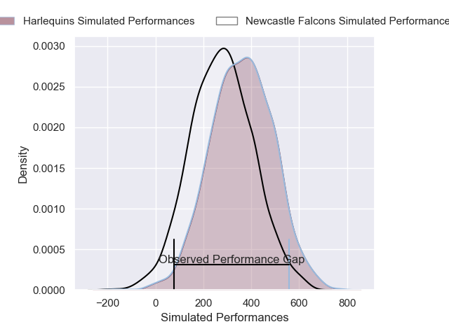
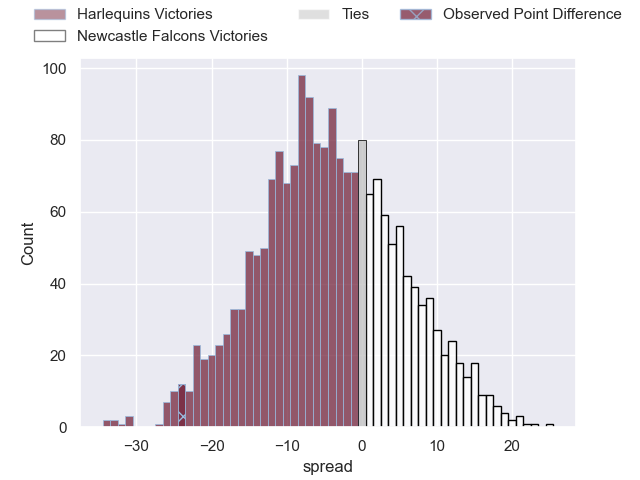

---  
layout: page  
title: Harlequins at Newcastle Falcons; 38-14  
date: 2025-01-03 18:00:00 -0500  
categories: "Gallagher Premiership 2024" match review  
---
# Harlequins at Newcastle Falcons; 38-14

# Club Level Predictions

The first set of predictions treats a club as the smallest object, as the club develops its members, organizes a gameplan, and deploys its players as needed for each match. This club model has a prediction of 0.306, which translates to predicting Harlequins to win by 7.2.

Our Over/Under is 46.5 - and combined with the spread above, we have a predicted scoreline of 27 to 20

Each club has a rating and a rating deviation (similar to a Glicko rating), and expected performances can be generated. This allows for simulated matches and spreads like the ones below.
## Projected Performances - Club Model

## Projected Spreads - Club Model

## Projected Results - Club Model

# Player Level Predictions

Treating teams instead as an entity made up of the currently active players, I have ratings for each player in an altogether different system. These can be combined to form team ratings once teamsheets are announced, weighting starters a bit higher than the reserves. After the match is played, players can be weighted by their minutes on the field, allowing for an accurate measure of the team's composition. With these compiled team ratings, we can make predictions, measure inaccuracy, and update the individual player ratings.
## Prediction without Player Minutes: Harlequins by 8.4

Harlequins by 22.1 on a neutral pitch

## Projected Performances - Player Model

## Projected Spreads - Player Model

## Projected Results - Player Model

|   Away Minutes | Away Player     |   Away Percentile |   Number |   Home Percentile | Home Player         |   Home Minutes |
|---------------:|:----------------|------------------:|---------:|------------------:|:--------------------|---------------:|
|             80 | Fin Baxter      |             26.86 |        1 |             22.88 | Murray McCallum     |             12 |
|             61 | Jack Walker     |             38.26 |        2 |              1.07 | Jamie Blamire       |             19 |
|             80 | Titi Lamositele |             69.92 |        3 |             64.32 | Richard Palframan   |              7 |
|             80 | Joe Launchbury  |             98.69 |        4 |              1.31 | Sebastian de Chaves |             32 |
|             80 | Dino Lamb       |             83.13 |        5 |             11.95 | Kiran McDonald      |             48 |
|             40 | Jack Kenningham |             94.67 |        6 |             15.68 | Freddie Lockwood    |             55 |
|             77 | Will Evans      |             82.99 |        7 |             88.42 | Tom Gordon          |             80 |
|             77 | Will Evans      |             82.99 |        7 |             88.42 | Tom Gordon          |             70 |
|             40 | James Chisholm  |             95.84 |        8 |              1.25 | Callum Chick        |             71 |
|              3 | Will Porter     |             33.82 |        9 |              0.18 | Sam Stuart          |             80 |
|              8 | Marcus Smith    |             81.14 |       10 |              1.1  | Brett Connon        |             80 |
|              3 | Cadan Murley    |             35.76 |       11 |             16.55 | Ben Stevenson       |             19 |
|              4 | Luke Northmore  |             74.69 |       12 |             24.64 | Connor Doherty      |             70 |
|              4 | Oscar Beard     |             60.93 |       13 |             26.19 | Alex Hearle         |             27 |
|             80 | Rodrigo Isgro   |             93.3  |       14 |              6.21 | Adam Radwan         |             76 |
|             19 | Nick David      |             83.77 |       15 |             10.96 | Mike Rewcastle      |             80 |
|             80 | Jarrod Evans    |             71.93 |       16 |              4.41 | Philip van der Walt |             76 |
|             71 | Irne Herbst     |             42.67 |       17 |             79.8  | Oliver Spencer      |             76 |
|             53 | Wyn Jones       |             91.86 |       18 |             12.85 | John Hawkins        |             80 |
|             80 | Dillon Lewis    |             95.85 |       19 |             20.59 | Callum Hancock      |             61 |
|             24 | Alex Dombrandt  |             80.87 |       20 |             53.89 | Max Pepper          |             40 |
|             80 | Sam Riley       |             70.46 |       21 |             83.33 | Louis Brown         |             80 |
|             80 | Ben Waghorn     |             66.37 |       22 |             11.03 | Ollie Fletcher      |             19 |
|             72 | Lucas Friday    |             72.69 |       23 |            nan    | nan                 |            nan |

