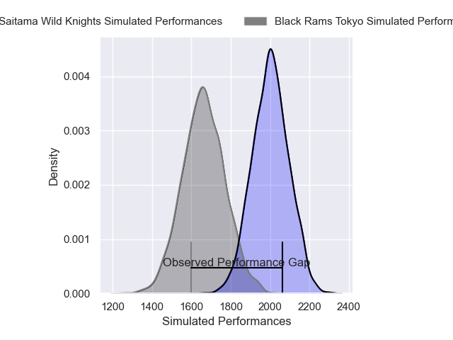
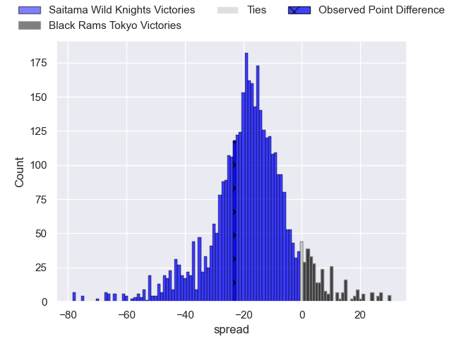
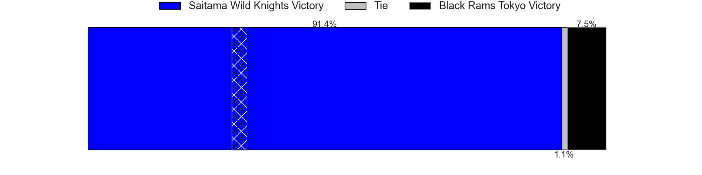
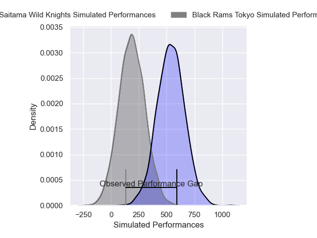
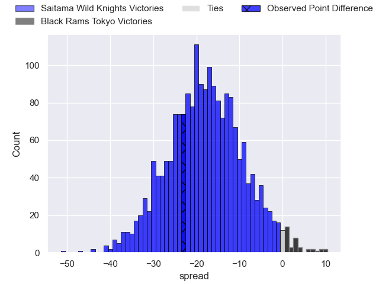
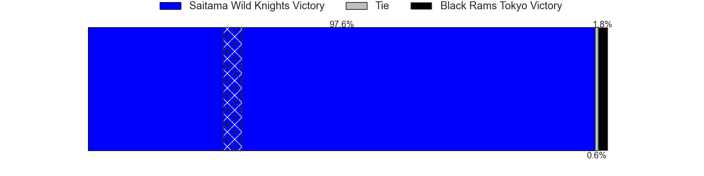

---  
layout: page  
title: Saitama Wild Knights at Black Rams Tokyo; 39-16  
date: 2025-01-04 18:00:00 -0500  
categories: "Japan Rugby League One 2024" match review  
---
# Saitama Wild Knights at Black Rams Tokyo; 39-16

# Club Level Predictions

The first set of predictions treats a club as the smallest object, as the club develops its members, organizes a gameplan, and deploys its players as needed for each match. This club model has a prediction of 0.131, which translates to predicting Saitama Wild Knights to win by 17.1.

Our Over/Under is 67.5 - and combined with the spread above, we have a predicted scoreline of 42 to 25

Each club has a rating and a rating deviation (similar to a Glicko rating), and expected performances can be generated. This allows for simulated matches and spreads like the ones below.
## Projected Performances - Club Model

## Projected Spreads - Club Model

## Projected Results - Club Model

# Player Level Predictions

Treating teams instead as an entity made up of the currently active players, I have ratings for each player in an altogether different system. These can be combined to form team ratings once teamsheets are announced, weighting starters a bit higher than the reserves. After the match is played, players can be weighted by their minutes on the field, allowing for an accurate measure of the team's composition. With these compiled team ratings, we can make predictions, measure inaccuracy, and update the individual player ratings.
## Prediction without Player Minutes: Saitama Wild Knights by 18.6

Saitama Wild Knights by 22.8 on a neutral pitch

## Projected Performances - Player Model

## Projected Spreads - Player Model

## Projected Results - Player Model

|   Away Minutes | Away Player       |   Away Percentile |   Number |   Home Percentile | Home Player       |   Home Minutes |
|---------------:|:------------------|------------------:|---------:|------------------:|:------------------|---------------:|
|             19 | Keita Inagaki     |             89.93 |        1 |             42.79 | Kazuma Nishi      |             51 |
|             53 | Atsushi Sakate    |             78.9  |        2 |             25.53 | Hinata Takei      |             72 |
|             69 | Taiki Fujii       |             87.25 |        3 |             76.76 | Paddy Ryan        |             61 |
|             11 | Ockie Barnard     |             65.73 |        4 |             22.33 | Josh Goodhue      |             51 |
|             19 | Esei Ha'angana    |             88.45 |        5 |             83.2  | Pohiva Lotoahea   |             80 |
|             54 | Ben Gunter        |             96.04 |        6 |              1.12 | Mike Stolberg     |             66 |
|             27 | Lachlan Boshier   |             99.49 |        7 |             62.3  | Shuhei Matsuhashi |             80 |
|             29 | Jack Cornelsen    |             94.9  |        8 |             72.86 | Liam Gill         |             21 |
|             29 | Shu Hagihara      |             47.27 |        9 |             96.91 | TJ Perenara       |             14 |
|             71 | Kyohei Yamasawa   |             87.44 |       10 |             40.97 | Ichigo Nakakusu   |              8 |
|             46 | Tomoki Osada      |             34.64 |       11 |             60.21 | Netani Vakayalia  |             26 |
|             80 | Damian de Allende |             99.89 |       12 |             50.61 | Yuki Ikeda        |             26 |
|              9 | Dylan Riley       |             98.79 |       13 |             65.71 | Ryohei Isoda      |             80 |
|             40 | Koki Takeyama     |             98.76 |       14 |             26.81 | Siope Lolo Tavo   |             64 |
|             54 | Ryuji Noguchi     |             98.26 |       15 |             63.62 | Isaac Lucas       |             80 |
|             40 | Craig Millar      |             62.75 |       16 |             12.3  | Otoya Kihara      |             51 |
|             34 | Asaeli Ai Valu    |             96.06 |       17 |             78.01 | Ko Sato           |             80 |
|             80 | Ryota Hasegawa    |             98.88 |       18 |             16.02 | Shohei Oyama      |             51 |
|             80 | Kazuma Shimane    |             80.32 |       19 |              8.33 | Amato Fakatava    |             80 |
|             80 | Itsuki Onishi     |             92.04 |       20 |             46.94 | Samuel Waqabaca   |             61 |
|             80 | Yuta Takagi       |            nan    |       21 |             35.95 | Kotaro Ito        |             75 |
|             61 | Vince Aso         |             69.02 |       22 |             65.82 | Toshiya Takahashi |              9 |
|             80 | Xavier Stowers    |             27.55 |       23 |            nan    | Penieli Jr Latu   |              5 |

