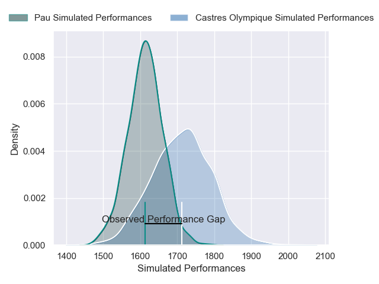
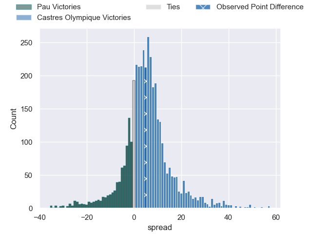
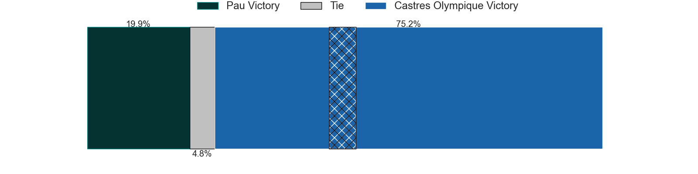
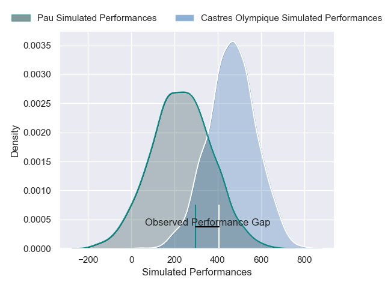
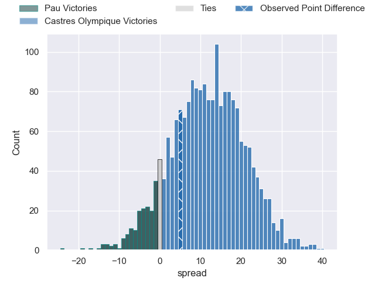
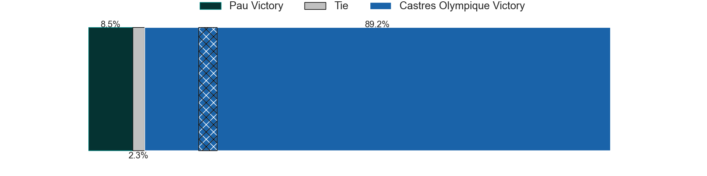

---  
layout: page  
title: Pau at Castres Olympique; 19-24  
date: 2025-01-04 18:00:00 -0500  
categories: "Top 14 Orange 2024" match review  
---
# Pau at Castres Olympique; 19-24

# Club Level Predictions

The first set of predictions treats a club as the smallest object, as the club develops its members, organizes a gameplan, and deploys its players as needed for each match. This club model has a prediction of 0.639, which translates to predicting Castres Olympique to win by 5.0.

Our Over/Under is 52.5 - and combined with the spread above, we have a predicted scoreline of 24 to 29

Each club has a rating and a rating deviation (similar to a Glicko rating), and expected performances can be generated. This allows for simulated matches and spreads like the ones below.
## Projected Performances - Club Model

## Projected Spreads - Club Model

## Projected Results - Club Model

# Player Level Predictions

Treating teams instead as an entity made up of the currently active players, I have ratings for each player in an altogether different system. These can be combined to form team ratings once teamsheets are announced, weighting starters a bit higher than the reserves. After the match is played, players can be weighted by their minutes on the field, allowing for an accurate measure of the team's composition. With these compiled team ratings, we can make predictions, measure inaccuracy, and update the individual player ratings.
## Prediction without Player Minutes: Castres Olympique by 15.3

Castres Olympique by 1.0 on a neutral pitch

## Projected Performances - Player Model

## Projected Spreads - Player Model

## Projected Results - Player Model

|   Away Minutes | Away Player         |   Away Percentile |   Number |   Home Percentile | Home Player          |   Home Minutes |
|---------------:|:--------------------|------------------:|---------:|------------------:|:---------------------|---------------:|
|             80 | Ignacio Calles      |             46.26 |        1 |             52.13 | Quentin Walcker      |             28 |
|             79 | Dan Jooste          |             57.07 |        2 |             75.49 | Gaetan Barlot        |             28 |
|              8 | Harry Williams      |             92.43 |        3 |              9.78 | Nicolas Corato       |             19 |
|             19 | Hugo Auradou        |             29.29 |        4 |             10.4  | Guillaume Ducat      |             80 |
|             19 | Jimi Maximin        |             36.46 |        5 |             82.22 | Florent Vanverberghe |             25 |
|             25 | Sacha Zegueur       |             16.27 |        6 |             16.38 | Mathieu Babillot     |             28 |
|             46 | Reece Hewat         |             81.17 |        7 |             65.1  | Tyler Ardron         |             20 |
|             80 | Beka Gorgadze       |             67.16 |        8 |             19.83 | Abraham Papali'i     |             41 |
|             62 | Thibault Daubagna   |             86.96 |        9 |             53.26 | Jeremy Fernandez     |             80 |
|             80 | Joe Simmonds        |             75.95 |       10 |             38.31 | Pierre Popelin       |             80 |
|             55 | Aaron Grandidier    |             67.68 |       11 |             82.22 | Remy Baget           |             14 |
|             80 | Elliot Roudil       |             31.54 |       12 |             92.42 | Jack Goodhue         |             65 |
|             57 | Emilien Gailleton   |             66.92 |       13 |             62.86 | Vilimoni Botitu      |             41 |
|             32 | Aymeric Luc         |             15.72 |       14 |             95.48 | Geoffrey Palis       |             78 |
|             80 | Jack Maddocks       |             77.48 |       15 |             52.25 | Julien Dumora        |             80 |
|             60 | Axel Desperes       |             87.75 |       16 |             80.36 | Antoine Tichit       |              2 |
|             28 | Loic Credoz         |             13    |       17 |             63.47 | Louis Le Brun        |             80 |
|             80 | Youri Delhommel     |             70.84 |       18 |              5.71 | Adrien Seguret       |             68 |
|             65 | Remi Seneca         |             71.68 |       19 |             80.78 | Levan Chilachava     |             80 |
|             80 | Guram Papidze       |             15.56 |       20 |             33.63 | Pierre Colonna       |             64 |
|             80 | Lekima Tagitagivalu |             63.84 |       21 |             54.96 | Simon Meka           |              2 |
|             67 | Dan Robson          |             98.37 |       22 |             94.75 | Leone Nakarawa       |             78 |
|             80 | Thibaut Hamonou     |              7.04 |       23 |            nan    | nan                  |            nan |

