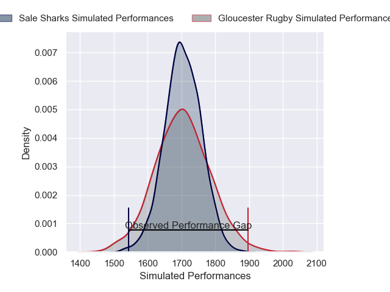
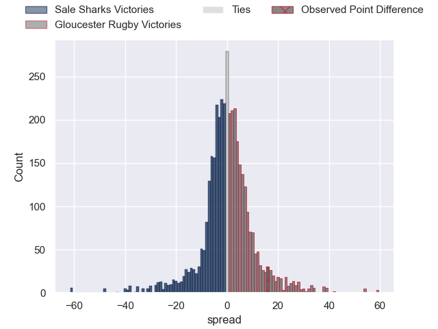
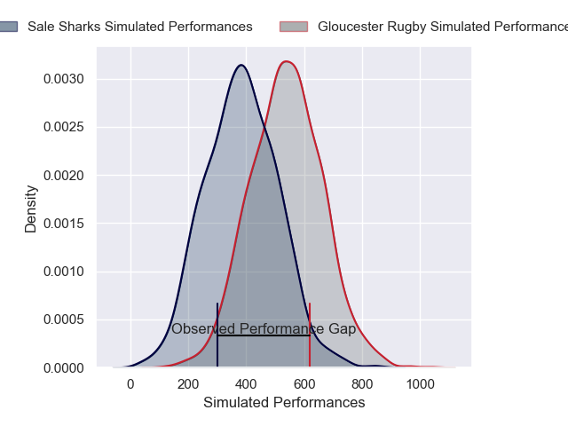
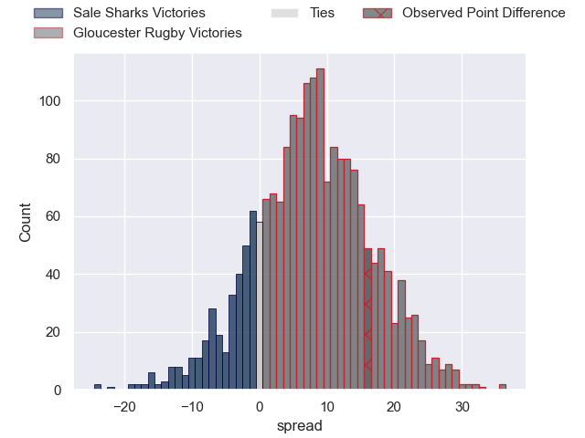
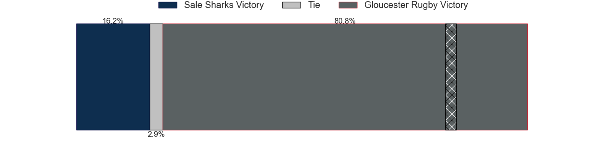

---  
layout: page  
title: Sale Sharks at Gloucester Rugby; 20-36  
date: 2025-01-04 18:00:00 -0500  
categories: "Gallagher Premiership 2024" match review  
---
# Sale Sharks at Gloucester Rugby; 20-36

# Club Level Predictions

The first set of predictions treats a club as the smallest object, as the club develops its members, organizes a gameplan, and deploys its players as needed for each match. This club model has a prediction of 0.503, which translates to predicting Gloucester Rugby to win by 0.1.

Our Over/Under is 53.5 - and combined with the spread above, we have a predicted scoreline of 27 to 27

Each club has a rating and a rating deviation (similar to a Glicko rating), and expected performances can be generated. This allows for simulated matches and spreads like the ones below.
## Projected Performances - Club Model

## Projected Spreads - Club Model

## Projected Results - Club Model

# Player Level Predictions

Treating teams instead as an entity made up of the currently active players, I have ratings for each player in an altogether different system. These can be combined to form team ratings once teamsheets are announced, weighting starters a bit higher than the reserves. After the match is played, players can be weighted by their minutes on the field, allowing for an accurate measure of the team's composition. With these compiled team ratings, we can make predictions, measure inaccuracy, and update the individual player ratings.
## Prediction without Player Minutes: Gloucester Rugby by 8.4

Sale Sharks by 7.3 on a neutral pitch

## Projected Performances - Player Model

## Projected Spreads - Player Model

## Projected Results - Player Model

|   Away Minutes | Away Player          |   Away Percentile |   Number |   Home Percentile | Home Player        |   Home Minutes |
|---------------:|:---------------------|------------------:|---------:|------------------:|:-------------------|---------------:|
|             80 | Bevan Rodd           |             94.66 |        1 |             11.02 | Mayco Vivas        |             68 |
|             80 | Luke Cowan-Dickie    |             89.68 |        2 |             94.31 | Jack Singleton     |             35 |
|             67 | Asher Opoku-Fordjour |             88.73 |        3 |             90    | Kirill Gotovtsev   |             80 |
|             80 | Ernst van Rhyn       |             90.06 |        4 |             69.98 | Freddie Thomas     |             59 |
|             80 | Jonny Hill           |             10.54 |        5 |             27.31 | Arthur Clark       |             80 |
|             77 | Tom Curry            |             86.99 |        6 |             25.92 | Jack Clement       |             65 |
|             31 | Ben Curry            |             51.33 |        7 |             13.73 | Lewis Ludlow       |             80 |
|             58 | Jean-Luc du Preez    |            100    |        8 |             85.24 | Ruan Ackermann     |             80 |
|             31 | Gus Warr             |             65.64 |        9 |             82.82 | Tomos Williams     |              9 |
|             13 | Tom Curtis           |             39.69 |       10 |             80.7  | Gareth Anscombe    |             59 |
|             40 | Tom O'Flaherty       |             97.83 |       11 |             80.59 | Josh Hathaway      |             80 |
|              9 | Luke James           |             77.47 |       12 |             32.74 | Sebastien Atkinson |             45 |
|             80 | Robert du Preez      |             70.59 |       13 |             34.18 | Chris Harris       |             76 |
|             49 | Tom Roebuck          |             65.12 |       14 |             92.71 | Max Llewellyn      |             22 |
|              4 | Joe Carpenter        |             10.09 |       15 |             79.61 | Santiago Carreras  |             18 |
|             80 | Simon McIntyre       |             93.47 |       16 |             83.47 | Val Rapava-Ruskin  |             49 |
|             55 | WillGriff John       |            nan    |       17 |             66.55 | Sebastian Blake    |             49 |
|             80 | Josh Beaumont        |             80.42 |       18 |              7.88 | Ciaran Knight      |             62 |
|             24 | Daniel du Preez      |             88.77 |       19 |             73.39 | Freddie Clarke     |             80 |
|             80 | Anerin (Nye) Thomas  |            nan    |       20 |             92.1  | Albert Tuisue      |             80 |
|              7 | Sam Bedlow           |             76.8  |       21 |             82.46 | Caolan Englefield  |              3 |
|            nan | nan                  |            nan    |       22 |             81.58 | George Barton      |             80 |
|            nan | nan                  |            nan    |       23 |             83.68 | Charlie Atkinson   |             40 |

