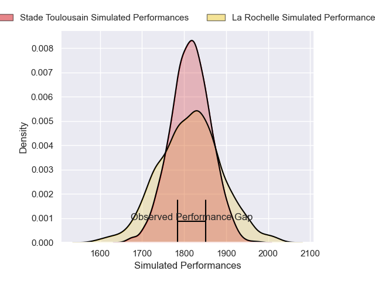
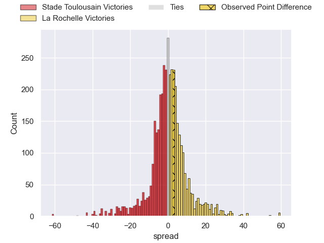
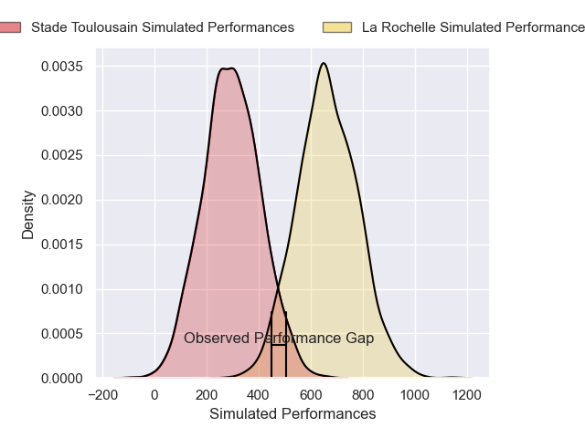
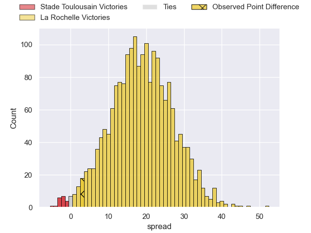
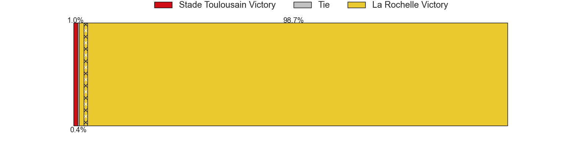

---  
layout: page  
title: Stade Toulousain at La Rochelle; 19-22  
date: 2025-01-04 18:00:00 -0500  
categories: "Top 14 Orange 2024" match review  
---
# Stade Toulousain at La Rochelle; 19-22

# Club Level Predictions

The first set of predictions treats a club as the smallest object, as the club develops its members, organizes a gameplan, and deploys its players as needed for each match. This club model has a prediction of 0.496, which translates to predicting Stade Toulousain to win by 0.1.

Our Over/Under is 39.5 - and combined with the spread above, we have a predicted scoreline of 20 to 20

Each club has a rating and a rating deviation (similar to a Glicko rating), and expected performances can be generated. This allows for simulated matches and spreads like the ones below.
## Projected Performances - Club Model

## Projected Spreads - Club Model

## Projected Results - Club Model

# Player Level Predictions

Treating teams instead as an entity made up of the currently active players, I have ratings for each player in an altogether different system. These can be combined to form team ratings once teamsheets are announced, weighting starters a bit higher than the reserves. After the match is played, players can be weighted by their minutes on the field, allowing for an accurate measure of the team's composition. With these compiled team ratings, we can make predictions, measure inaccuracy, and update the individual player ratings.
## Prediction without Player Minutes: La Rochelle by 24.7

La Rochelle by 13.2 on a neutral pitch

## Projected Performances - Player Model

## Projected Spreads - Player Model

## Projected Results - Player Model

|   Away Minutes | Away Player         |   Away Percentile |   Number |   Home Percentile | Home Player           |   Home Minutes |
|---------------:|:--------------------|------------------:|---------:|------------------:|:----------------------|---------------:|
|             39 | Cyril Baille        |             97.2  |        1 |             95.76 | Reda Wardi            |             80 |
|             31 | Thomas Lacombre     |             70.64 |        2 |             88.79 | Tolu Latu             |             67 |
|             22 | Malachi Hawkes      |             47.88 |        3 |             98.9  | Uini Atonio           |             13 |
|             32 | Efrain Elias        |             95.18 |        4 |             24.8  | Judicael Cancoriet    |             19 |
|             32 | Clement Verge       |             80.02 |        5 |             77.61 | Ultan Dillane         |             22 |
|             10 | Leo Banos           |             87.6  |        6 |              4.51 | Paul Boudehent        |             72 |
|             30 | Joshua Brennan      |             90.06 |        7 |             66.8  | Oscar Jegou           |             80 |
|             70 | Theo Ntamack        |             70.06 |        8 |             96.88 | Gregory Alldritt      |             30 |
|             80 | Simon Daroque       |             62.39 |        9 |             98.01 | Tawera Kerr-Barlow    |             80 |
|             59 | Valentin Delpy      |             87.5  |       10 |             53.95 | Ihaia West            |             80 |
|             80 | Celian Pouzelgues   |             59.21 |       11 |             98.33 | Dillyn Leyds          |             13 |
|             49 | Lucas Vigneres      |             53.61 |       12 |             91.01 | Jules Favre           |             48 |
|             50 | Paul Costes         |             79.13 |       13 |             89.35 | Ulupano Seuteni       |              8 |
|             48 | Nelson Epee         |             33.4  |       14 |             97.64 | Jack Nowell           |             67 |
|             48 | Thomas Alary        |             53.07 |       15 |             99.12 | Brice Dulin           |             80 |
|             50 | Sialevailea Tolofua |             72.75 |       16 |             64.47 | Antoine Hastoy        |             63 |
|             28 | Julien Marchand     |             98.4  |       17 |              7.12 | Georges-Henri Colombe |             41 |
|             21 | Anthony Jelonch     |             98.59 |       18 |             81.32 | Quentin Lespiaucq     |             21 |
|             80 | Joel Merkler        |             81.78 |       19 |             97.34 | Levani Botia          |             58 |
|             59 | Benjamin Bertrand   |            nan    |       20 |             36.19 | Louis Penverne        |             80 |
|             13 | Raphaël Portat      |            nan    |       21 |             94.18 | Thomas Lavault        |             40 |
|             80 | Dimitri Delibes     |             89.85 |       22 |             64.34 | Matthias Haddad       |             52 |
|             59 | Ange Capuozzo       |             98.03 |       23 |             61.58 | Hoani Bosmorin        |             58 |

