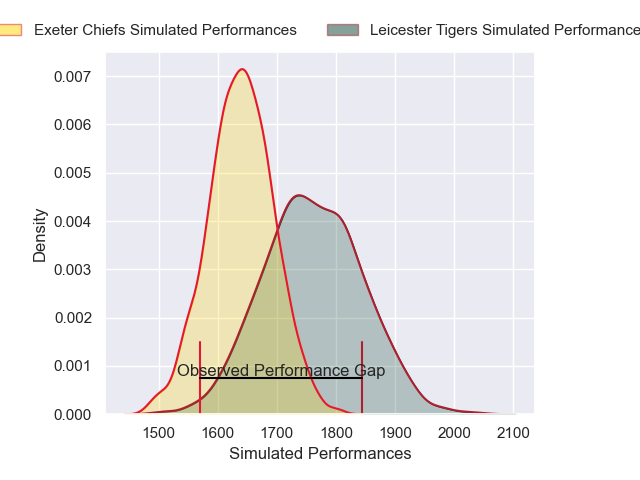
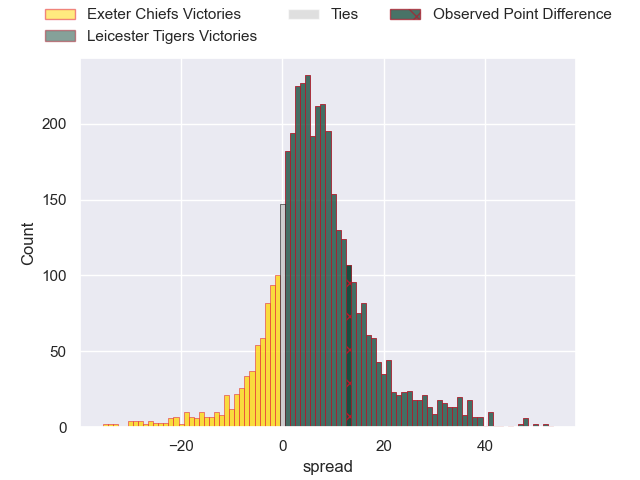
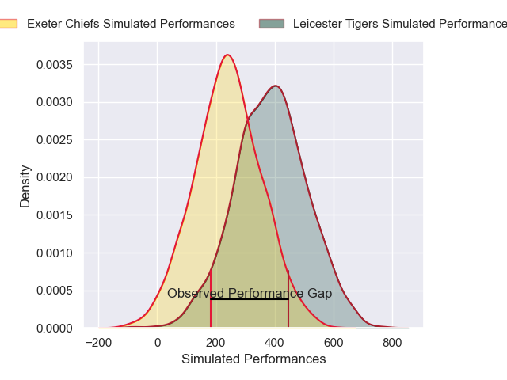
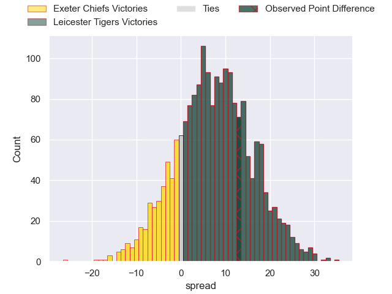
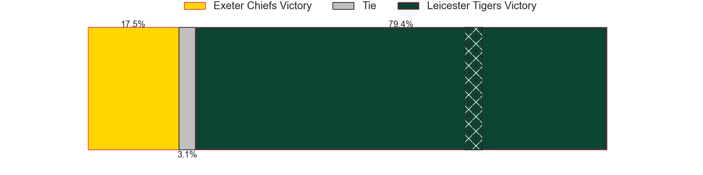

---  
layout: page  
title: Exeter Chiefs at Leicester Tigers; 15-28  
date: 2025-01-04 18:00:00 -0500  
categories: "Gallagher Premiership 2024" match review  
---
# Exeter Chiefs at Leicester Tigers; 15-28

# Club Level Predictions

The first set of predictions treats a club as the smallest object, as the club develops its members, organizes a gameplan, and deploys its players as needed for each match. This club model has a prediction of 0.667, which translates to predicting Leicester Tigers to win by 6.1.

Our Over/Under is 51.5 - and combined with the spread above, we have a predicted scoreline of 23 to 29

Each club has a rating and a rating deviation (similar to a Glicko rating), and expected performances can be generated. This allows for simulated matches and spreads like the ones below.
## Projected Performances - Club Model

## Projected Spreads - Club Model

## Projected Results - Club Model

# Player Level Predictions

Treating teams instead as an entity made up of the currently active players, I have ratings for each player in an altogether different system. These can be combined to form team ratings once teamsheets are announced, weighting starters a bit higher than the reserves. After the match is played, players can be weighted by their minutes on the field, allowing for an accurate measure of the team's composition. With these compiled team ratings, we can make predictions, measure inaccuracy, and update the individual player ratings.
## Prediction without Player Minutes: Leicester Tigers by 6.8

Exeter Chiefs by 8.4 on a neutral pitch

## Projected Performances - Player Model

## Projected Spreads - Player Model

## Projected Results - Player Model

|   Away Minutes | Away Player          |   Away Percentile |   Number |   Home Percentile | Home Player           |   Home Minutes |
|---------------:|:---------------------|------------------:|---------:|------------------:|:----------------------|---------------:|
|             21 | Scott Sio            |             94.58 |        1 |             31.69 | Nicky Smith           |             80 |
|             15 | Dan Frost            |             89.15 |        2 |             89.32 | Julian Montoya        |             31 |
|             65 | Marcus Street        |             11.86 |        3 |             83.22 | Joe Heyes             |             52 |
|             35 | Dafydd Jenkins       |             89.26 |        4 |             59.04 | Cameron Henderson     |             21 |
|             35 | Franco Molina        |             92.37 |        5 |             85.74 | Harry Wells           |             40 |
|             21 | Franco Molina        |             92.37 |        5 |             85.74 | Harry Wells           |             40 |
|             80 | Ethan Roots          |              2.15 |        6 |             70.29 | Hanro Liebenberg      |             15 |
|             80 | Jacques Vermeulen    |             86.17 |        7 |             39.55 | Tommy Reffell         |             21 |
|             35 | Greg Fisilau         |             79    |        8 |             16.01 | Olly Cracknell        |             73 |
|             80 | Stu Townsend         |             80.65 |        9 |             55.33 | Jack van Poortvliet   |             12 |
|             32 | Henry Slade          |             96.93 |       10 |             85.75 | Handre Pollard        |             80 |
|             64 | Tom Wyatt            |             92.12 |       11 |             51.43 | Ollie Hassell-Collins |              3 |
|             23 | Tamati Tua           |             61.38 |       12 |             11.21 | Solomone Kata         |             80 |
|             80 | Zack Wimbush         |             33.63 |       13 |             75.69 | Dan Kelly             |             45 |
|             80 | Ben Hammersley       |             50.15 |       14 |             84.04 | Josh Bassett          |             45 |
|             23 | Josh Hodge           |              1.54 |       15 |              3.95 | Freddie Steward       |             80 |
|             46 | Will Goodrick-Clarke |             31.1  |       16 |             54.58 | James Whitcombe       |             59 |
|             23 | Jack Innard          |            nan    |       17 |             22.78 | Charlie Clare         |             59 |
|             48 | Josh Iosefa-Scott    |             92.8  |       18 |             35.59 | Dan Cole              |             80 |
|             52 | Rusiate Tuima        |             24.4  |       19 |             14.16 | Jed Holloway          |             59 |
|             46 | Richard Capstick     |              3.01 |       20 |             88.22 | Matt Rogerson         |             80 |
|             52 | Tom Cairns           |             82.64 |       21 |             54.61 | Ben Youngs            |             80 |
|             45 | Will Rigg            |             91.79 |       22 |             61.04 | Joseph Woodward       |             80 |
|            nan | nan                  |            nan    |       23 |              8.33 | James Shillcock       |             77 |

