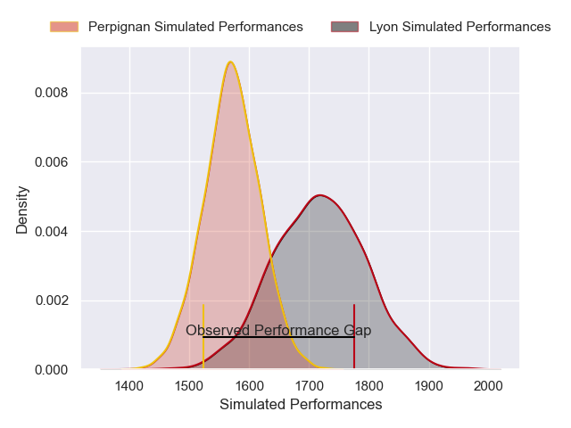
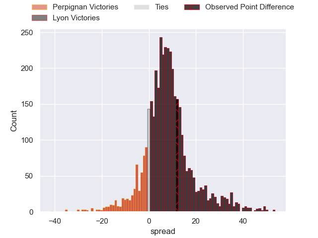
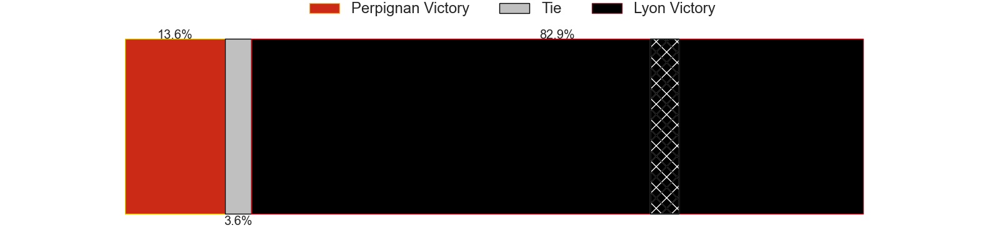
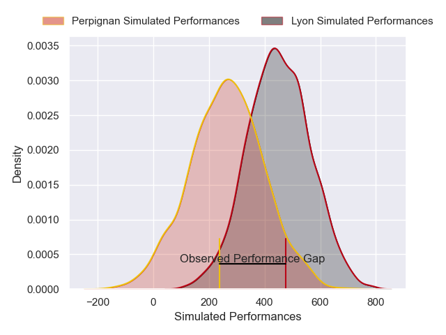
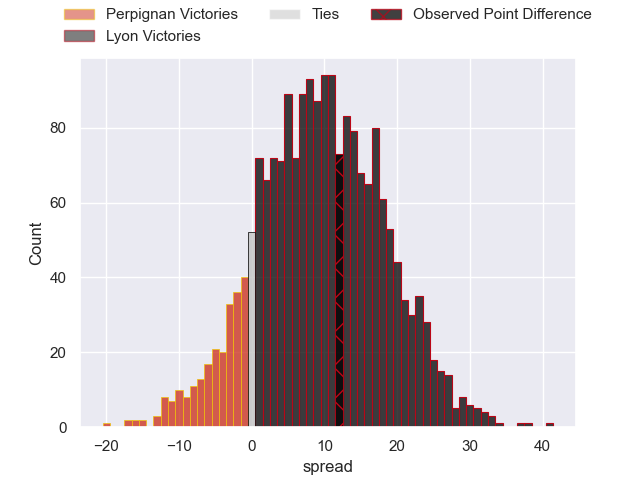
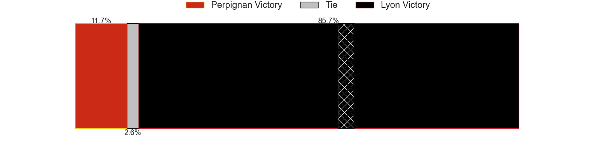

---  
layout: page  
title: Perpignan at Lyon; 24-36  
date: 2025-01-04 18:00:00 -0500  
categories: "Top 14 Orange 2024" match review  
---
# Perpignan at Lyon; 24-36

# Club Level Predictions

The first set of predictions treats a club as the smallest object, as the club develops its members, organizes a gameplan, and deploys its players as needed for each match. This club model has a prediction of 0.694, which translates to predicting Lyon to win by 7.2.

Our Over/Under is 50.5 - and combined with the spread above, we have a predicted scoreline of 22 to 29

Each club has a rating and a rating deviation (similar to a Glicko rating), and expected performances can be generated. This allows for simulated matches and spreads like the ones below.
## Projected Performances - Club Model

## Projected Spreads - Club Model

## Projected Results - Club Model

# Player Level Predictions

Treating teams instead as an entity made up of the currently active players, I have ratings for each player in an altogether different system. These can be combined to form team ratings once teamsheets are announced, weighting starters a bit higher than the reserves. After the match is played, players can be weighted by their minutes on the field, allowing for an accurate measure of the team's composition. With these compiled team ratings, we can make predictions, measure inaccuracy, and update the individual player ratings.
## Prediction without Player Minutes: Lyon by 13.1

Lyon by 0.6 on a neutral pitch

## Projected Performances - Player Model

## Projected Spreads - Player Model

## Projected Results - Player Model

|   Away Minutes | Away Player           |   Away Percentile |   Number |   Home Percentile | Home Player          |   Home Minutes |
|---------------:|:----------------------|------------------:|---------:|------------------:|:---------------------|---------------:|
|             78 | Bruce Devaux          |             15.6  |        1 |             12.84 | Hamza Kaabeche       |              6 |
|             52 | Seilala Lam           |             47.7  |        2 |             26.06 | Guillaume Marchand   |             33 |
|             68 | Pietro Ceccarelli     |             62.16 |        3 |             11.33 | Jermaine Ainsley     |             80 |
|              0 | Tristan Labouteley    |             13.11 |        4 |             39.22 | Killian Geraci       |             18 |
|             66 | Adrien Warion         |             21.26 |        5 |             74.47 | Alban Roussel        |             58 |
|             75 | Joaquin Oviedo        |             86.99 |        6 |             72.66 | Dylan Cretin         |             63 |
|             82 | Joaquin Oviedo        |             86.99 |        6 |             72.66 | Dylan Cretin         |             63 |
|             82 | Max Hicks             |             32.62 |        7 |             79.47 | Beka Saghinadze      |             82 |
|             18 | So'otala Fa'aso'o     |             91.02 |        8 |             47.76 | Beka Shvangiradze    |             82 |
|             56 | James Hall            |             16.91 |        9 |             92.73 | Baptiste Couilloud   |             46 |
|             82 | Tommaso Allan         |             61.45 |       10 |             78.85 | Leo Berdeu           |             22 |
|             36 | Alivereti Duguivalu   |              6.68 |       11 |             95.61 | Monty Ioane          |             57 |
|             30 | Jeronimo de la Fuente |             99.01 |       12 |             64.17 | Theo Millet          |             14 |
|             36 | Eneriko Buliruarua    |              3.97 |       13 |             74.86 | Alfred Parisien      |             50 |
|             66 | Tavite Veredamu       |             76.91 |       14 |             72.9  | Xavier Mignot        |             80 |
|             23 | Louis Dupichot        |             79.52 |       15 |             53.38 | Davit Niniashvili    |             22 |
|             23 | Louis Dupichot        |             79.52 |       15 |             53.38 | Davit Niniashvili    |             23 |
|             49 | Ignacio Ruiz          |             93.26 |       16 |             81.56 | Sam Matavesi         |             30 |
|             41 | Giorgi Beria          |             83.64 |       17 |              7.89 | Sebastien Taofifenua |             62 |
|             82 | Lucas Bachelier       |             84.35 |       18 |             88.98 | Arno Botha           |             82 |
|             64 | Lucas Velarte         |             13.82 |       19 |             15.45 | Steeve Blanc-Mappaz  |             82 |
|             41 | Tom Ecochard          |             66    |       20 |             85.09 | Charlie Cassang      |             82 |
|             41 | Jake McIntyre         |             88.77 |       21 |              6.83 | Martin Meliande      |             42 |
|             82 | Apisai Naqalevu       |             27.12 |       22 |             77.24 | Liam Allen           |             41 |
|             25 | Kieran Brookes        |              3.52 |       23 |             61.16 | Cedate Gomes Sa      |             46 |

