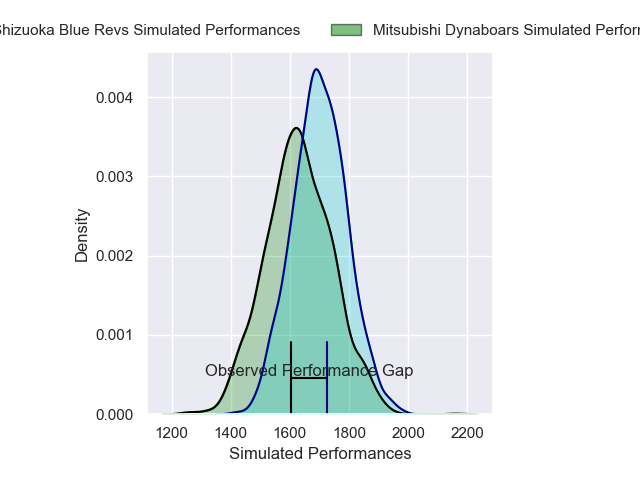
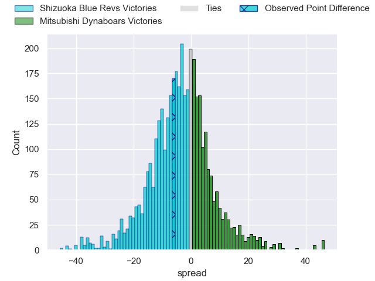
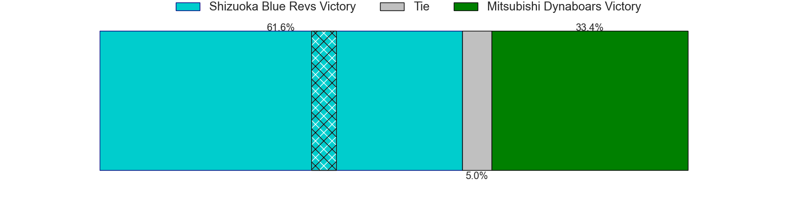
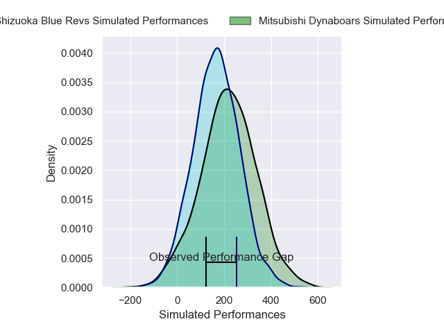
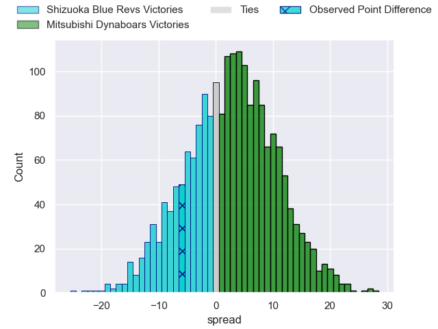
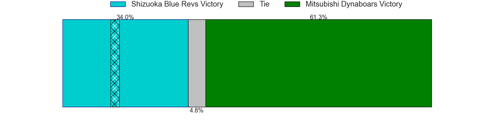

---  
layout: page  
title: Shizuoka Blue Revs at Mitsubishi Dynaboars; 40-34  
date: 2025-01-04 18:00:00 -0500  
categories: "Japan Rugby League One 2024" match review  
---
# Shizuoka Blue Revs at Mitsubishi Dynaboars; 40-34

# Club Level Predictions

The first set of predictions treats a club as the smallest object, as the club develops its members, organizes a gameplan, and deploys its players as needed for each match. This club model has a prediction of 0.402, which translates to predicting Shizuoka Blue Revs to win by 3.6.

Our Over/Under is 64.5 - and combined with the spread above, we have a predicted scoreline of 34 to 30

Each club has a rating and a rating deviation (similar to a Glicko rating), and expected performances can be generated. This allows for simulated matches and spreads like the ones below.
## Projected Performances - Club Model

## Projected Spreads - Club Model

## Projected Results - Club Model

# Player Level Predictions

Treating teams instead as an entity made up of the currently active players, I have ratings for each player in an altogether different system. These can be combined to form team ratings once teamsheets are announced, weighting starters a bit higher than the reserves. After the match is played, players can be weighted by their minutes on the field, allowing for an accurate measure of the team's composition. With these compiled team ratings, we can make predictions, measure inaccuracy, and update the individual player ratings.
## Prediction without Player Minutes: Shizuoka Blue Revs by 1.5

Shizuoka Blue Revs by 4.7 on a neutral pitch

## Projected Performances - Player Model

## Projected Spreads - Player Model

## Projected Results - Player Model

|   Away Minutes | Away Player             |   Away Percentile |   Number |   Home Percentile | Home Player       |   Home Minutes |
|---------------:|:------------------------|------------------:|---------:|------------------:|:------------------|---------------:|
|             80 | Kenta Yamashita         |             41.95 |        1 |              3.78 | Hayato Hosoda     |             65 |
|             45 | Takeshi Hino            |             96.28 |        2 |              2.66 | Lee Seung Hyok    |             68 |
|             45 | Heiichiro Ito           |             84.06 |        3 |             86.16 | Rento Tsukayama   |             46 |
|             40 | Eishin Kuwano           |             84.37 |        4 |             67.28 | Walt Steenkamp    |             21 |
|             28 | Murray Douglas          |             91.55 |        5 |             14.37 | Daniel Linde      |             21 |
|             15 | Simon Miller            |             16.87 |        6 |             54.37 | Kyo Yoshida       |             70 |
|             70 | Kwagga Smith            |             91.26 |        7 |             31.5  | Kohki Sato        |             48 |
|             15 | Malgene Ilaua           |             28.78 |        8 |             39.59 | Jackson Hemopo    |             80 |
|             80 | Kodai Okazaki           |             58.55 |        9 |             67.45 | Kota Iwamura      |             32 |
|             15 | Kenta Iemura            |             56.61 |       10 |             29.96 | James Grayson     |             65 |
|             15 | Malo Tuitama            |             80.82 |       11 |             62.6  | Satoshi Koizumi   |             65 |
|             70 | Viliami Tahitu'a        |             75.3  |       12 |             90.74 | Charlie Lawrence  |             12 |
|              9 | Sylvian Mahuza          |             43.77 |       13 |             18.85 | Tonishio Vaiahu   |             40 |
|             10 | Eito Maki               |             63.36 |       14 |             97.81 | Kurt-Lee Arendse  |             80 |
|             10 | Charles Piutau          |             93.9  |       15 |              8.5  | Kazuki Ishida     |             35 |
|             10 | Vueti Tupou             |             37.91 |       16 |            nan    | Riku Mishima      |             80 |
|             19 | Valynce Te Whare-Crosby |            nan    |       17 |             94.88 | Tomoaki Ishii     |             52 |
|             25 | Yuya Odo                |             93.7  |       18 |             30.5  | Yuki Miyazato     |             65 |
|             21 | Richard Goh Jones       |             42.78 |       19 |              7.55 | Mototsugu Hachiya |             80 |
|              7 | Takayoshi Mohara        |             16.19 |       20 |             82.8  | Curtis Rona       |             29 |
|             54 | Richmond Tongatama      |            nan    |       21 |             92.55 | Jack Stratton     |             28 |
|             80 | Sean Vete               |             56.8  |       22 |            nan    | Timote Tavalea    |             74 |
|             61 | Shuntaro Kitamura       |            nan    |       23 |            nan    | Shunsuke Sakamoto |             19 |

