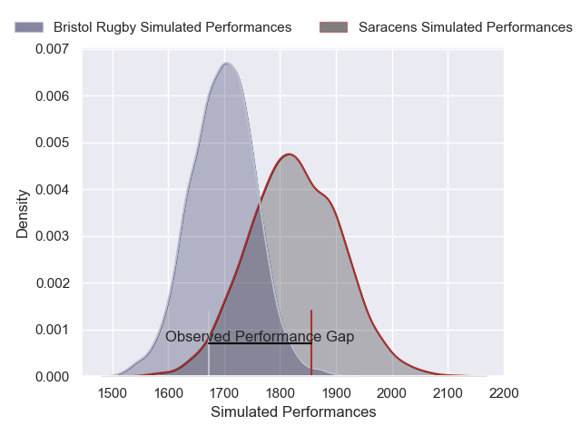
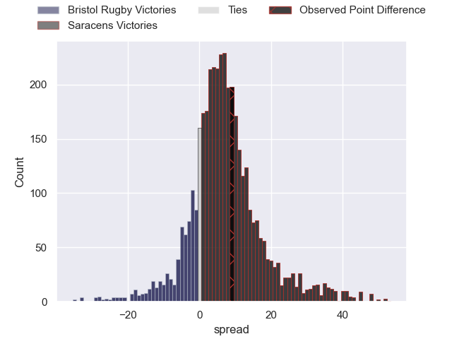
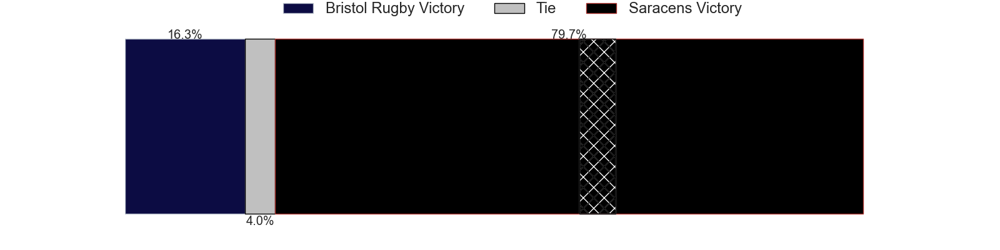
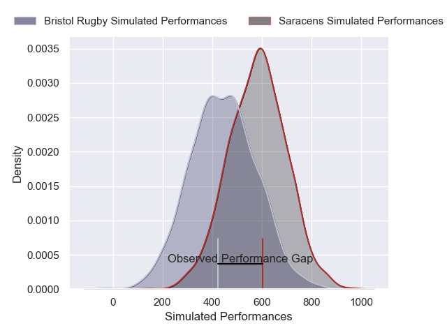
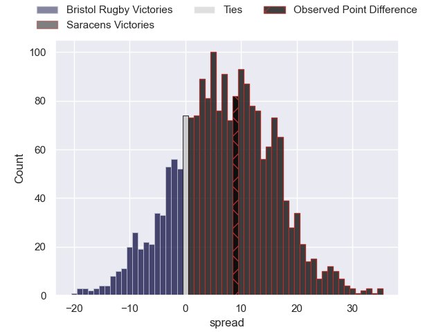

---  
layout: page  
title: Bristol Rugby at Saracens; 26-35  
date: 2025-01-04 18:00:00 -0500  
categories: "Gallagher Premiership 2024" match review  
---
# Bristol Rugby at Saracens; 26-35

# Club Level Predictions

The first set of predictions treats a club as the smallest object, as the club develops its members, organizes a gameplan, and deploys its players as needed for each match. This club model has a prediction of 0.675, which translates to predicting Saracens to win by 6.5.

Our Over/Under is 51.5 - and combined with the spread above, we have a predicted scoreline of 22 to 29

Each club has a rating and a rating deviation (similar to a Glicko rating), and expected performances can be generated. This allows for simulated matches and spreads like the ones below.
## Projected Performances - Club Model

## Projected Spreads - Club Model

## Projected Results - Club Model

# Player Level Predictions

Treating teams instead as an entity made up of the currently active players, I have ratings for each player in an altogether different system. These can be combined to form team ratings once teamsheets are announced, weighting starters a bit higher than the reserves. After the match is played, players can be weighted by their minutes on the field, allowing for an accurate measure of the team's composition. With these compiled team ratings, we can make predictions, measure inaccuracy, and update the individual player ratings.
## Prediction without Player Minutes: Saracens by 13.1

Saracens by 2.1 on a neutral pitch

## Projected Performances - Player Model

## Projected Spreads - Player Model

## Projected Results - Player Model

|   Away Minutes | Away Player                |   Away Percentile |   Number |   Home Percentile | Home Player          |   Home Minutes |
|---------------:|:---------------------------|------------------:|---------:|------------------:|:---------------------|---------------:|
|             80 | Ellis Genge                |             75.34 |        1 |              9.31 | Rhys Carré           |             68 |
|             80 | Gabriel Oghre              |             90.78 |        2 |             99.65 | Jamie George         |             58 |
|             12 | George Kloska              |             63.34 |        3 |             67.28 | Marco Riccioni       |             64 |
|             26 | James Dun                  |             93.01 |        4 |             98.54 | Maro Itoje           |             44 |
|             22 | Jamie Hodgson              |             88.64 |        5 |             30.19 | Harry Wilson         |             80 |
|             79 | Steven Luatua              |             99.19 |        6 |             98.68 | Juan Martin Gonzalez |             80 |
|             80 | Fitz Harding               |             95.93 |        7 |             98.78 | Ben Earl             |             80 |
|             53 | Viliame Mata               |             36.53 |        8 |             59.39 | Tom Willis           |             40 |
|             16 | Harry Randall              |             95.45 |        9 |             78.18 | Ivan van Zyl         |             36 |
|             27 | Sam Worsley                |             27.53 |       10 |             59.47 | Fergus Burke         |             80 |
|             80 | Noah Heward                |             86.55 |       11 |             85.4  | Lucio Cinti          |             55 |
|             80 | James Williams             |             73.54 |       12 |             99.78 | Nick Tompkins        |             72 |
|             78 | Benhard Janse van Rensburg |             96.47 |       13 |             83.68 | Alex Lozowski        |              2 |
|             80 | Jack Bates                 |              4.96 |       14 |             65.36 | Rotimi Segun         |             54 |
|             80 | Richard Lane               |             69.93 |       15 |             83.01 | Elliot Daly          |              2 |
|             80 | Yann Thomas                |             83.14 |       16 |             25.08 | Phil Brantingham     |             12 |
|              2 | Harry Thacker              |             79.26 |       17 |              3.72 | Kapeli Pifeleti      |             58 |
|             58 | Jimmy Halliwell            |             67.37 |       18 |             40.86 | Alec Clarey          |              8 |
|             71 | Jake Heenan                |             25    |       19 |             79.59 | Nathan Michelow      |             80 |
|             53 | Steele Robert Barker       |             92.33 |       20 |             88.65 | James Hadfield       |             10 |
|             48 | Kieran Marmion             |             94.18 |       21 |             69.21 | Olamide Sodeke       |             68 |
|             80 | Harry Byrne                |             90.75 |       22 |             31.64 | Gareth Simpson       |             22 |
|             10 | Kalaveti Ravouvou          |             82.58 |       23 |             53.14 | Olly Hartley         |             80 |

