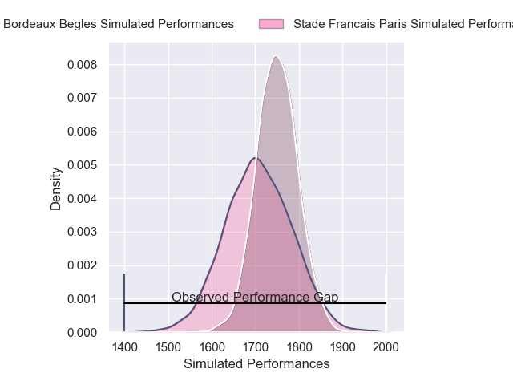
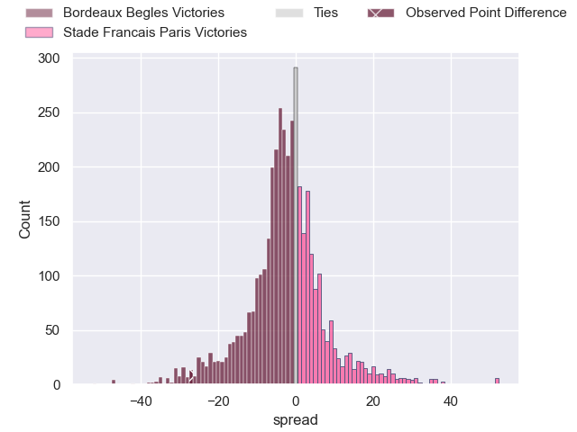
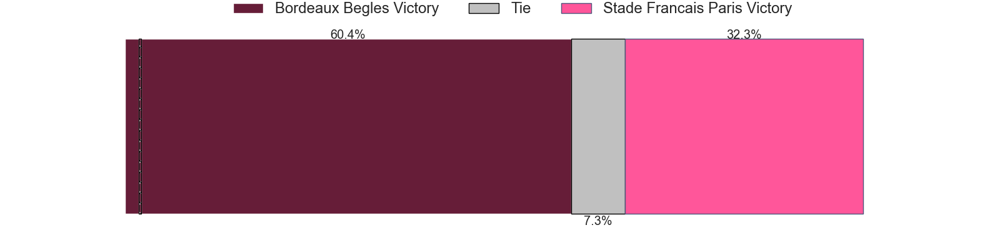
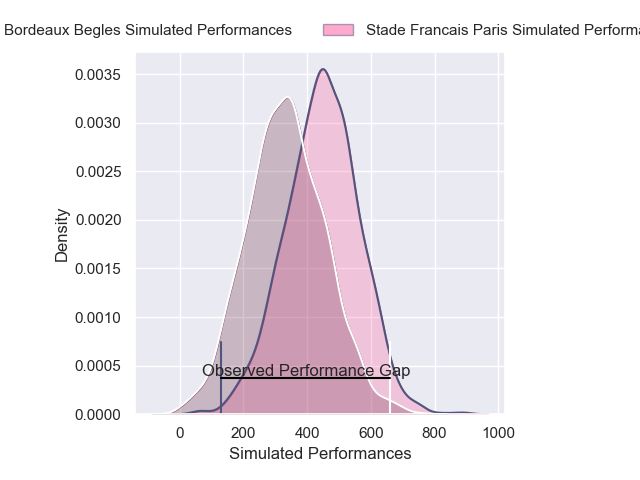
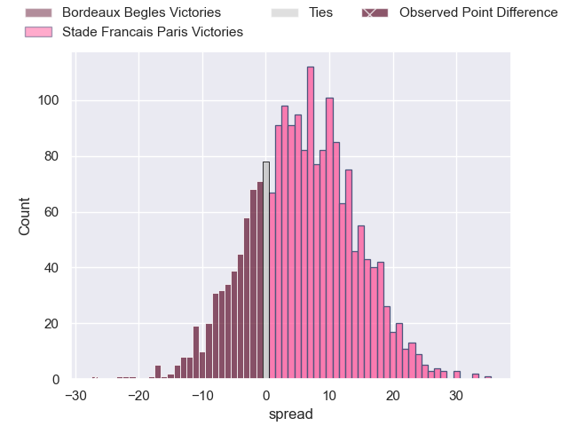
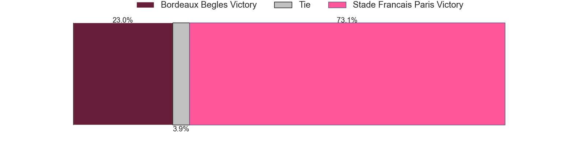

---  
layout: page  
title: Bordeaux Begles at Stade Francais Paris; 46-19  
date: 2025-01-04 18:00:00 -0500  
categories: "Top 14 Orange 2024" match review  
---
# Bordeaux Begles at Stade Francais Paris; 46-19

# Club Level Predictions

The first set of predictions treats a club as the smallest object, as the club develops its members, organizes a gameplan, and deploys its players as needed for each match. This club model has a prediction of 0.444, which translates to predicting Bordeaux Begles to win by 2.0.

Our Over/Under is 41.5 - and combined with the spread above, we have a predicted scoreline of 22 to 20

Each club has a rating and a rating deviation (similar to a Glicko rating), and expected performances can be generated. This allows for simulated matches and spreads like the ones below.
## Projected Performances - Club Model

## Projected Spreads - Club Model

## Projected Results - Club Model

# Player Level Predictions

Treating teams instead as an entity made up of the currently active players, I have ratings for each player in an altogether different system. These can be combined to form team ratings once teamsheets are announced, weighting starters a bit higher than the reserves. After the match is played, players can be weighted by their minutes on the field, allowing for an accurate measure of the team's composition. With these compiled team ratings, we can make predictions, measure inaccuracy, and update the individual player ratings.
## Prediction without Player Minutes: Stade Francais Paris by 1.7

Bordeaux Begles by 13.6 on a neutral pitch

## Projected Performances - Player Model

## Projected Spreads - Player Model

## Projected Results - Player Model

|   Away Minutes | Away Player               |   Away Percentile |   Number |   Home Percentile | Home Player            |   Home Minutes |
|---------------:|:--------------------------|------------------:|---------:|------------------:|:-----------------------|---------------:|
|             67 | Jefferson Poirot          |             92.37 |        1 |              8.05 | Moses Alo-Emile        |             80 |
|             35 | Maxime Lamothe            |             80.6  |        2 |             95.91 | Giacomo Nicotera       |             19 |
|             80 | Ben Tameifuna             |             99.24 |        3 |             52.71 | Paul Alo-Emile         |             39 |
|             15 | Adam Coleman              |             99.1  |        4 |              1.91 | Paul Gabrillagues      |             39 |
|             10 | Cyril Cazeaux             |             91.16 |        5 |             81.53 | JJ van der Mescht      |             25 |
|             65 | Bastien Vergnes Taillefer |             93.55 |        6 |              7.58 | Tanginoa Halaifonua    |             23 |
|             15 | Romain Gardrat            |             52.77 |        7 |             28.48 | Ryan Chapuis           |             20 |
|             80 | Marko Gazzotti            |             76.09 |        8 |             17.88 | Juan Martin Scelzo     |             20 |
|              2 | Maxime Lucu               |             98.37 |        9 |             93.67 | Brad Weber             |             65 |
|             80 | Joey Carbery              |             89.04 |       10 |             63.38 | Louis Carbonel         |             55 |
|             80 | Louis Bielle-Biarrey      |             81.67 |       11 |             11.92 | Charles Laloi          |             80 |
|             10 | Ben Tapuai                |             71.81 |       12 |             32.85 | Jeremy Ward            |             65 |
|             65 | Nicolas Depoortere        |             90.12 |       13 |              5.77 | Samuel Ezeala          |             57 |
|             22 | Pablo Uberti              |              3.55 |       14 |             47.98 | Joe Marchant           |             61 |
|             80 | Romain Buros              |             98.9  |       15 |             24.12 | Leo Barre              |             80 |
|             26 | Temo Matiu                |              3.59 |       16 |             58.63 | Baptiste Pesenti       |             80 |
|             44 | Alexandre Ricard          |             75.4  |       17 |             48.98 | Isaac Koffi            |             45 |
|             58 | Toma Taufa                |             54.24 |       18 |             25.16 | Romain Briatte         |             80 |
|             34 | Romain Latterrade         |              1.6  |       19 |             78.52 | Lester Etien           |             70 |
|             32 | Ugo Boniface              |             92.88 |       20 |             12.28 | Lucas Peyresblanques   |             80 |
|             80 | Nans Ducuing              |             90.79 |       21 |             94.24 | Francisco Gomez Kodela |             80 |
|             55 | Rohan Janse van Rensburg  |             84.35 |       22 |             87.85 | Pierre-Henri Azagoh    |             13 |
|             80 | Yann Lesgourgues          |              9.22 |       23 |            nan    | nan                    |            nan |

