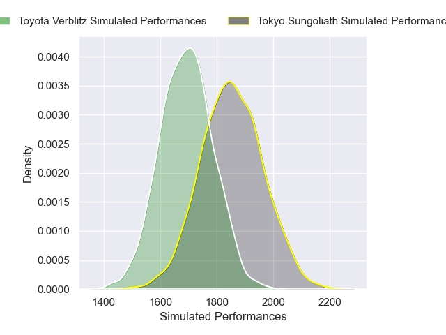
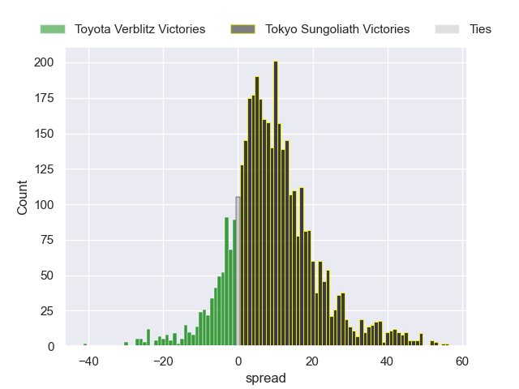
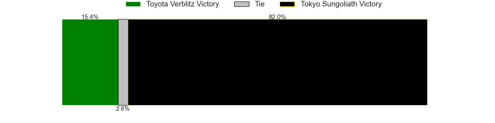
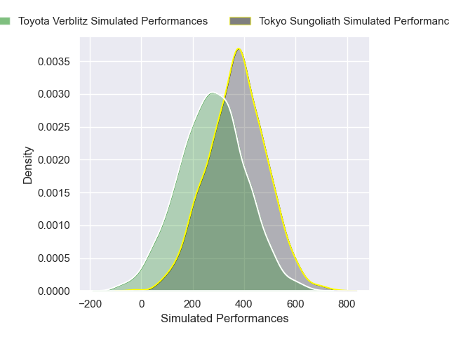
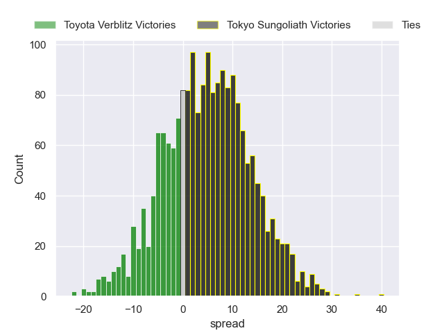
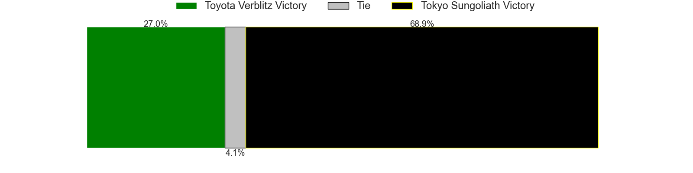

---  
layout: page  
title: Toyota Verblitz at Tokyo Sungoliath; 30-30  
date: 2025-01-04 18:00:00 -0500  
categories: "Japan Rugby League One 2024" match review  
---
# Toyota Verblitz at Tokyo Sungoliath; 30-30

# Club Level Predictions

The first set of predictions treats a club as the smallest object, as the club develops its members, organizes a gameplan, and deploys its players as needed for each match. This club model has a prediction of 0.707, which translates to predicting Tokyo Sungoliath to win by 7.9.

Our Over/Under is 59.5 - and combined with the spread above, we have a predicted scoreline of 26 to 34

Each club has a rating and a rating deviation (similar to a Glicko rating), and expected performances can be generated. This allows for simulated matches and spreads like the ones below.
## Projected Performances - Club Model

## Projected Spreads - Club Model

## Projected Results - Club Model

# Player Level Predictions

Treating teams instead as an entity made up of the currently active players, I have ratings for each player in an altogether different system. These can be combined to form team ratings once teamsheets are announced, weighting starters a bit higher than the reserves. After the match is played, players can be weighted by their minutes on the field, allowing for an accurate measure of the team's composition. With these compiled team ratings, we can make predictions, measure inaccuracy, and update the individual player ratings.
## Prediction without Player Minutes: Tokyo Sungoliath by 5.8

Tokyo Sungoliath by 1.0 on a neutral pitch

## Projected Performances - Player Model

## Projected Spreads - Player Model

## Projected Results - Player Model

|   Away Minutes | Away Player         |   Away Percentile |   Number |   Home Percentile | Home Player         |   Home Minutes |
|---------------:|:--------------------|------------------:|---------:|------------------:|:--------------------|---------------:|
|             29 | Shogo Miura         |             92.03 |        1 |             85.49 | Yukio Morikawa      |             40 |
|             82 | Yoshikatsu Hikosaka |             95.04 |        2 |             66.67 | Kosuke Horikoshi    |             40 |
|             82 | Genki Sudo          |             79.87 |        3 |             29.53 | Kan Nakano          |             19 |
|             82 | Richie Gray         |             83.59 |        4 |             95.44 | Sam Jeffries        |             80 |
|             30 | Daichi Akiyama      |             78.25 |        5 |             98.74 | Harry Hockings      |             26 |
|             41 | Isaiah Mapusua      |             83.03 |        6 |             64.43 | Kanji Shimokawa     |             31 |
|             53 | Kosei Miki          |             57.62 |        7 |             32.11 | Kai Yamamoto        |              9 |
|             33 | Kazuki Himeno       |             71.84 |        8 |             94.08 | Sean McMahon        |             80 |
|             33 | Aaron Smith         |             96.18 |        9 |             77.82 | Yutaka Nagare       |             14 |
|             71 | Rikiya Matsuda      |             97.36 |       10 |             44.71 | Mikiya Takamoto     |             61 |
|             41 | Yuichiro Wada       |             74.71 |       11 |             99.62 | Cheslin Kolbe       |             26 |
|             41 | Nicholas McCurran   |             78.5  |       12 |             88.97 | Ryoto Nakamura      |             24 |
|             49 | Joseph Manu         |             32.64 |       13 |             41.68 | Isaiah Punivai      |             25 |
|             19 | Taichi Takahashi    |             86.26 |       14 |             89.22 | Seiya Ozaki         |             31 |
|              9 | Tiaan Falcon        |             87.36 |       15 |             23.31 | Ryosuke Kawase      |             80 |
|             80 | Will Tupou          |             21.54 |       16 |             43.54 | Kenta Kobayashi     |             55 |
|             71 | Josh Dickson        |             69.22 |       17 |             85.4  | Shinnosuke Kakinaga |             80 |
|             56 | Siosaia Fifita      |              0.55 |       18 |             13.27 | Tamati Ioane        |             19 |
|             49 | Shunsuke Asaoka     |            nan    |       19 |            nan    | Kienori Go          |             71 |
|             80 | Matt McGahan        |             81.37 |       20 |             70.8  | Taiga Ozaki         |             80 |
|             80 | Ryunosuke Momoji    |            nan    |       21 |             15.44 | Shogo Nakano        |             66 |
|             80 | Ryusei Kato         |             80.14 |       22 |            nan    | Saimoni Vunilagi    |             80 |
|             82 | Kaito Shigeno       |             33.09 |       23 |             69.27 | Kenta Fukuda        |             49 |

