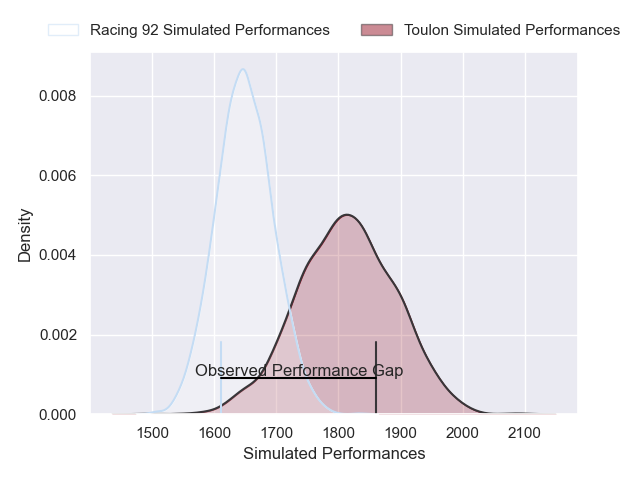
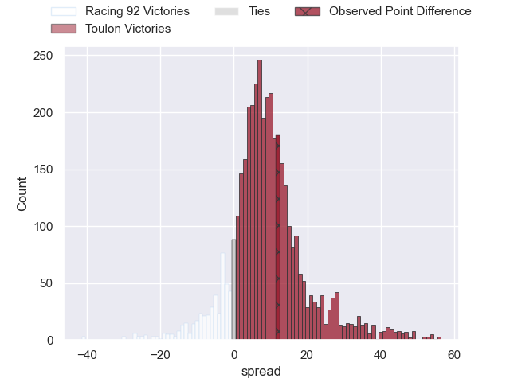
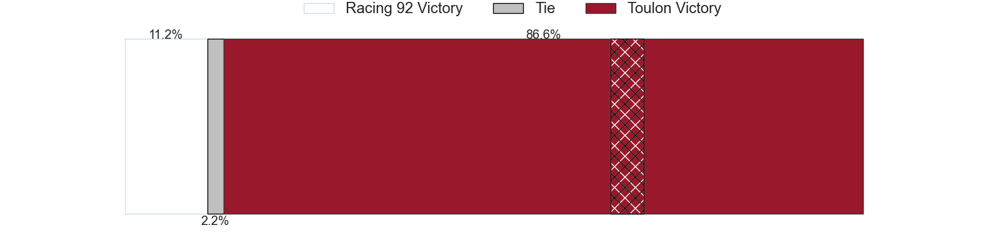
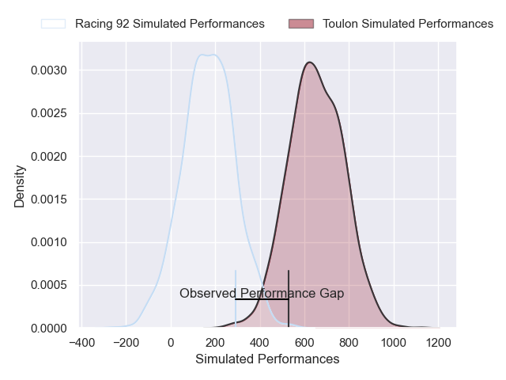
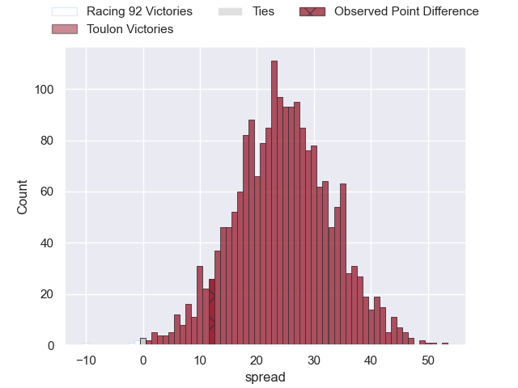
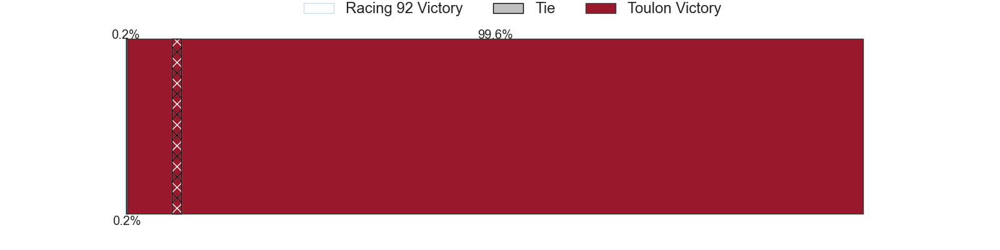

---  
layout: page  
title: Racing 92 at Toulon; 24-36  
date: 2025-01-04 18:00:00 -0500  
categories: "Top 14 Orange 2024" match review  
---
# Racing 92 at Toulon; 24-36

# Club Level Predictions

The first set of predictions treats a club as the smallest object, as the club develops its members, organizes a gameplan, and deploys its players as needed for each match. This club model has a prediction of 0.715, which translates to predicting Toulon to win by 8.1.

Our Over/Under is 49.5 - and combined with the spread above, we have a predicted scoreline of 21 to 29

Each club has a rating and a rating deviation (similar to a Glicko rating), and expected performances can be generated. This allows for simulated matches and spreads like the ones below.
## Projected Performances - Club Model

## Projected Spreads - Club Model

## Projected Results - Club Model

# Player Level Predictions

Treating teams instead as an entity made up of the currently active players, I have ratings for each player in an altogether different system. These can be combined to form team ratings once teamsheets are announced, weighting starters a bit higher than the reserves. After the match is played, players can be weighted by their minutes on the field, allowing for an accurate measure of the team's composition. With these compiled team ratings, we can make predictions, measure inaccuracy, and update the individual player ratings.
## Prediction without Player Minutes: Toulon by 23.7

Toulon by 12.1 on a neutral pitch

## Projected Performances - Player Model

## Projected Spreads - Player Model

## Projected Results - Player Model

|   Away Minutes | Away Player         |   Away Percentile |   Number |   Home Percentile | Home Player            |   Home Minutes |
|---------------:|:--------------------|------------------:|---------:|------------------:|:-----------------------|---------------:|
|             71 | Hassane Kolingar    |             18.22 |        1 |             91.36 | Dany Priso             |             80 |
|             80 | Janick Tarrit       |             65.3  |        2 |             82.03 | Teddy Baubigny         |             74 |
|             42 | Thomas Laclayat     |             67.54 |        3 |             94.92 | Kyle Sinckler          |             80 |
|             80 | Will Rowlands       |             22.89 |        4 |             47.69 | Matthias Halagahu      |             22 |
|             23 | Fabien Sanconnie    |             39.76 |        5 |             78.82 | David Ribbans          |             40 |
|             22 | Cameron Woki        |             95.08 |        6 |             63.01 | Lewis Ludlam           |             23 |
|             23 | Ibrahim Diallo      |             46.52 |        7 |             99.08 | Charles Ollivon        |             55 |
|             33 | Jordan Joseph       |             79.83 |        8 |             82.74 | Facundo Isa            |             58 |
|             80 | Nolann Le Garrec    |             76.31 |        9 |             97.83 | Baptiste Serin         |             71 |
|             80 | Dan Lancaster       |              3.07 |       10 |             86.84 | Paolo Garbisi          |             56 |
|             41 | Henry Arundell      |              0.59 |       11 |             78.03 | Seta Tuicuvu           |             22 |
|             23 | Josua Tuisova       |             94.23 |       12 |             10.77 | Jérémy Sinzelle        |             80 |
|             70 | Henry Chavancy      |            100    |       13 |             89.9  | Leicester Fainga'anuku |             25 |
|             57 | Vinaya Habosi       |             37.34 |       14 |             24.43 | Gael Drean             |             80 |
|             57 | Max Spring          |              7.89 |       15 |             55.48 | Marius Domon           |             80 |
|             38 | Robin Couly         |             40.04 |       16 |             78.18 | Esteban Abadie         |             80 |
|             80 | Junior Kpoku        |             82.03 |       17 |             88.08 | Gianmarco Lucchesi     |             57 |
|             47 | Maxime Baudonne     |             67.57 |       18 |             73.09 | Brian Alainu'uese      |             14 |
|             50 | Gia Kharaishvili    |             37.8  |       19 |             96.02 | Emerick Setiano        |             80 |
|             10 | Guram Gogichashvili |             71.53 |       20 |             85.03 | Selevasio Tolofua      |             57 |
|             58 | Antoine Gibert      |             92.98 |       21 |             34.15 | Daniel Brennan         |              6 |
|             25 | Tristan Tedder      |             20.83 |       22 |             89.51 | Ben White              |             80 |
|             20 | Clovis Le bail      |             44.67 |       23 |             85.53 | Enzo Herve             |             58 |

