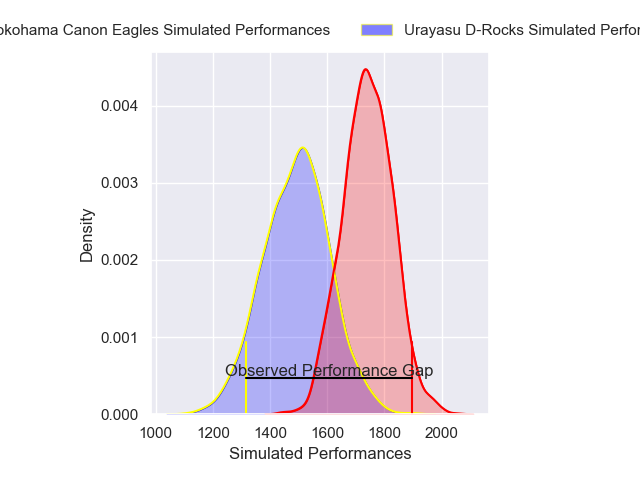
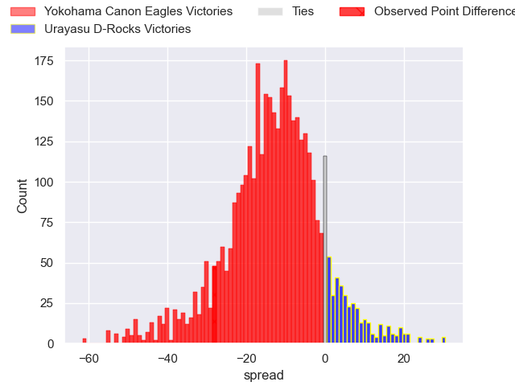
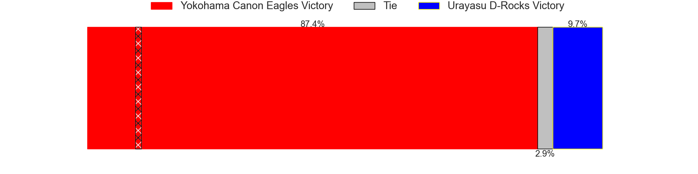
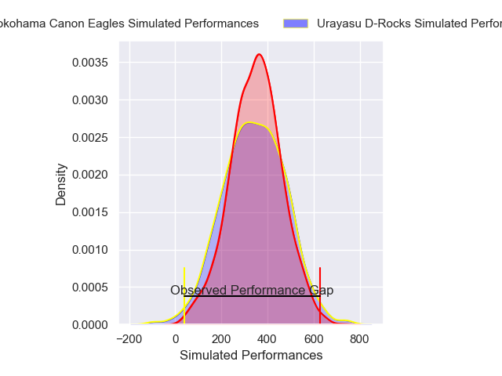
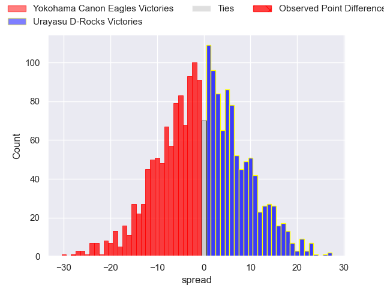
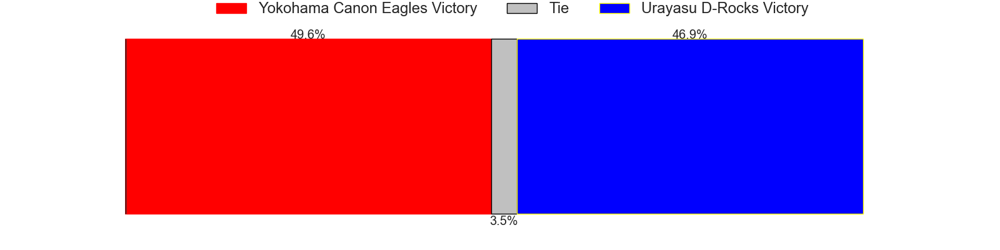

---  
layout: page  
title: Yokohama Canon Eagles at Urayasu D-Rocks; 40-12  
date: 2025-01-04 18:00:00 -0500  
categories: "Japan Rugby League One 2024" match review  
---
# Yokohama Canon Eagles at Urayasu D-Rocks; 40-12

# Club Level Predictions

The first set of predictions treats a club as the smallest object, as the club develops its members, organizes a gameplan, and deploys its players as needed for each match. This club model has a prediction of 0.199, which translates to predicting Yokohama Canon Eagles to win by 12.6.

Our Over/Under is 60.5 - and combined with the spread above, we have a predicted scoreline of 36 to 24

Each club has a rating and a rating deviation (similar to a Glicko rating), and expected performances can be generated. This allows for simulated matches and spreads like the ones below.
## Projected Performances - Club Model

## Projected Spreads - Club Model

## Projected Results - Club Model

# Player Level Predictions

Treating teams instead as an entity made up of the currently active players, I have ratings for each player in an altogether different system. These can be combined to form team ratings once teamsheets are announced, weighting starters a bit higher than the reserves. After the match is played, players can be weighted by their minutes on the field, allowing for an accurate measure of the team's composition. With these compiled team ratings, we can make predictions, measure inaccuracy, and update the individual player ratings.
## Prediction without Player Minutes: Yokohama Canon Eagles by 2.0

Yokohama Canon Eagles by 6.1 on a neutral pitch

## Projected Performances - Player Model

## Projected Spreads - Player Model

## Projected Results - Player Model

|   Away Minutes | Away Player        |   Away Percentile |   Number |   Home Percentile | Home Player          |   Home Minutes |
|---------------:|:-------------------|------------------:|---------:|------------------:|:---------------------|---------------:|
|             25 | Takato Okabe       |             95.15 |        1 |             10.03 | Hidetomo Nabeshima   |             74 |
|             80 | Yusuke Niwai       |             88.19 |        2 |             45.26 | Ryuji Fujimura       |             80 |
|             19 | Tatsuro Sugimoto   |              5.36 |        3 |             28.06 | Shuhei Takeuchi      |             53 |
|             10 | Liaki Moli         |              7.98 |        4 |             90.61 | Shingo Nakashima     |             61 |
|             10 | Matt Philip        |             49.8  |        5 |             87.27 | Tom Parsons          |              6 |
|             80 | Billy Harmon       |             68.27 |        6 |             19.34 | Zephania Tuinona     |             71 |
|             28 | Masato Furukawa    |             74.41 |        7 |             59.16 | Hendrik Tui          |             32 |
|             80 | Sione Halasili     |             81.88 |        8 |             77.19 | Jasper Wiese         |             15 |
|             45 | Faf de Klerk       |             95.47 |        9 |              2.17 | Norifumi Hashimoto   |             70 |
|             80 | Yu Tamura          |             89.53 |       10 |             68.82 | Otere Black          |             10 |
|             35 | Masayoshi Takezawa |             39.69 |       11 |             25.15 | Caleb Cavubati       |             70 |
|             80 | Yusuke Kajimura    |             97.8  |       12 |             21.87 | Kentaro Nanimatsu    |             80 |
|             28 | Jesse Kriel        |             98.79 |       13 |             50.22 | Shane Gates          |             80 |
|             15 | Kippei Ishida      |             50.59 |       14 |             23.48 | Junya Matsumoto      |             80 |
|             15 | Jumpei Ogura       |             99.1  |       15 |             89.64 | Takuhei Yasuda       |             55 |
|             46 | Shunta Nakamura    |             89.98 |       16 |             94.06 | Brody MacAskill      |             70 |
|             80 | Amanaki Mafi       |             94.67 |       17 |             94.95 | Tone Tukufuka        |             80 |
|             65 | Viliame Takayawa   |             96.17 |       18 |             72.96 | Kim Ryom             |             73 |
|             27 | Sioeli Vakalahi    |             81.37 |       19 |             58.11 | Israel Folau         |             80 |
|             80 | Shouta Matsuoka    |            nan    |       20 |             78.62 | Ren Iinuma           |             40 |
|             61 | Cormac Daly        |             56.46 |       21 |            nan    | Junichiro Matsushita |             52 |
|             19 | Kafazumi Yamasuga  |             64.31 |       22 |            nan    | Yang Jung Soo        |             80 |
|             15 | Ryo Tabata         |             31.1  |       23 |             84.14 | Wimpie van der Walt  |             80 |

