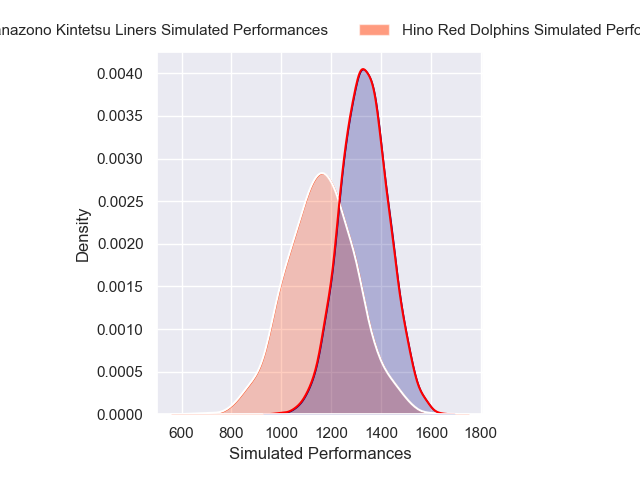
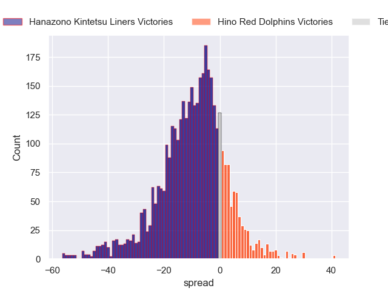
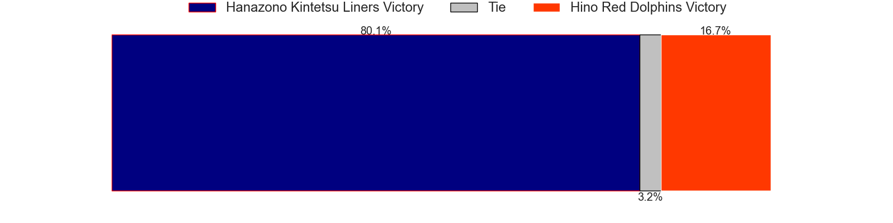
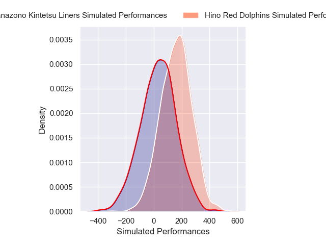
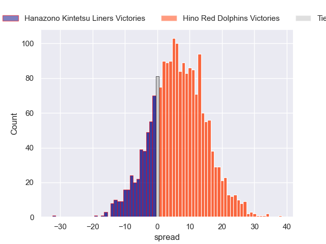
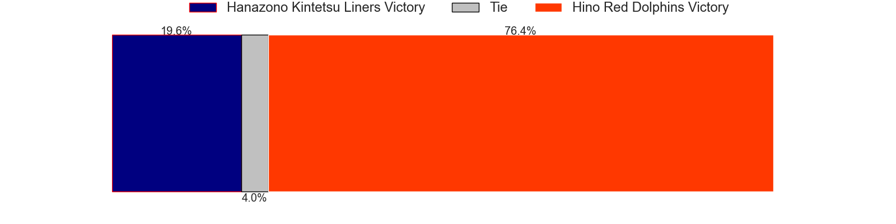

---  
layout: page  
title: Hanazono Kintetsu Liners at Hino Red Dolphins; 38-38  
date: 2025-01-05 18:00:00 -0500  
categories: "Japan Rugby League One D2 2024" match review  
---
# Hanazono Kintetsu Liners at Hino Red Dolphins; 38-38

# Club Level Predictions

The first set of predictions treats a club as the smallest object, as the club develops its members, organizes a gameplan, and deploys its players as needed for each match. This club model has a prediction of 0.281, which translates to predicting Hanazono Kintetsu Liners to win by 8.5.

Our Over/Under is 65.5 - and combined with the spread above, we have a predicted scoreline of 37 to 29

Each club has a rating and a rating deviation (similar to a Glicko rating), and expected performances can be generated. This allows for simulated matches and spreads like the ones below.
## Projected Performances - Club Model

## Projected Spreads - Club Model

## Projected Results - Club Model

# Player Level Predictions

Treating teams instead as an entity made up of the currently active players, I have ratings for each player in an altogether different system. These can be combined to form team ratings once teamsheets are announced, weighting starters a bit higher than the reserves. After the match is played, players can be weighted by their minutes on the field, allowing for an accurate measure of the team's composition. With these compiled team ratings, we can make predictions, measure inaccuracy, and update the individual player ratings.
## Prediction without Player Minutes: Hino Red Dolphins by 3.6

Hino Red Dolphins by 0.9 on a neutral pitch

## Projected Performances - Player Model

## Projected Spreads - Player Model

## Projected Results - Player Model

|   Away Minutes | Away Player      |   Away Percentile |   Number |   Home Percentile | Home Player     |   Home Minutes |
|---------------:|:-----------------|------------------:|---------:|------------------:|:----------------|---------------:|
|             80 | Kenta Tanaka     |              3.4  |        1 |             56.55 | Yuto Tokuda     |             32 |
|             80 | Reiya Ueyama     |             50.63 |        2 |             35.24 | Towa Taniguchi  |             53 |
|             80 | Kota Mitake      |             19.9  |        3 |             28.4  | Makoto Tsuchiya |             53 |
|             80 | Sam Jeffries     |             91.52 |        4 |             39.9  | Noah Tovio      |             22 |
|             80 | Sanaila Waqa     |             64.95 |        5 |             95.56 | Rory Arnold     |             66 |
|             13 | Shohei Nonaka    |             10.03 |        6 |             41.04 | Shun Nakashika  |             48 |
|             80 | Daiki Miyashita  |              3.58 |        7 |             58.75 | Shun Tomonaga   |             80 |
|             20 | Akira Ioane      |             94.46 |        8 |              4.48 | Josh Fenner     |             80 |
|             80 | Will Genia       |             88.59 |        9 |             35.14 | Kotaro Hatada   |             80 |
|             35 | Quade Cooper     |             97.55 |       10 |             30.73 | Keita Doi       |             27 |
|             80 | Tomoya Kimura    |              9.43 |       11 |             50.49 | Moeki Fukushi   |             80 |
|             58 | Koji Okamura     |              2.09 |       12 |             60.44 | Taroma Togo     |             25 |
|             45 | Tom Hendrickson  |             42.53 |       13 |             12.2  | Shogo Tokota    |             55 |
|             20 | Takehito Ekawa   |             49.12 |       14 |             61.3  | Ko Kojima       |             27 |
|             27 | Hiroki Kumoyama  |             50.23 |       15 |             19.82 | Kyoji Takano    |             13 |
|             60 | James Blackwell  |             12.79 |       16 |             27.74 | Junya Lee       |             25 |
|              9 | Keitaro Hitora   |             27.72 |       17 |            nan    | Motoki Yamazaki |             78 |
|             55 | Will Harrison    |              2.23 |       18 |             71    | Kyosuke Horie   |              2 |
|             20 | Simeone Schmidt  |            nan    |       19 |             38.59 | AJ Wolf         |             45 |
|             80 | Keiichi Kaneko   |              6.26 |       20 |             14.64 | Sora Ohchi      |             25 |
|             67 | Shintaro Okamoto |            nan    |       21 |            nan    | Kousei Tamaki   |             80 |
|             22 | Yuchol Mun       |              8.59 |       22 |            nan    | nan             |            nan |
|             19 | Akauloa Manu     |            nan    |       23 |            nan    | nan             |            nan |

