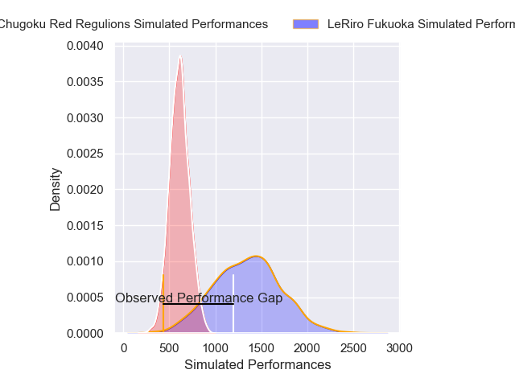
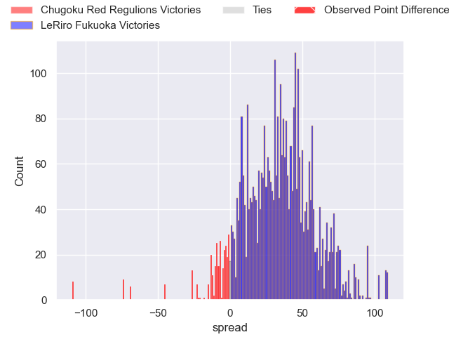
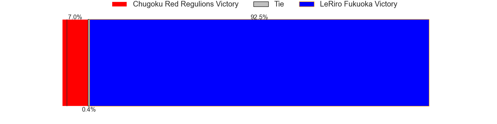
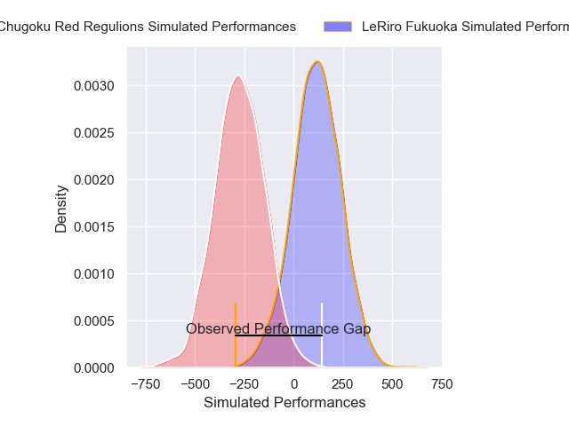
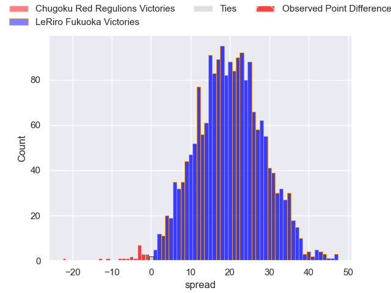
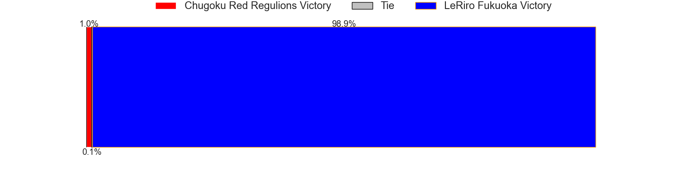

---  
layout: page  
title: Chugoku Red Regulions at LeRiro Fukuoka; 39-17  
date: 2025-01-05 18:00:00 -0500  
categories: "Japan Rugby League One D3 2024" match review  
---
# Chugoku Red Regulions at LeRiro Fukuoka; 39-17

# Club Level Predictions

The first set of predictions treats a club as the smallest object, as the club develops its members, organizes a gameplan, and deploys its players as needed for each match. This club model has a prediction of 0.982, which translates to predicting LeRiro Fukuoka to win by 36.7.

Our Over/Under is 37.5 - and combined with the spread above, we have a predicted scoreline of 0 to 37

Each club has a rating and a rating deviation (similar to a Glicko rating), and expected performances can be generated. This allows for simulated matches and spreads like the ones below.
## Projected Performances - Club Model

## Projected Spreads - Club Model

## Projected Results - Club Model

# Player Level Predictions

Treating teams instead as an entity made up of the currently active players, I have ratings for each player in an altogether different system. These can be combined to form team ratings once teamsheets are announced, weighting starters a bit higher than the reserves. After the match is played, players can be weighted by their minutes on the field, allowing for an accurate measure of the team's composition. With these compiled team ratings, we can make predictions, measure inaccuracy, and update the individual player ratings.
## Prediction without Player Minutes: LeRiro Fukuoka by 20.9

LeRiro Fukuoka by 18.8 on a neutral pitch

## Projected Performances - Player Model

## Projected Spreads - Player Model

## Projected Results - Player Model

|   Away Minutes | Away Player       |   Away Percentile |   Number |   Home Percentile | Home Player         |   Home Minutes |
|---------------:|:------------------|------------------:|---------:|------------------:|:--------------------|---------------:|
|             80 | Kojiro Arito      |              9.98 |        1 |             13.34 | Keita Kimura        |             67 |
|             40 | Kentaro Iwanaga   |              4.61 |        2 |             10.99 | Nozomi Kuraya       |             67 |
|             80 | Haruki Miyata     |             73.07 |        3 |              2.6  | Shun Terawaki       |             80 |
|             80 | Taro Nishikawa    |              0.49 |        4 |             17.57 | Kennta Ueda         |             80 |
|             80 | Tomonari Aoki     |             33.98 |        5 |             15.44 | Keita Terada        |             19 |
|             76 | Kohei Matsunaga   |              1.83 |        6 |              8.23 | Karne Hesketh       |             60 |
|              8 | Kouta Moriyama    |              0.2  |        7 |             14.94 | Yuusuke Hisada      |             67 |
|             80 | Ed Quirk          |              1.02 |        8 |             23.88 | Finau Makavaha      |             20 |
|             35 | Rintaro Kawashima |             15.45 |        9 |             72.36 | Hisanori Mimata     |             67 |
|             32 | Hayato Miyazaki   |             59.03 |       10 |             14.54 | Shotaro Matsuo      |             80 |
|             32 | Syougo Azuma      |             56.49 |       11 |             47.61 | Masakazu Yatsumonji |             80 |
|             40 | Shinya Hirayama   |             17.86 |       12 |             16.87 | Issei Shige         |             60 |
|             80 | Masaaki Morita    |              2.09 |       13 |             14.88 | Kentaro Kamata      |             45 |
|             25 | Kentaro Fujii     |             12.31 |       14 |             43.89 | Amanaki Lisala      |              8 |
|             13 | Masahiro Nakano   |              1.09 |       15 |              6.1  | Doga Maeda          |             72 |
|             20 | Hashizo Yoshida   |              8.82 |       16 |             47.66 | Masahito Tonomoto   |             13 |
|             80 | Kento Miyata      |             12    |       17 |            nan    | Tomoki Nobeta       |             29 |
|             31 | Hayato Moriyama   |            nan    |       18 |             36.83 | Shota Hirono        |             55 |
|             80 | Keigo Hatanaka    |              2.39 |       19 |            nan    | Taiyou Minami       |             18 |
|             61 | Shohei Tsukamoto  |              1.82 |       20 |            nan    | Syuuhei Harada      |             80 |
|             13 | Noriyuki Kureyama |             16.02 |       21 |             36.12 | Kouta Nishimura     |             13 |
|             72 | Yuta Nishihama    |            nan    |       22 |              2    | Benjamin Ray Yagi   |             31 |
|            nan | nan               |            nan    |       23 |            nan    | Yuki Kono           |             66 |

