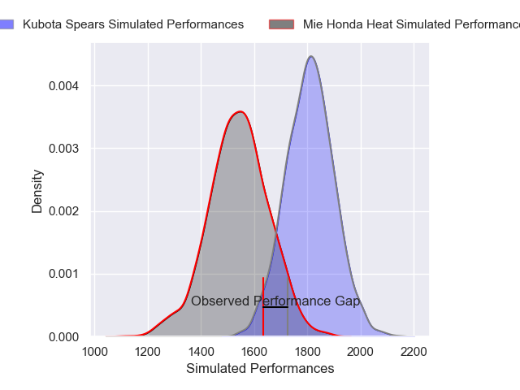
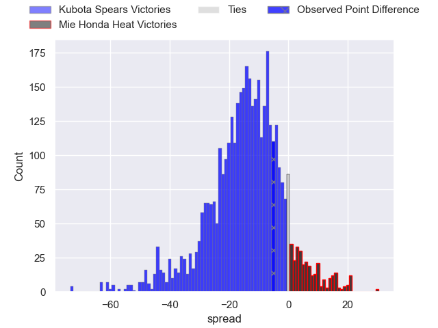
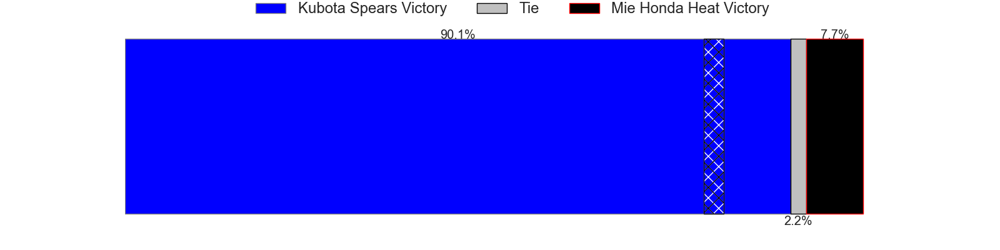
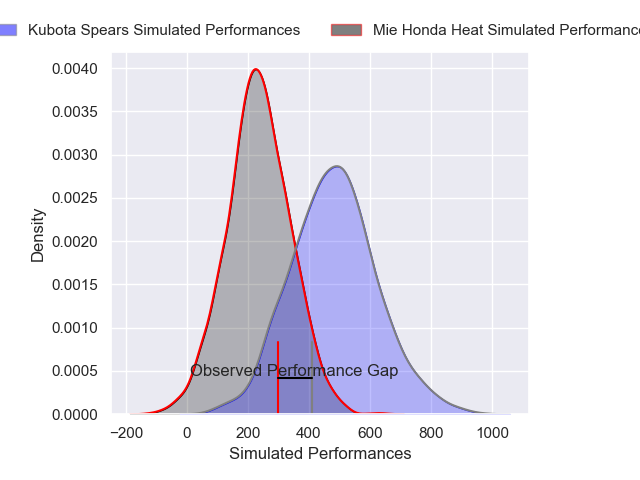
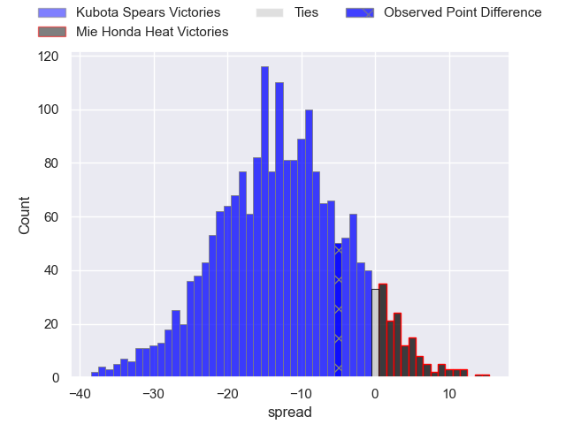
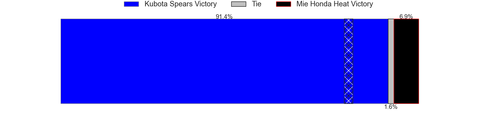

---  
layout: page  
title: Kubota Spears at Mie Honda Heat; 32-27  
date: 2025-01-05 18:00:00 -0500  
categories: "Japan Rugby League One 2024" match review  
---
# Kubota Spears at Mie Honda Heat; 32-27

# Club Level Predictions

The first set of predictions treats a club as the smallest object, as the club develops its members, organizes a gameplan, and deploys its players as needed for each match. This club model has a prediction of 0.186, which translates to predicting Kubota Spears to win by 13.3.

Our Over/Under is 52.5 - and combined with the spread above, we have a predicted scoreline of 33 to 20

Each club has a rating and a rating deviation (similar to a Glicko rating), and expected performances can be generated. This allows for simulated matches and spreads like the ones below.
## Projected Performances - Club Model

## Projected Spreads - Club Model

## Projected Results - Club Model

# Player Level Predictions

Treating teams instead as an entity made up of the currently active players, I have ratings for each player in an altogether different system. These can be combined to form team ratings once teamsheets are announced, weighting starters a bit higher than the reserves. After the match is played, players can be weighted by their minutes on the field, allowing for an accurate measure of the team's composition. With these compiled team ratings, we can make predictions, measure inaccuracy, and update the individual player ratings.
## Prediction without Player Minutes: Kubota Spears by 7.6

Kubota Spears by 11.1 on a neutral pitch

## Projected Performances - Player Model

## Projected Spreads - Player Model

## Projected Results - Player Model

|   Away Minutes | Away Player       |   Away Percentile |   Number |   Home Percentile | Home Player            |   Home Minutes |
|---------------:|:------------------|------------------:|---------:|------------------:|:-----------------------|---------------:|
|             25 | Yota Kamimori     |             40.94 |        1 |              9.23 | Tatsuhiko Tsurukawa    |             62 |
|             80 | Malcolm Marx      |             99.82 |        2 |             64.54 | Koki Hida              |             40 |
|             80 | Opeti Helu        |             75.17 |        3 |             21.81 | Taiki Yoshioka         |             14 |
|             31 | David Van Zeeland |             45.34 |        4 |             44.08 | Mark Abbott            |             49 |
|             80 | David Bulbring    |             78.64 |        5 |             94.85 | Franco Mostert         |             80 |
|             73 | Tyler Paul        |             96.95 |        6 |             99.7  | Pablo Matera           |             29 |
|             80 | Takeo Suenaga     |             85.06 |        7 |             17.17 | Waimana Kapa           |             20 |
|             55 | Faulua Makisi     |             78.57 |        8 |             37.96 | Talifolofola Tangipa   |             80 |
|             29 | Shinobu Fujiwara  |             45.64 |        9 |             72    | Azuma Doei             |             49 |
|             56 | Bernard Foley     |             98.9  |       10 |             63.66 | Manu Vunipola          |             49 |
|             62 | Haruto Kida       |             68.23 |       11 |             69.94 | Larry Steven Sulunga   |             62 |
|             80 | Rikus Pretorius   |             21.39 |       12 |              7.83 | Fraser Quirk           |             18 |
|             56 | Sione Teaupa      |             88.64 |       13 |             86.33 | Jonathan Faauli        |             40 |
|             80 | Koga Nezuka       |             85.02 |       14 |             10.59 | Haruhiko Uemura        |             18 |
|             66 | Yuhei Shimada     |             20.48 |       15 |             83.66 | Lomano Lemeki          |             51 |
|             80 | Keijiro Tamefusa  |             52.6  |       16 |              6.61 | Ryota Kobayashi        |             51 |
|             25 | Halatoa Vailea    |             72.23 |       17 |             87.28 | Janko Swanepoel        |             51 |
|             54 | Kota Kaishi       |             84.23 |       18 |            nan    | Kanato Hirano          |             80 |
|             40 | Hayate Era        |             36.88 |       19 |            nan    | Feinga Kihe Lotu Fakai |              4 |
|             60 | Merwe Olivier     |             65.83 |       20 |            nan    | Ikuma Yamada           |             40 |
|             80 | Asipeli Moala     |            nan    |       21 |             20.36 | Taichi Takenaka        |             26 |
|             80 | Bryn Hall         |             97.45 |       22 |            nan    | Tony Ray Hunt          |             40 |
|             31 | Tomoki Kishioka   |             47.14 |       23 |             77.09 | Hayata Nakao           |             80 |

