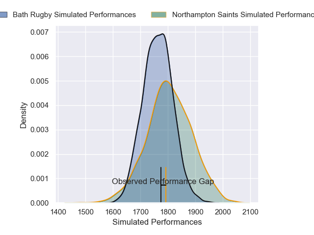
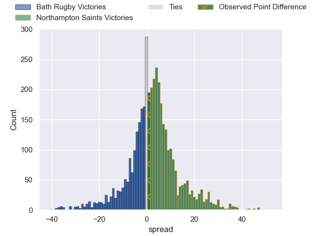
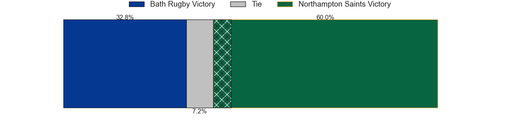
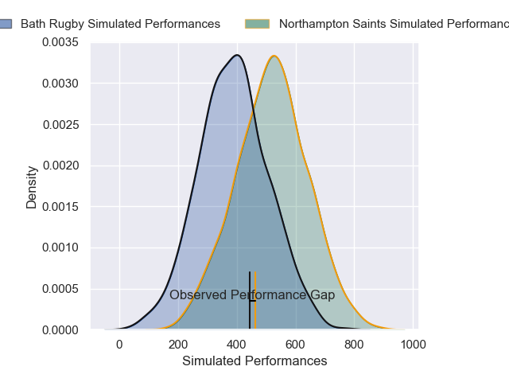
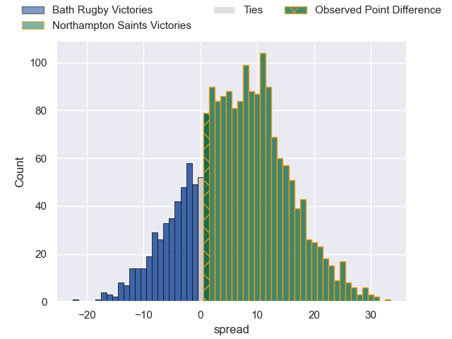
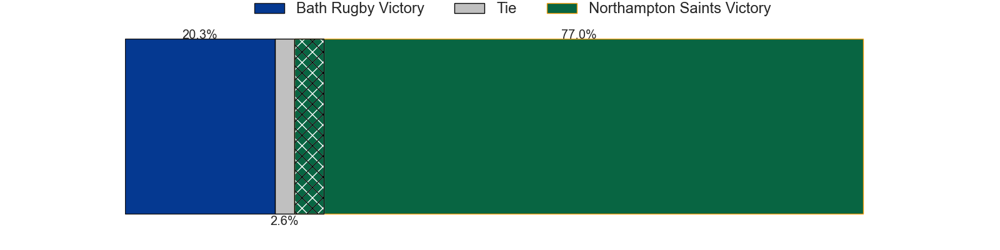

---  
layout: page  
title: Bath Rugby at Northampton Saints; 34-35  
date: 2025-01-05 18:00:00 -0500  
categories: "Gallagher Premiership 2024" match review  
---
# Bath Rugby at Northampton Saints; 34-35

# Club Level Predictions

The first set of predictions treats a club as the smallest object, as the club develops its members, organizes a gameplan, and deploys its players as needed for each match. This club model has a prediction of 0.564, which translates to predicting Northampton Saints to win by 2.3.

Our Over/Under is 44.5 - and combined with the spread above, we have a predicted scoreline of 21 to 23

Each club has a rating and a rating deviation (similar to a Glicko rating), and expected performances can be generated. This allows for simulated matches and spreads like the ones below.
## Projected Performances - Club Model

## Projected Spreads - Club Model

## Projected Results - Club Model

# Player Level Predictions

Treating teams instead as an entity made up of the currently active players, I have ratings for each player in an altogether different system. These can be combined to form team ratings once teamsheets are announced, weighting starters a bit higher than the reserves. After the match is played, players can be weighted by their minutes on the field, allowing for an accurate measure of the team's composition. With these compiled team ratings, we can make predictions, measure inaccuracy, and update the individual player ratings.
## Prediction without Player Minutes: Northampton Saints by 3.0

Bath Rugby by 12.0 on a neutral pitch

## Projected Performances - Player Model

## Projected Spreads - Player Model

## Projected Results - Player Model

|   Away Minutes | Away Player      |   Away Percentile |   Number |   Home Percentile | Home Player       |   Home Minutes |
|---------------:|:-----------------|------------------:|---------:|------------------:|:------------------|---------------:|
|             30 | Beno Obano       |             92.37 |        1 |             17.03 | Tom West          |             35 |
|             80 | Tom Dunn         |             97.16 |        2 |             17.38 | Nathan Langdon    |             80 |
|             16 | Will Stuart      |             68.96 |        3 |              0.08 | Trevor Davison    |             45 |
|             29 | Quinn Roux       |             96.21 |        4 |             97.77 | Temo Mayanavanua  |             80 |
|             22 | Ross Molony      |             95.24 |        5 |             10.97 | Alex Coles        |             80 |
|             80 | Guy Pepper       |              9.55 |        6 |              3.56 | Josh Kemeny       |             80 |
|             49 | Miles Reid       |             95.73 |        7 |             95.83 | Tom Pearson       |             30 |
|             16 | Alfie Barbeary   |             72.65 |        8 |             44.29 | Juarno Augustus   |             50 |
|             31 | Ben Spencer      |             87.82 |        9 |             96.73 | Alex Mitchell     |             80 |
|             31 | Finn Russell     |            100    |       10 |             57.93 | Fin Smith         |             58 |
|             56 | Will Muir        |             11.93 |       11 |             35.59 | James Ramm        |             50 |
|             80 | Max Ojomoh       |             93.5  |       12 |             80.6  | Rory Hutchinson   |              9 |
|             54 | Ollie Lawrence   |             80.49 |       13 |             80.15 | Fraser Dingwall   |             80 |
|             31 | Joe Cokanasiga   |             95.04 |       14 |             94.75 | Tommy Freeman     |             80 |
|             22 | Orlando Bailey   |             71.02 |       15 |             83.88 | George Hendy      |             64 |
|             80 | Josh Bayliss     |             14.23 |       16 |             65.52 | Tarek Haffar      |             80 |
|             80 | Sam Underhill    |             97.15 |       17 |             11.55 | Tom Lockett       |             80 |
|             80 | Francois van Wyk |             83.89 |       18 |             21.65 | Angus Scott-Young |             31 |
|             80 | Jaco Coetzee     |             54.08 |       19 |             86.28 | Henry Pollock     |             35 |
|             71 | Charlie Ewels    |             80.29 |       20 |             71.64 | Luke Green        |             80 |
|             64 | Thomas du Toit   |             96.14 |       21 |            nan    | nan               |            nan |

