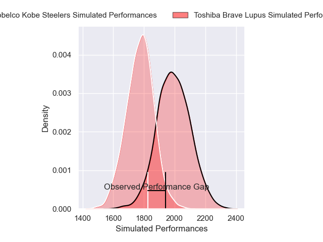
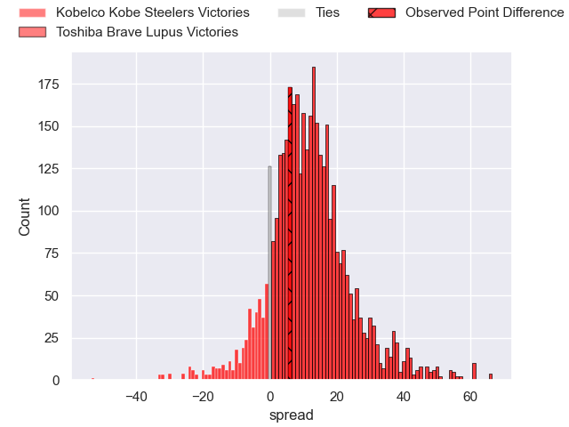
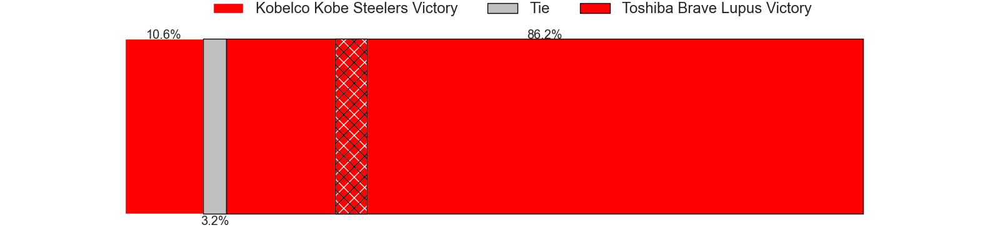
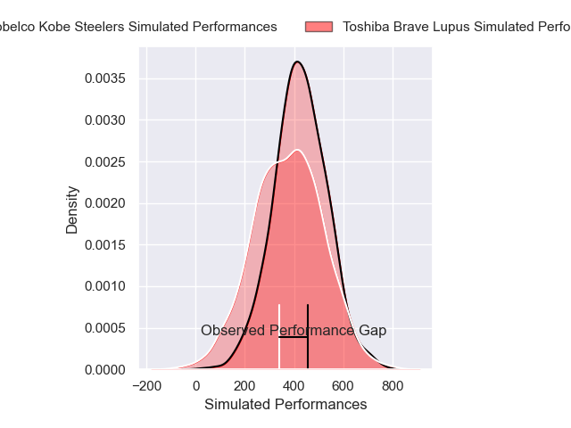
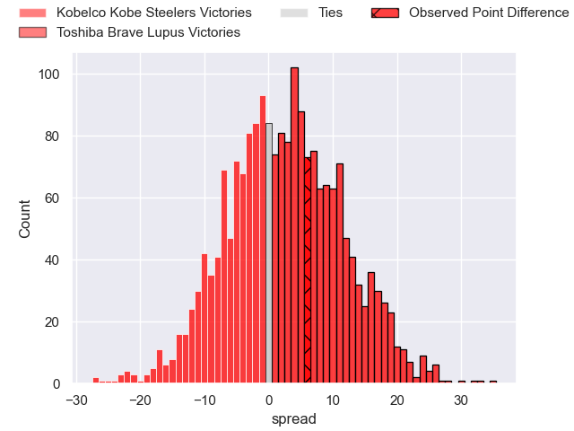
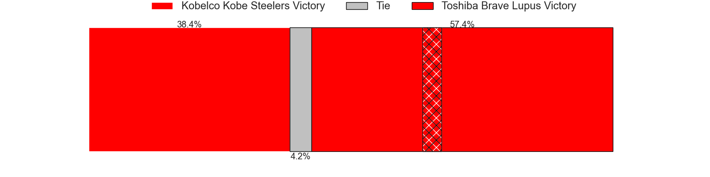

---  
layout: page  
title: Kobelco Kobe Steelers at Toshiba Brave Lupus; 26-32  
date: 2025-01-05 18:00:00 -0500  
categories: "Japan Rugby League One 2024" match review  
---
# Kobelco Kobe Steelers at Toshiba Brave Lupus; 26-32

# Club Level Predictions

The first set of predictions treats a club as the smallest object, as the club develops its members, organizes a gameplan, and deploys its players as needed for each match. This club model has a prediction of 0.77, which translates to predicting Toshiba Brave Lupus to win by 10.9.

Our Over/Under is 51.5 - and combined with the spread above, we have a predicted scoreline of 20 to 31

Each club has a rating and a rating deviation (similar to a Glicko rating), and expected performances can be generated. This allows for simulated matches and spreads like the ones below.
## Projected Performances - Club Model

## Projected Spreads - Club Model

## Projected Results - Club Model

# Player Level Predictions

Treating teams instead as an entity made up of the currently active players, I have ratings for each player in an altogether different system. These can be combined to form team ratings once teamsheets are announced, weighting starters a bit higher than the reserves. After the match is played, players can be weighted by their minutes on the field, allowing for an accurate measure of the team's composition. With these compiled team ratings, we can make predictions, measure inaccuracy, and update the individual player ratings.
## Prediction without Player Minutes: Toshiba Brave Lupus by 13.4

Toshiba Brave Lupus by 9.2 on a neutral pitch

## Projected Performances - Player Model

## Projected Spreads - Player Model

## Projected Results - Player Model

|   Away Minutes | Away Player          |   Away Percentile |   Number |   Home Percentile | Home Player      |   Home Minutes |
|---------------:|:---------------------|------------------:|---------:|------------------:|:-----------------|---------------:|
|             62 | Shigure Takao        |             55.62 |        1 |             89.43 | Sena Kimura      |             53 |
|             80 | George Turner        |            100    |        2 |             71.45 | Daigo Hashimoto  |             80 |
|             12 | Koo Ji-won           |              1.01 |        3 |             93.12 | Yuta Kokaji      |             45 |
|             80 | Gerard Cowley-Tuioti |             82.91 |        4 |             98.93 | Jacob Pierce     |             49 |
|             40 | Brodie Retallick     |            100    |        5 |             90.97 | Warner Dearns    |             80 |
|             68 | Takara Imamura       |             63.21 |        6 |             95.02 | Shannon Frizell  |             18 |
|             80 | Tiennan Costley      |             66.97 |        7 |             86.89 | Takeshi Sasaki   |             80 |
|             27 | Amanaki Saumaki      |             38.57 |        8 |             90.82 | Michael Leitch   |             14 |
|             40 | Atsushi Hiwasa       |             91.82 |        9 |             89.09 | Yuhei Sugiyama   |              7 |
|             62 | Timothy Lafaele      |             46.48 |       10 |             93.17 | Takuro Matsunaga |             18 |
|             62 | Kanta Matsunaga      |             72.42 |       11 |             87.88 | Atsuki Kuwayama  |             18 |
|             13 | Ngani Laumape        |             89.31 |       12 |             84.45 | Taichi Mano      |             18 |
|             80 | Michael Little       |             71.11 |       13 |             97.57 | Seta Tamanivalu  |             80 |
|             80 | Inoke Burua          |             79.77 |       14 |             68.32 | Jone Naikabula   |             56 |
|             80 | Seungsin Lee         |              1.31 |       15 |             94.34 | Michael Collins  |             24 |
|              5 | Rakuhei Yamashita    |             93.42 |       16 |             76.24 | Mamoru Harada    |             75 |
|             80 | Kauvaka Kaivelata    |             71.98 |       17 |             34.95 | Rob Thompson     |             80 |
|             62 | Takuya Kitade        |             85.64 |       18 |             64.41 | Yuto Mori        |             80 |
|             80 | Hiroshi Yamashita    |             94.04 |       19 |             83.22 | Teruo Makabe     |             24 |
|             19 | Waisake Raratubua    |             78.66 |       20 |             40.58 | Samuela Anise    |             56 |
|             61 | Ryohei Yamanaka      |             65.58 |       21 |             79.53 | Masataka Mikami  |             24 |
|             80 | Daiki Nakajima       |             29.64 |       22 |             82.62 | Shin Ito         |             24 |
|             80 | Sosefo Fakatava      |            nan    |       23 |            nan    | Shotaro Ikedo    |             67 |

