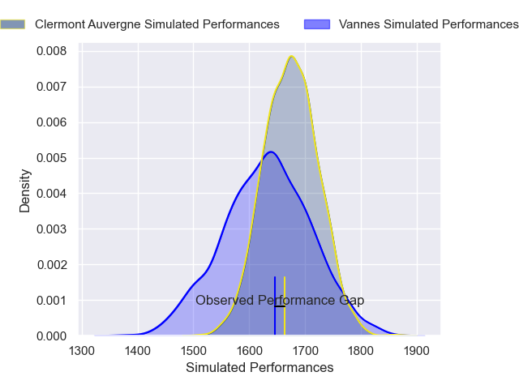
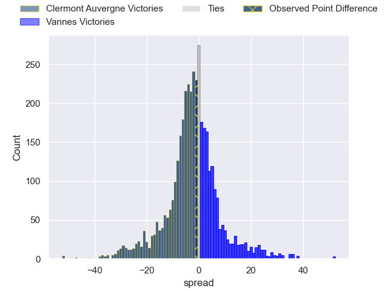
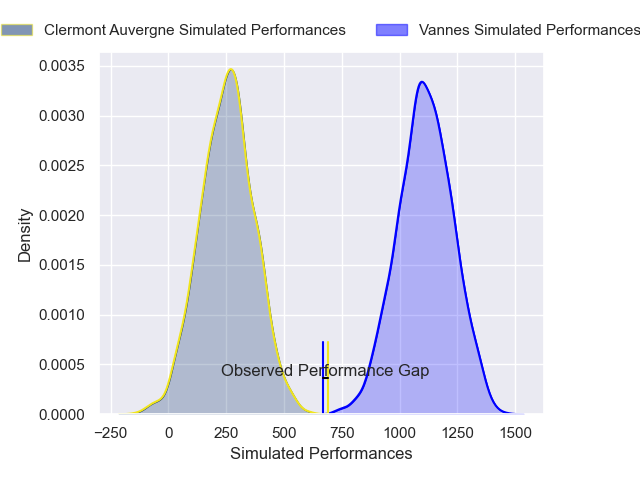
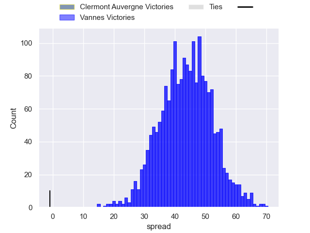

---  
layout: page  
title: Clermont Auvergne at Vannes; 20-19  
date: 2025-01-05 18:00:00 -0500  
categories: "Top 14 Orange 2024" match review  
---
# Clermont Auvergne at Vannes; 20-19

# Club Level Predictions

The first set of predictions treats a club as the smallest object, as the club develops its members, organizes a gameplan, and deploys its players as needed for each match. This club model has a prediction of 0.442, which translates to predicting Clermont Auvergne to win by 2.1.

Our Over/Under is 43.5 - and combined with the spread above, we have a predicted scoreline of 23 to 21

Each club has a rating and a rating deviation (similar to a Glicko rating), and expected performances can be generated. This allows for simulated matches and spreads like the ones below.
## Projected Performances - Club Model

## Projected Spreads - Club Model

## Projected Results - Club Model

# Player Level Predictions

Treating teams instead as an entity made up of the currently active players, I have ratings for each player in an altogether different system. These can be combined to form team ratings once teamsheets are announced, weighting starters a bit higher than the reserves. After the match is played, players can be weighted by their minutes on the field, allowing for an accurate measure of the team's composition. With these compiled team ratings, we can make predictions, measure inaccuracy, and update the individual player ratings.
## Prediction without Player Minutes: Vannes by 12.8

Vannes by 7.5 on a neutral pitch

## Projected Performances - Player Model

## Projected Spreads - Player Model

## Projected Results - Player Model

|   Away Minutes | Away Player          |   Away Percentile |   Number |   Home Percentile | Home Player         |   Home Minutes |
|---------------:|:---------------------|------------------:|---------:|------------------:|:--------------------|---------------:|
|             80 | Etienne Falgoux      |             86.24 |        1 |             97.73 | Mako Vunipola       |             80 |
|             54 | Barnabe Massa        |             73.94 |        2 |             67.38 | Cyril Blanchard     |             49 |
|             80 | Regis Montagne       |             85.74 |        3 |             10.99 | Simon Bourgeois     |             80 |
|             34 | Thibaud Lanen        |             89.61 |        4 |              6.99 | Eric Marks          |             80 |
|             24 | Thomas Ceyte         |             54.66 |        5 |             85.05 | Fabrice Metz        |             12 |
|             26 | Killian Tixeront     |             82.52 |        6 |              7.11 | Simon Augry         |             18 |
|              8 | Marcos Kremer        |             93.19 |        7 |             97.56 | Francisco Gorrissen |              9 |
|             26 | Fritz Lee            |             89.18 |        8 |             53.27 | Sione Kalamafoni    |             18 |
|             34 | Baptiste Jauneau     |             87.45 |        9 |             95.64 | Michael Ruru        |             27 |
|             80 | Anthony Belleau      |             96.48 |       10 |             92.95 | Maxime Lafage       |             12 |
|             34 | Alivereti Raka       |             12.02 |       11 |             73.19 | Romaric Camou       |             15 |
|             34 | Irae Simone          |             56.89 |       12 |              5.07 | Alex Arrate         |             16 |
|             34 | Pierre Fouyssac      |             19.74 |       13 |             76.41 | Robin Taccola       |             54 |
|             26 | Bautista Delguy      |             80.34 |       14 |             93.89 | Salesi Rayasi       |              0 |
|             80 | Alex Newsome         |             79.74 |       15 |             38.34 | Paul Surano         |             46 |
|             80 | Cristian Ojovan      |             59.14 |       16 |            100    | Santiago Medrano    |             72 |
|             80 | Cristian Ojovan      |             59.14 |       16 |            100    | Santiago Medrano    |             80 |
|             58 | Peceli Yato Senibitu |             90.1  |       17 |             95.83 | Joe Edwards         |             80 |
|             80 | Giorgi Akhaladze     |             13.42 |       18 |             11.03 | Francis Saili       |             80 |
|             80 | Etienne Fourcade     |             86.17 |       19 |             24.24 | Thomas Moukoro      |             13 |
|             51 | Alexandre Fischer    |             79.07 |       20 |             56.7  | Timothe Mezou       |             46 |
|             49 | Sebastien Bezy       |             76.73 |       21 |             75.18 | Theo Beziat         |             49 |
|            nan | nan                  |            nan    |       22 |             27.34 | Leon Boulier        |              8 |
|            nan | nan                  |            nan    |       23 |              1.09 | Stephen Varney      |             68 |

