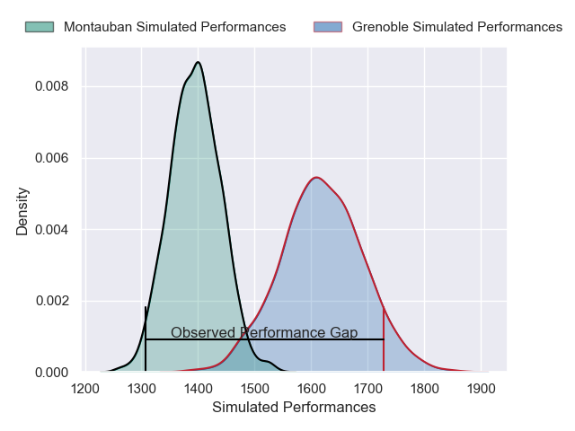
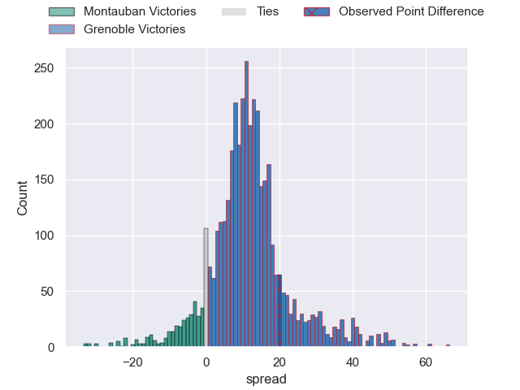
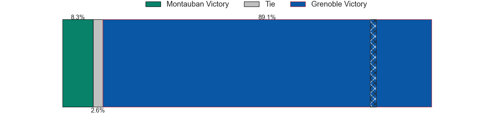
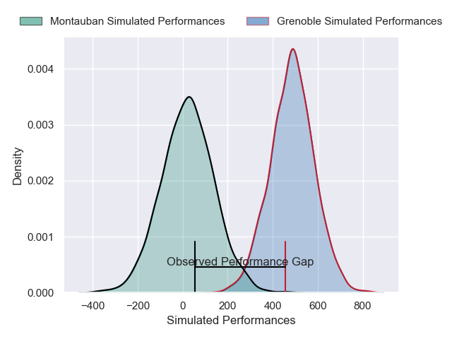
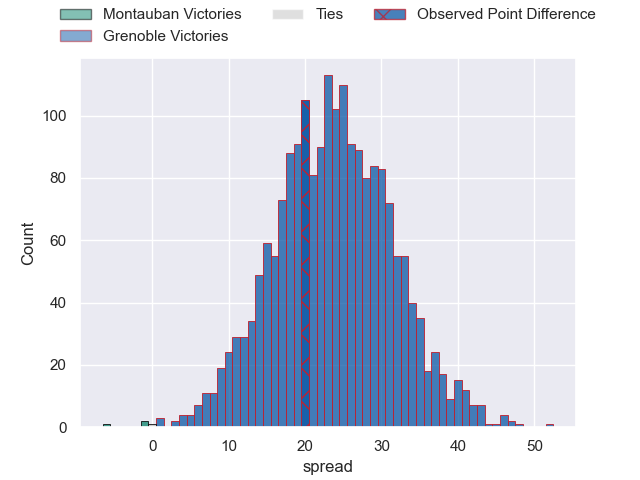
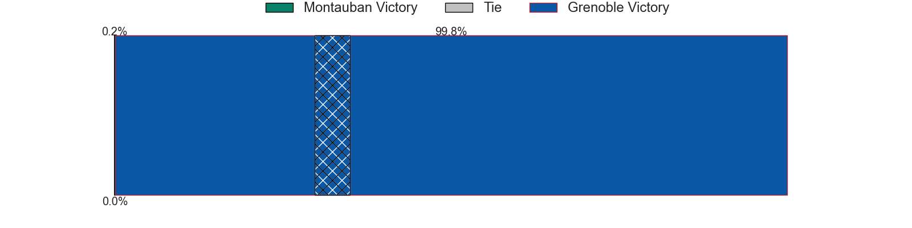

---  
layout: page  
title: Montauban at Grenoble; 15-35  
date: 2025-01-09 18:00:00 -0500  
categories: "Pro D2 2024" match review  
---
# Montauban at Grenoble; 15-35

# Club Level Predictions

The first set of predictions treats a club as the smallest object, as the club develops its members, organizes a gameplan, and deploys its players as needed for each match. This club model has a prediction of 0.781, which translates to predicting Grenoble to win by 11.1.

Our Over/Under is 57.5 - and combined with the spread above, we have a predicted scoreline of 23 to 35

Each club has a rating and a rating deviation (similar to a Glicko rating), and expected performances can be generated. This allows for simulated matches and spreads like the ones below.
## Projected Performances - Club Model

## Projected Spreads - Club Model

## Projected Results - Club Model

# Player Level Predictions

Treating teams instead as an entity made up of the currently active players, I have ratings for each player in an altogether different system. These can be combined to form team ratings once teamsheets are announced, weighting starters a bit higher than the reserves. After the match is played, players can be weighted by their minutes on the field, allowing for an accurate measure of the team's composition. With these compiled team ratings, we can make predictions, measure inaccuracy, and update the individual player ratings.
## Prediction without Player Minutes: Grenoble by 24.9

Grenoble by 11.8 on a neutral pitch

## Projected Performances - Player Model

## Projected Spreads - Player Model

## Projected Results - Player Model

|   Away Minutes | Away Player       |   Away Percentile |   Number |   Home Percentile | Home Player        |   Home Minutes |
|---------------:|:------------------|------------------:|---------:|------------------:|:-------------------|---------------:|
|             80 | Thomas Bue        |             17.71 |        1 |             62.63 | Eli Eglaine        |             22 |
|             12 | Kevin Firmin      |              7.12 |        2 |             73.13 | Mathis Sarragallet |             25 |
|             80 | Tietie Tuimauga   |             71.86 |        3 |             68.64 | Cody Thomas        |             24 |
|             62 | Clément Bitz      |             70.98 |        4 |             52.91 | Thomas Ployet      |             24 |
|             80 | Lewis Bean        |             11.65 |        5 |             82.73 | Pierce Phillips    |             57 |
|             80 | Karl Wilkins      |             15.78 |        6 |             73.16 | Ryno Pieterse      |             36 |
|             56 | Kyllian Ringuet   |             29.41 |        7 |             73.67 | Victor Guillaumond |             13 |
|             18 | Sikhumbuzo Notshe |             76.3  |        8 |             87.94 | Hanru Sirgel       |             12 |
|             23 | Joe Powell        |             71.79 |        9 |             41.77 | Barnabe Couilloud  |             80 |
|             24 | Thomas Fortunel   |             34.87 |       10 |             90.79 | Sam Davies         |             16 |
|             44 | Josua Vici        |             20.49 |       11 |             88.87 | Wilfried Hulleu    |             15 |
|             80 | Simon Renda       |             74.58 |       12 |             46.39 | Romain Fusier      |             22 |
|             59 | Maxime Espeut     |             54.72 |       13 |             93.78 | Giorgi Kveseladze  |             80 |
|             28 | Stephane Ahmed    |             95.27 |       14 |             88.37 | Geoffrey Cros      |             80 |
|             21 | Baptiste Mouchous |             84.87 |       15 |             96.71 | Julien Farnoux     |             27 |
|             62 | Mirian Burduli    |              4.75 |       16 |             71.93 | Thibaut Martel     |             25 |
|              0 | Lucas Seyrolle    |              9.66 |       17 |             92.12 | Zack Gauthier      |             25 |
|             55 | Jeremie Maurouard |              2.67 |       18 |             85.54 | Giorgi Javakhia    |             80 |
|             80 | Tjuee Uanivi      |              5.42 |       19 |             38.61 | Bastien Soury      |             80 |
|             68 | Noa Kanika        |             55.12 |       20 |             79.75 | Eric Escande       |             52 |
|             18 | Maxime Mathy      |              5.44 |       21 |              8.55 | Marc Palmier       |             68 |
|              9 | Mael Castel       |             31.46 |       22 |             63.37 | Gerswin Mouton     |             56 |
|             18 | Corentin Coularis |             22.75 |       23 |            nan    | Théo Lavoine       |             52 |

