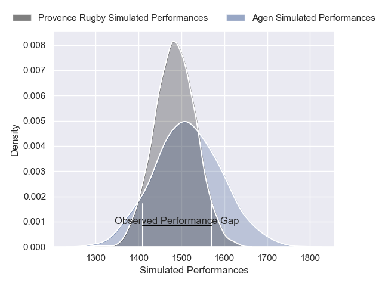
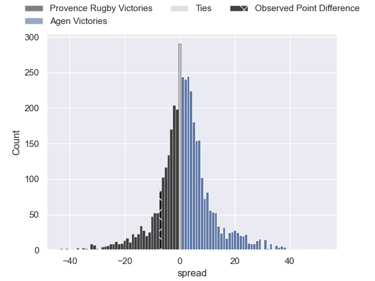
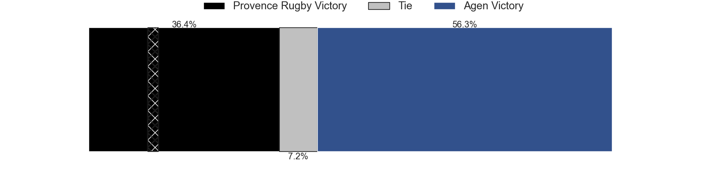
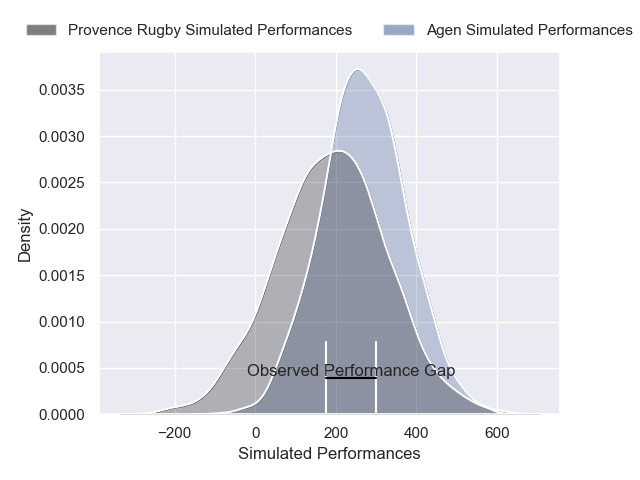
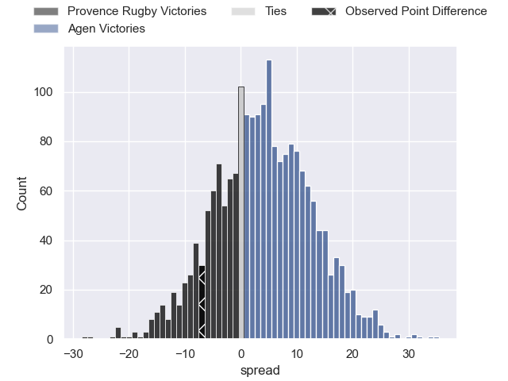

---  
layout: page  
title: Provence Rugby at Agen; 17-10  
date: 2025-01-10 18:00:00 -0500  
categories: "Pro D2 2024" match review  
---
# Provence Rugby at Agen; 17-10

# Club Level Predictions

The first set of predictions treats a club as the smallest object, as the club develops its members, organizes a gameplan, and deploys its players as needed for each match. This club model has a prediction of 0.545, which translates to predicting Agen to win by 1.6.

Our Over/Under is 40.5 - and combined with the spread above, we have a predicted scoreline of 20 to 21

Each club has a rating and a rating deviation (similar to a Glicko rating), and expected performances can be generated. This allows for simulated matches and spreads like the ones below.
## Projected Performances - Club Model

## Projected Spreads - Club Model

## Projected Results - Club Model

# Player Level Predictions

Treating teams instead as an entity made up of the currently active players, I have ratings for each player in an altogether different system. These can be combined to form team ratings once teamsheets are announced, weighting starters a bit higher than the reserves. After the match is played, players can be weighted by their minutes on the field, allowing for an accurate measure of the team's composition. With these compiled team ratings, we can make predictions, measure inaccuracy, and update the individual player ratings.
## Prediction without Player Minutes: Agen by 4.2

Provence Rugby by 10.1 on a neutral pitch

## Projected Performances - Player Model

## Projected Spreads - Player Model

## Projected Results - Player Model

|   Away Minutes | Away Player              |   Away Percentile |   Number |   Home Percentile | Home Player         |   Home Minutes |
|---------------:|:-------------------------|------------------:|---------:|------------------:|:--------------------|---------------:|
|             30 | Thomas Vernet            |             80.05 |        1 |             59.68 | Hans Lombard-Buret  |             28 |
|             22 | Joseph Laget             |             64.34 |        2 |             29.21 | Pierre Jouvin       |             39 |
|             37 | Paul Mallez              |             89.98 |        3 |             34.38 | Alex Burin          |             18 |
|             80 | Andres Zafra Tarazona    |              2.95 |        4 |             28.11 | Vincent Farre       |             17 |
|             15 | Izack Rodda              |             79.02 |        5 |              2.24 | Javier Eissmann     |             20 |
|             20 | Teimana Harrison         |             75.56 |        6 |             22.11 | Matthieu Bonnet     |             61 |
|             80 | Charly Gambini           |             90.87 |        7 |             40.06 | Tomasi Fineanganofo |             30 |
|             22 | Tornike Jalagonia        |              6.24 |        8 |             25.16 | Valentin Gayraud    |             80 |
|             22 | Arthur Coville           |             16.73 |        9 |             43.53 | Dorian Bellot       |             11 |
|             22 | Jules Plisson            |             69.87 |       10 |              1.53 | Billy Searle        |             58 |
|             22 | Nadir Bouhedjeur         |             90.78 |       11 |             10    | Iban Etcheverry     |             47 |
|             22 | Kaveinga Finau           |             85.56 |       12 |             18.89 | Clement Garrigues   |             58 |
|             22 | Mathias Colombet         |             69.56 |       13 |             43.78 | Kolinio Ramoka      |             58 |
|             20 | Adrien Lapegue-Lafaye    |             28.43 |       14 |              0.59 | Loris Tolot         |             80 |
|             46 | Thomas Salles            |             81.66 |       15 |             83.84 | Franck Pourteau     |             80 |
|             75 | Malohi Suta              |             47.4  |       16 |              1.73 | Evan Olmstead       |             67 |
|             77 | Rémi Bouaffou            |            nan    |       17 |             79.57 | Hayam El Bibouji    |             13 |
|             61 | Jimmy Gopperth           |             89.74 |       18 |              5.01 | Florent Guion       |             50 |
|             80 | George North             |             99.56 |       19 |             78.78 | Peyo Muscarditz     |             30 |
|             56 | Hayden Thompson-Stringer |             92.28 |       20 |             42.87 | Beau Farrance       |             27 |
|             80 | Hayden Thompson-Stringer |             92.28 |       20 |             42.87 | Beau Farrance       |             27 |
|             61 | Hayden Thompson-Stringer |             92.28 |       20 |             42.87 | Beau Farrance       |             27 |
|             80 | Josh Tyrell              |             77.49 |       21 |             74.9  | Lucas Martins       |             80 |
|             80 | Eliott Yemsi             |             33.53 |       22 |              2.49 | Fotu Lokotui        |             80 |
|             33 | Kevin Viallard           |             41.01 |       23 |             75.72 | Jack Maunder        |             35 |

