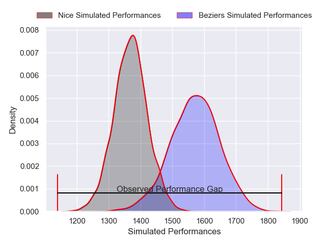
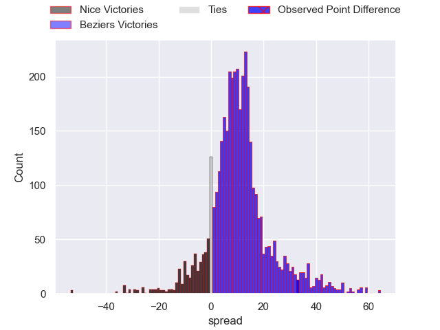
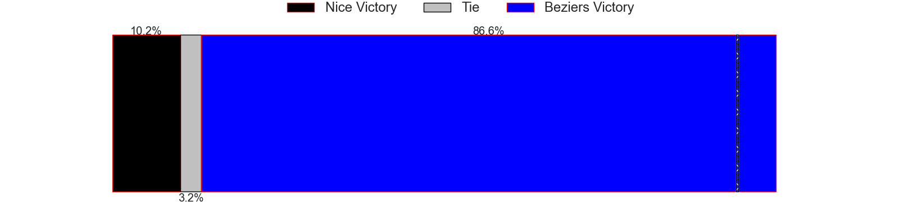
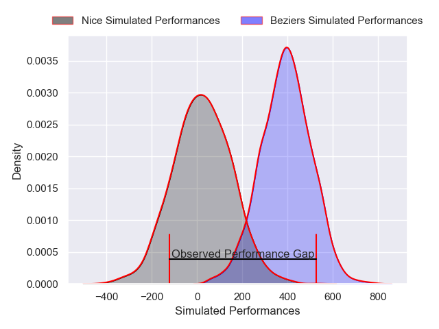
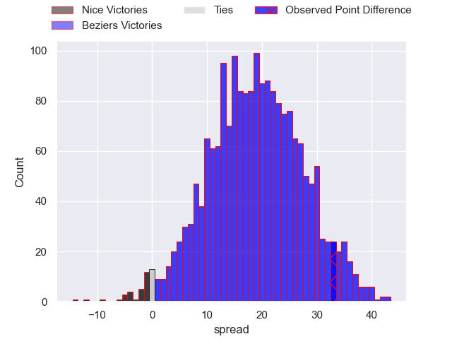
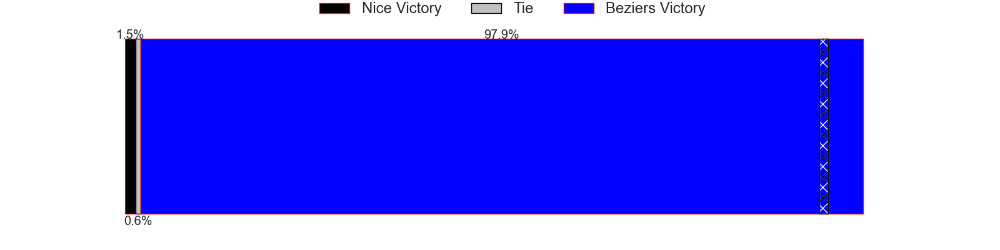

---  
layout: page  
title: Nice at Beziers; 9-42  
date: 2025-01-10 18:00:00 -0500  
categories: "Pro D2 2024" match review  
---
# Nice at Beziers; 9-42

# Club Level Predictions

The first set of predictions treats a club as the smallest object, as the club develops its members, organizes a gameplan, and deploys its players as needed for each match. This club model has a prediction of 0.759, which translates to predicting Beziers to win by 10.1.

Our Over/Under is 49.5 - and combined with the spread above, we have a predicted scoreline of 20 to 30

Each club has a rating and a rating deviation (similar to a Glicko rating), and expected performances can be generated. This allows for simulated matches and spreads like the ones below.
## Projected Performances - Club Model

## Projected Spreads - Club Model

## Projected Results - Club Model

# Player Level Predictions

Treating teams instead as an entity made up of the currently active players, I have ratings for each player in an altogether different system. These can be combined to form team ratings once teamsheets are announced, weighting starters a bit higher than the reserves. After the match is played, players can be weighted by their minutes on the field, allowing for an accurate measure of the team's composition. With these compiled team ratings, we can make predictions, measure inaccuracy, and update the individual player ratings.
## Prediction without Player Minutes: Beziers by 18.6

Beziers by 4.4 on a neutral pitch

## Projected Performances - Player Model

## Projected Spreads - Player Model

## Projected Results - Player Model

|   Away Minutes | Away Player              |   Away Percentile |   Number |   Home Percentile | Home Player                 |   Home Minutes |
|---------------:|:-------------------------|------------------:|---------:|------------------:|:----------------------------|---------------:|
|             80 | Julien Beaufils          |             57.67 |        1 |             69.68 | Yahnis El Maslouhi          |             14 |
|             30 | Santiago Ovejero Abdala  |             95.19 |        2 |             45.63 | Yanis Boulassel             |             65 |
|             55 | Tom Ross                 |             15.25 |        3 |             76.92 | Christian Judge             |             80 |
|             80 | Thibault Rey             |              2.43 |        4 |             80.22 | Cam Dodson                  |             58 |
|             23 | Clément Chartier         |             46.45 |        5 |              1.01 | Shahn Eru                   |             80 |
|             23 | Hugo Sarrasin            |             21.1  |        6 |             68.8  | Baptiste Abescat-Leroy      |             30 |
|             23 | Louis Suaud              |             96.1  |        7 |             87.2  | Clement Ancely              |             30 |
|             64 | Kylian Laurans           |             37.01 |        8 |             80.09 | Otonuku Jr Pauta            |             57 |
|             52 | Jules Gimbert            |              6.26 |        9 |             86.76 | Samuel Marques              |             58 |
|             80 | Mathis Viard             |             61.95 |       10 |             44.91 | Charly Malie                |             14 |
|             80 | Simon Delas              |             59.13 |       11 |             78.08 | Watisoni Votu               |             20 |
|             20 | Luca Cutayar             |             19.2  |       12 |             89.8  | Taylor Gontineac            |             21 |
|             80 | Nathan Courtade          |             65.29 |       13 |             62.26 | Paul Recor                  |             80 |
|             43 | Christian Erasmus        |             75.02 |       14 |             25.47 | Pierre Courtaud             |             21 |
|             53 | Tanguy Ménoret           |             62.61 |       15 |             89.6  | Gabin Lorre                 |             58 |
|             18 | Christa Powell           |              2.6  |       16 |             36.9  | William van Bost            |             52 |
|             62 | Matéo Jeune Joly         |             27.91 |       17 |              3.75 | Francisco Fernandes Moreira |             62 |
|             80 | Sacha Idoumi             |             34.58 |       18 |            nan    | John Henry Fincham          |             80 |
|             80 | Nicolas Ciancio          |             53.66 |       19 |             11    | Gillian Benoy               |             56 |
|             51 | Jules Martinez           |             12.86 |       20 |             56.89 | Damien Añon                 |             14 |
|             80 | Bastien Berenguel        |              2.6  |       21 |            nan    | Romain Uruty                |             75 |
|             63 | Ramiha Tarrel Tia Smiler |             32.03 |       22 |             39.48 | Maxime Vacquier             |             77 |
|             80 | Kevin Yameogo            |            nan    |       23 |             83.07 | Yvann Lalevee               |              7 |

