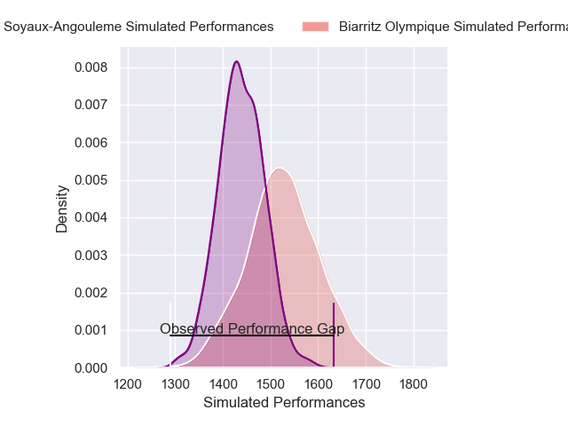
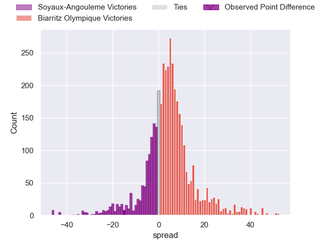
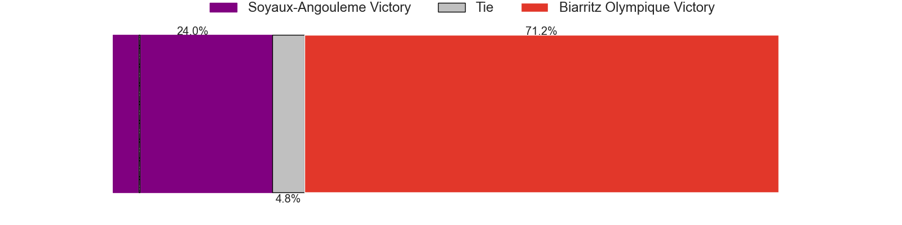
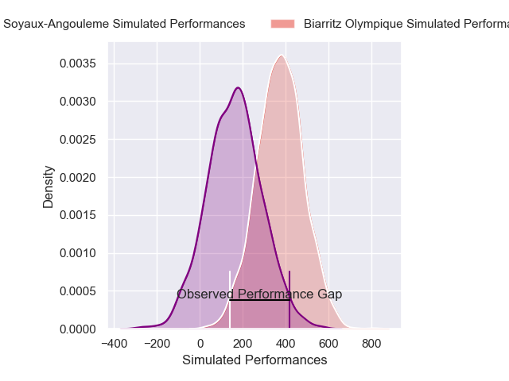
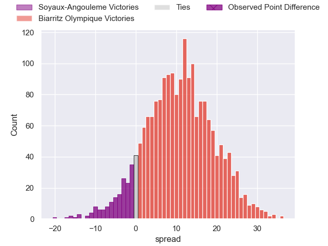
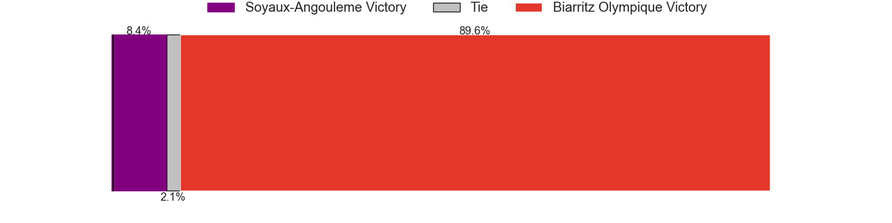

---  
layout: page  
title: Soyaux-Angouleme at Biarritz Olympique; 25-10  
date: 2025-01-10 18:00:00 -0500  
categories: "Pro D2 2024" match review  
---
# Soyaux-Angouleme at Biarritz Olympique; 25-10

# Club Level Predictions

The first set of predictions treats a club as the smallest object, as the club develops its members, organizes a gameplan, and deploys its players as needed for each match. This club model has a prediction of 0.624, which translates to predicting Biarritz Olympique to win by 4.5.

Our Over/Under is 44.5 - and combined with the spread above, we have a predicted scoreline of 20 to 25

Each club has a rating and a rating deviation (similar to a Glicko rating), and expected performances can be generated. This allows for simulated matches and spreads like the ones below.
## Projected Performances - Club Model

## Projected Spreads - Club Model

## Projected Results - Club Model

# Player Level Predictions

Treating teams instead as an entity made up of the currently active players, I have ratings for each player in an altogether different system. These can be combined to form team ratings once teamsheets are announced, weighting starters a bit higher than the reserves. After the match is played, players can be weighted by their minutes on the field, allowing for an accurate measure of the team's composition. With these compiled team ratings, we can make predictions, measure inaccuracy, and update the individual player ratings.
## Prediction without Player Minutes: Biarritz Olympique by 14.2

Soyaux-Angouleme by 1.3 on a neutral pitch

## Projected Performances - Player Model

## Projected Spreads - Player Model

## Projected Results - Player Model

|   Away Minutes | Away Player        |   Away Percentile |   Number |   Home Percentile | Home Player         |   Home Minutes |
|---------------:|:-------------------|------------------:|---------:|------------------:|:--------------------|---------------:|
|             80 | Sami Zouhair       |             98.57 |        1 |              1.01 | Giorgi Nutsubidze   |             59 |
|             35 | Patxi Bidart       |             79.5  |        2 |             10.61 | Yohan Beheregaray   |             80 |
|             80 | Karl Sorin         |             51.89 |        3 |             64.17 | Solomone Tukuafu    |             30 |
|             80 | Enzo Morand-Bruyat |             80.78 |        4 |              1.21 | Adrian Motoc        |             30 |
|             80 | Sikeli Nabou       |             91.15 |        5 |             29.78 | Piula Faasalele     |             80 |
|             35 | Adrian Mitu        |             59.42 |        6 |             31.1  | Thomas Hebert       |             14 |
|             35 | Germain Burgaud    |             85.68 |        7 |             58.6  | Cornell du Preez    |             80 |
|             80 | Samuel Nollet      |             25.05 |        8 |             57.75 | Masivesi Dakuwaqa   |             21 |
|             35 | Alexis Levron      |             33.88 |        9 |             39.86 | Imanol Biscay       |             30 |
|             80 | Corentin Glenat    |             68.43 |       10 |             32.67 | Thomas Dolhagaray   |             21 |
|             56 | Nathan Farissier   |             31.91 |       11 |             81.27 | Arthur Bonneval     |             45 |
|             45 | Mathis Lafon       |             54.69 |       12 |              1.54 | Francois Vergnaud   |             80 |
|             50 | Arthur Proult      |              4.74 |       13 |             93.83 | Mathieu Acebes      |             45 |
|             22 | Jonny May          |              7.14 |       14 |              4.26 | Zach Kibirige       |             27 |
|             22 | Jules Dubecq       |             65.49 |       15 |             83.08 | Kylian Jaminet      |             45 |
|             65 | Hubert Texier      |             53.55 |       16 |             56.12 | Luteru Tolai        |             50 |
|             18 | Manu Saubusse      |             57.97 |       17 |              3.62 | Zakaria El Fakir    |             45 |
|             80 | Léo Morand-Bruyat  |             47.18 |       18 |             58.87 | Giorgi Dzmanashvili |             66 |
|             28 | Ben Botica         |             85.87 |       19 |             22.54 | Levi Douglas        |             53 |
|             22 | Seydou Diakité     |             25.65 |       20 |             44.98 | Tyler Morgan        |             80 |
|             80 | Georgy Balakarev   |             22.12 |       21 |              6.16 | Aitor Hourcade      |             30 |
|             35 | George Tilsley     |             92.39 |       22 |             13.95 | Pierre Pages        |             80 |
|             66 | Rayne Barka        |             77.7  |       23 |             53.64 | Edgar Retiere       |             26 |

